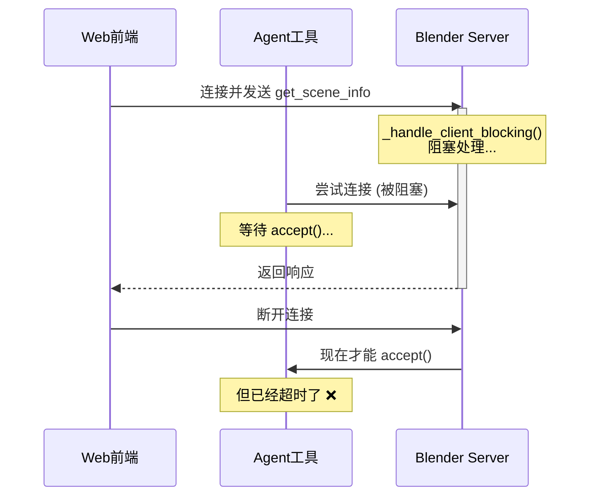
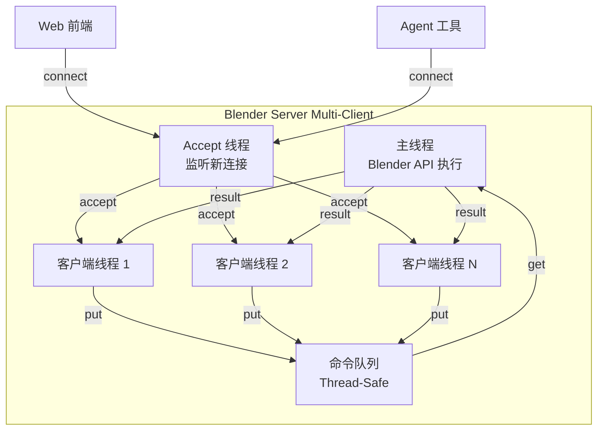

# Blender 连接架构重构方案

## 问题分析

### 问题 1: GUI 被移除

刚才的重构完全移除了 GUI operators 和 UI 面板，但用户需要在同一台机器上测试两种模式。

### 问题 2: Headless 模式路由混乱

**症状**：通过 `start_services.sh` 设置 `BLENDER_MODE=headless` 启动后，前端无法获取数据；但手动启动 `blender_headless_client.py` + `BLENDER_MODE=local-client` 却可以。

**根本原因**（在 `[scene_agent/interfaces/api.py](scene_agent/interfaces/api.py)`）：

```python
# Line 138-173: get_blender_connection_for_thread()
def get_blender_connection_for_thread(thread_id: str) -> BlenderConnection:
    settings = get_settings()
    if settings.blender_mode == "local-client":
        return get_blender_connection()  # 使用全局连接 BLENDER_HOST:BLENDER_PORT

    # headless 模式：尝试为每个 thread_id 启动新的 Blender 进程
    manager = get_session_manager()
    session = manager.ensure(thread_id, "headless")
    host = os.getenv("BLENDER_HEADLESS_HOST", settings.blender_host)
    base_port = int(os.getenv("BLENDER_HEADLESS_BASE_PORT", "9876"))
    port_range = int(os.getenv("BLENDER_HEADLESS_PORT_RANGE", "1"))
    port = allocate_headless_port(thread_id, base_port, port_range)  # 计算端口
    
    # 问题：尝试启动新进程
    if not connection.connect():
        start_headless_process(session, command, args)  # ❌ 启动新 Blender
```

**问题所在**：

- `local-client` 模式：直接连接到用户手动启动的 `blender_headless_client.py`（端口 9876）
- `headless` 模式：尝试为每个 thread_id 启动新的 Blender 实例，导致：
  1. 与已运行的实例端口冲突
  2. 无法连接到用户手动启动的实例
  3. 逻辑混乱：前端的 thread_id 与后端的 session 管理不匹配

**解决方案**：

- `headless` 模式应该连接到**已运行的共享 Blender 实例**（类似 local-client）
- 只有在需要隔离环境时才启动独立进程（通过显式配置）

### 问题 3: 单连接阻塞

**症状**：local-client 模式下，web 应用占用连接后，agent 工具调用无法连接。

**根本原因**（在 `[addon/blender_mcpv_addon/server.py](addon/blender_mcpv_addon/server.py)`）：

```python
# Line 80-114: _server_loop_blocking()
def _server_loop_blocking(self):
    while self.running:
        client, address = self.socket.accept()  # accept 一个连接
        self._handle_client_blocking(client)    # 同步处理，阻塞在这里
        # 只有这个连接断开才能继续 accept() 下一个连接 ❌
```

**架构图**：




**问题所在**：

- Blender 在主线程中 `accept()` → `handle()` → `close()` 串行处理
- 第一个连接未关闭时，后续连接无法被 `accept()`
- **不是** connection pooling 问题，而是根本无法建立并发连接

**解决方案**：

- 支持多客户端：每个连接在独立线程中处理
- 命令执行仍在主线程（通过队列）以保证 Blender API 的线程安全

## 解决方案

### 1. 恢复并优化 GUI 支持

**目标**：GUI 和 headless 模式共存，用户可以选择使用。

#### 1.1 恢复 operators

在 `[addon/blender_mcpv_addon/operators.py](addon/blender_mcpv_addon/operators.py)` 中添加：

```python
class BLENDERMCPV_OT_StartServer(bpy.types.Operator):
    """Start the BlenderMCP server (GUI mode)"""
    bl_idname = "blendermcpv.start_server"
    bl_label = "Start Server"
    bl_description = "Start the BlenderMCP server (threaded mode for GUI)"

    def execute(self, context):
        from .server import BlenderMCPVisionServer
        scene = context.scene

        if not hasattr(bpy.types, "blendermcpv_server"):
            bpy.types.blendermcpv_server = BlenderMCPVisionServer(
                port=scene.blendermcpv_port
            )

        # GUI 模式：使用线程模式启动
        bpy.types.blendermcpv_server.start(blocking=False)
        scene.blendermcpv_server_running = True
        return {'FINISHED'}

class BLENDERMCPV_OT_StopServer(bpy.types.Operator):
    """Stop the BlenderMCP server"""
    bl_idname = "blendermcpv.stop_server"
    bl_label = "Stop Server"

    def execute(self, context):
        if hasattr(bpy.types, "blendermcpv_server"):
            bpy.types.blendermcpv_server.stop()
        context.scene.blendermcpv_server_running = False
        return {'FINISHED'}
```

#### 1.2 恢复 UI 面板

在 `[addon/blender_mcpv_addon/ui.py](addon/blender_mcpv_addon/ui.py)` 中恢复面板。

#### 1.3 server.py 支持两种模式

```python
def start(self, blocking=True, enable_multi_client=False):
    """
    Start socket server.
    
    Args:
        blocking: If True (headless), run in main thread blocking mode
                  If False (GUI), run in background thread
        enable_multi_client: If True, handle multiple clients concurrently
    """
    if blocking:
        self._server_loop_blocking(enable_multi_client)
    else:
        self._server_loop_threaded(enable_multi_client)
```

### 2. 重构 Headless 模式路由

#### 2.1 简化连接逻辑

在 `[scene_agent/interfaces/api.py](scene_agent/interfaces/api.py)` 中：

**当前逻辑**（复杂且混乱）：

```python
def send_blender_command_sync(...):
    if settings.blender_mode == "headless" and thread_id:
        # 为每个 thread_id 启动独立 Blender ❌
        blender = get_blender_connection_for_thread(thread_id)
        return blender.send_command(...)
    else:
        # local-client 模式：使用全局连接
        blender = get_blender_connection()
        return blender.send_command(...)
```

**新逻辑**（统一且清晰）：

```python
def send_blender_command_sync(...):
    """
    Both local-client and headless modes use shared Blender connection.
    No per-thread process spawning.
    """
    blender = get_blender_connection()  # 统一使用全局连接
    return blender.send_command(command_type, params)
```

#### 2.2 移除不必要的 session 管理

- 删除 `get_blender_connection_for_thread()` 的复杂逻辑
- 保留 `get_blender_connection()` 作为唯一入口
- Thread_id 通过命令参数传递，而不是创建新连接

#### 2.3 配置统一

`.env` 文件：

```bash
# 两种模式使用相同的连接配置
BLENDER_HOST=localhost
BLENDER_PORT=9876

# 模式选择只影响是否自动启动 Blender
# local-client: 用户手动启动 Blender（GUI 或 headless）
# headless: 系统启动时自动启动 headless Blender
BLENDER_MODE=local-client
```

### 3. 实现多客户端支持

#### 3.1 架构设计




#### 3.2 实现要点

在 `[addon/blender_mcpv_addon/server.py](addon/blender_mcpv_addon/server.py)` 中：

```python
import queue
import threading

class BlenderMCPVisionServer(AssetHandlerMixin):
    def __init__(self, host='localhost', port=9876):
        self.host = host
        self.port = port
        self.running = False
        self.socket = None
        
        # 多客户端支持
        self.command_queue = queue.Queue()
        self.result_queues = {}  # {client_id: queue.Queue}
        self.client_threads = []
        
        self.camera_manager = CameraManager()

    def start(self, blocking=True, enable_multi_client=True):
        """
        Start server with multi-client support.
        
        Args:
            blocking: If True (headless), process commands in main thread
                     If False (GUI), use modal timer
            enable_multi_client: Enable concurrent client connections
        """
        self.running = True
        self.socket = socket.socket(socket.AF_INET, socket.SOCK_STREAM)
        self.socket.setsockopt(socket.SOL_SOCKET, socket.SO_REUSEADDR, 1)
        self.socket.bind((self.host, self.port))
        self.socket.listen(5)  # 增加 backlog

        if enable_multi_client:
            # 启动 accept 线程
            accept_thread = threading.Thread(target=self._accept_loop)
            accept_thread.daemon = True
            accept_thread.start()

        if blocking:
            # Headless: 在主线程处理命令
            self._command_processor_blocking()
        else:
            # GUI: 使用 timer 处理命令
            self._command_processor_timer()

    def _accept_loop(self):
        """在独立线程中 accept 新连接"""
        print("Accept loop started (multi-client mode)")
        self.socket.settimeout(1.0)
        
        while self.running:
            try:
                client, address = self.socket.accept()
                print(f"New client connected: {address}")
                
                # 为每个客户端创建独立线程
                client_id = id(client)
                self.result_queues[client_id] = queue.Queue()
                
                client_thread = threading.Thread(
                    target=self._handle_client_multi,
                    args=(client, client_id)
                )
                client_thread.daemon = True
                client_thread.start()
                self.client_threads.append(client_thread)
                
            except socket.timeout:
                continue
            except Exception as e:
                if self.running:
                    print(f"Error accepting connection: {e}")

    def _handle_client_multi(self, client, client_id):
        """处理单个客户端连接（在独立线程中）"""
        print(f"Client handler started (ID: {client_id})")
        buffer = b''
        
        try:
            while self.running:
                data = client.recv(8192)
                if not data:
                    break
                
                buffer += data
                try:
                    command = json.loads(buffer.decode('utf-8'))
                    buffer = b''
                    
                    # 将命令放入队列，等待主线程处理
                    self.command_queue.put((client_id, command))
                    
                    # 等待结果
                    result = self.result_queues[client_id].get(timeout=180)
                    
                    # 发送响应
                    client.sendall(json.dumps(result).encode('utf-8'))
                    
                except json.JSONDecodeError:
                    pass
                except queue.Empty:
                    error = {"status": "error", "message": "Command timeout"}
                    client.sendall(json.dumps(error).encode('utf-8'))
                    
        except Exception as e:
            print(f"Client handler error: {e}")
        finally:
            client.close()
            if client_id in self.result_queues:
                del self.result_queues[client_id]
            print(f"Client handler stopped (ID: {client_id})")

    def _command_processor_blocking(self):
        """主线程处理命令队列（headless 模式）"""
        print("Command processor started (main thread, blocking)")
        
        while self.running:
            try:
                # 从队列获取命令（超时机制）
                client_id, command = self.command_queue.get(timeout=1.0)
                
                # 在主线程中执行命令（Blender API 线程安全）
                response = self.execute_command(command)
                
                # 将结果放入对应客户端的队列
                if client_id in self.result_queues:
                    self.result_queues[client_id].put(response)
                    
            except queue.Empty:
                continue
            except Exception as e:
                print(f"Command processor error: {e}")

    def _command_processor_timer(self):
        """GUI 模式：使用 bpy.app.timers 处理命令"""
        def process_commands():
            if not self.running:
                return None
                
            try:
                # 批量处理命令
                for _ in range(10):  # 每次处理最多 10 个命令
                    client_id, command = self.command_queue.get_nowait()
                    response = self.execute_command(command)
                    if client_id in self.result_queues:
                        self.result_queues[client_id].put(response)
            except queue.Empty:
                pass
                
            return 0.01  # 10ms 后再次检查
        
        bpy.app.timers.register(process_commands, first_interval=0.01)
```

### 4. 配置和启动脚本更新

#### 4.1 环境变量简化

`.env`:

```bash
VLM_PROVIDER=GEMINI
VLM_API_KEY=xxx

# Blender 连接配置（两种模式共用）
BLENDER_HOST=localhost
BLENDER_PORT=9876

# 模式选择
# local-client: 手动启动 Blender（GUI 或 headless）
# headless: start_services.sh 自动启动 headless Blender
BLENDER_MODE=local-client

API_WORKERS=4
API_STREAM_TIMEOUT_SECONDS=120
```

#### 4.2 start_services.sh 更新

```bash
# 如果是 headless 模式，自动启动 Blender
if [ "$BLENDER_MODE" = "headless" ]; then
    echo -e "${GREEN}[0/3] Starting headless Blender...${NC}"
    blender --background --python scripts/blender_headless_client.py -- \
        --host localhost --port 9876 > /tmp/blender_headless.log 2>&1 &
    BLENDER_PID=$!
    echo -e "${GREEN}      Blender started (PID: $BLENDER_PID)${NC}"
    sleep 3
fi

# 启动 MCP server
echo -e "${GREEN}[1/2] Starting MCP server...${NC}"
...
```

## 测试验证

### 测试场景 1: Local-client + 手动 GUI Blender

```bash
# Terminal 1: 启动 Blender GUI，点击 "Start Server"
blender

# Terminal 2: 启动服务
export BLENDER_MODE=local-client
./scripts/start_services.sh

# Terminal 3: 测试
curl http://localhost:8000/scene/test-thread
```

### 测试场景 2: Local-client + 手动 Headless Blender

```bash
# Terminal 1: 手动启动 headless Blender
blender --background --python scripts/blender_headless_client.py -- \
    --host localhost --port 9876

# Terminal 2: 启动服务
export BLENDER_MODE=local-client
./scripts/start_services.sh

# Terminal 3: 测试多并发
curl http://localhost:8000/scene/thread1 &
curl http://localhost:8000/scene/thread2 &
curl http://localhost:8000/scene/thread3 &
```

### 测试场景 3: Headless 自动启动

```bash
# Terminal 1: 启动服务（自动启动 Blender）
export BLENDER_MODE=headless
./scripts/start_services.sh

# Terminal 2: 测试
curl http://localhost:8000/scene/test-thread
```

### 测试场景 4: 多客户端并发

```python
# test_concurrent.py
import socket
import json
import threading

def send_command(client_id):
    sock = socket.socket(socket.AF_INET, socket.SOCK_STREAM)
    sock.connect(('localhost', 9876))
    
    command = {'type': 'get_scene_info', 'params': {}}
    sock.sendall(json.dumps(command).encode('utf-8'))
    
    response = sock.recv(65536)
    print(f"Client {client_id}: {response}")
    sock.close()

# 同时启动 10 个客户端
threads = [threading.Thread(target=send_command, args=(i,)) for i in range(10)]
for t in threads:
    t.start()
for t in threads:
    t.join()

print("All clients completed successfully!")
```

## 迁移指南

### 破坏性变更

1. **API 路由逻辑变化**
  - 旧：headless 模式为每个 thread_id 启动独立 Blender
  - 新：所有模式使用共享 Blender 连接
2. **Session 管理简化**
  - 旧：复杂的 per-thread session 管理
  - 新：统一的连接管理，thread_id 只是参数
3. **环境变量变化**
  - 移除：`BLENDER_HEADLESS_HOST`, `BLENDER_HEADLESS_BASE_PORT`, `BLENDER_HEADLESS_PORT_RANGE`
  - 保留：`BLENDER_HOST`, `BLENDER_PORT`, `BLENDER_MODE`

### 向后兼容

保留旧的环境变量支持（废弃警告）：

```python
if os.getenv("BLENDER_HEADLESS_HOST"):
    warnings.warn("BLENDER_HEADLESS_HOST is deprecated, use BLENDER_HOST")
```

## 实施顺序

1. **阶段 1**：恢复 GUI 支持（高优先级，低风险）
  - 恢复 operators.py
  - 恢复 ui.py
  - 添加 `blocking=False` 模式到 server.py
2. **阶段 2**：实现多客户端支持（高优先级，中风险）
  - 实现队列机制
  - 实现 accept 线程
  - 实现客户端处理线程
  - 测试并发场景
3. **阶段 3**：简化 headless 路由（中优先级，高收益）
  - 重构 api.py 连接逻辑
  - 移除 per-thread session 创建
  - 统一连接管理
  - 更新配置文件
4. **阶段 4**：测试和文档（必需）
  - 编写测试用例
  - 更新 README
  - 添加故障排查指南

