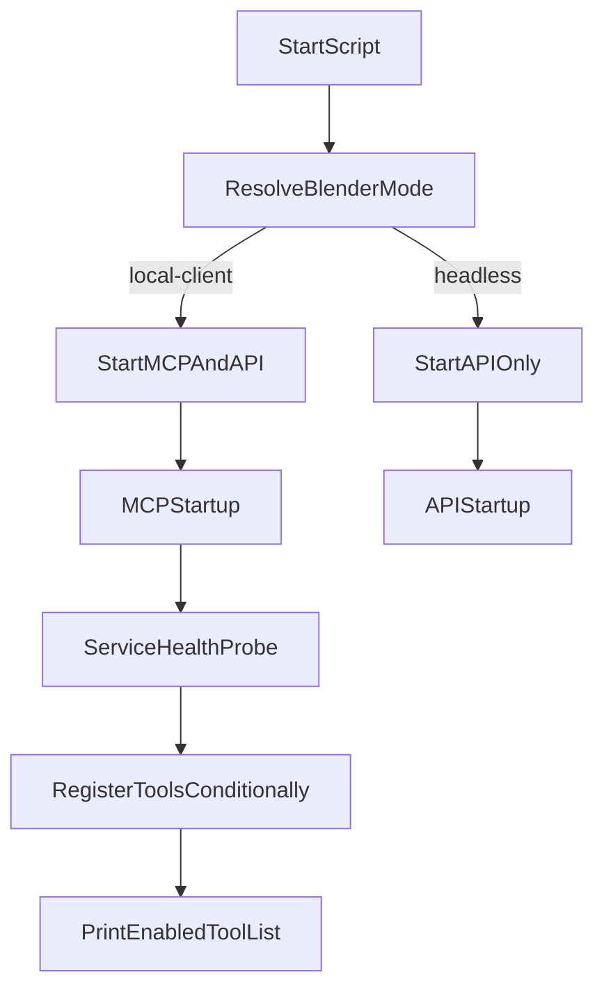

# 启动脚本与MCP按需启用改造计划

## 目标与边界

- 目标：满足 4 个需求点，并保持现有 `headless` 会话按需启动机制不被破坏。
- 已确认约束：
  - 脚本行为由最终 `blender-mode` 决定（参数可覆盖 `.env`）。
  - `health_check_services.sh` 改为 Python-only，不保留 `.sh` wrapper。

## 变更方案

### 1) 启动脚本改造（mode 驱动行为）

- 修改 [scripts/run_headless.sh](scripts/run_headless.sh)：
  - 增加参数解析（至少 `--blender-mode`，可附带 `--workers`）。
  - 默认 mode 仍为 `headless`；若参数传入则覆盖 `.env` 值并 `export BLENDER_MODE`。
  - 行为改为“按最终 mode 决定”：
    - `headless`：仅启动 API（不启动 MCP，满足需求 1）。
    - `local-client`：启动 MCP + API。
- 新增 [scripts/run_local_client.sh](scripts/run_local_client.sh)：
  - 默认 mode 为 `local-client`，同样支持 `--blender-mode` 覆盖。
  - 采用相同 mode 驱动逻辑，确保当 mode 为 `local-client` 时启动 MCP。
- 关键修正：统一清理逻辑支持“可能不存在 MCP 进程”的场景，避免脚本退出时误报。

现有关键行为（将被替换为条件行为）：

```91:103:scripts/run_headless.sh
# Start MCP server in background
echo -e "${GREEN}[1/2] Starting MCP server...${NC}"
python mcp_server/server.py > /tmp/mcp_server.log 2>&1 &
MCP_PID=$!
# ...
python main.py --mode api --host 0.0.0.0 --port 8000 --workers "$API_WORKERS" &
```

### 2) 健康检查改为 Python 工具类

- 将 [scripts/health_check_services.sh](scripts/health_check_services.sh) 替换为 Python 版本（文件名改为 `scripts/health_check_services.py`）。
- 设计一个可复用工具类（例如 `ServiceHealthChecker`），支持：
  - 检查指定 IP/host 的 HTTP 服务健康状态。
  - 可配置 endpoint、超时、期望字段。
  - 返回结构化检查结果，供脚本 CLI 与 MCP 端共用。
- 内置/支持检查项：
  - TRELLIS2
  - Retrieval API
  - PCGIntegrator（按你给出的 `GET /healthy` 规则，如 `{"status":"healthy","service":"PCGIntegrator3D"...}`）
- 提供 CLI 入口：可传入目标 host（例如 `--host 127.0.0.1`）并用 exit code 表示整体可用性。

### 3) MCP 按需注册工具 + 启用清单输出

- 修改 [mcp_server/server.py](mcp_server/server.py)：
  - 在启动阶段调用第 2 步工具类完成服务探测。
  - 使用 `mcp.add_tool(...)` 进行“条件注册”，仅在依赖服务在线时注册相关工具。
- 工具与服务依赖映射（初版）：
  - TRELLIS2 在线时注册：`generate_trellis2_model`
  - PCGIntegrator 在线时注册：`get_infinigen_available_assets`、`generate_infinigen_assets`
  - Retrieval 在线时注册：`search_3d_assets_by_text`
  - 与外部服务无强依赖的工具维持常驻注册（如 Blender 基础工具、`import_glb_model`、`import_retrieved_asset`）
- 在 MCP 启动日志中打印：
  - 当前探测到的服务可用性
  - 最终启用的 MCP 工具列表（需求 4）
- 顺手修复已存在的小问题：`generate_infinigen_assets` 中使用了 `shutil` 但文件未导入。

### 4) 文档同步更新

- 更新 [docs/overview.md](docs/overview.md)：
  - 启动脚本现状：`run_headless` 与新增 local-client 脚本、mode 覆盖规则。
  - 健康检查实现迁移：Shell -> Python 工具类。
  - MCP 工具按服务在线状态动态注册机制与日志行为。
  - 明确 headless 下 MCP 的按需启动语义，避免与 local-client 固定 MCP 进程混淆。

## 执行流程图




## 验证与回归检查

- 脚本层：
  - `run_headless.sh` 默认不拉起 MCP。
  - `run_headless.sh --blender-mode local-client` 会拉起 MCP。
  - `run_local_client.sh` 默认拉起 MCP。
- 健康检查层：
  - `python scripts/health_check_services.py --host localhost` 能输出每项服务状态并返回合理 exit code。
- MCP 层：
  - 启动日志能看到“启用工具清单”；下线某服务后对应工具从清单中消失。
- 文档层：
  - `overview.md` 中脚本/健康检查/MCP 注册逻辑与实现一致。

