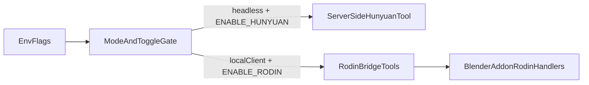

# Headless Hunyuan + Local Rodin 集成计划

## 目标与范围

- 在 `[mcp_server/server.py](/Users/fishwowater/projects/3DSceneAgent/mcp_server/server.py)` 新增**服务端 Hunyuan 官方 API**工具（不把生成任务发给 Blender 执行），并在工具内部执行“提交任务 + 轮询直到完成/失败/超时”。
- 在 `[mcp_server/server.py](/Users/fishwowater/projects/3DSceneAgent/mcp_server/server.py)` 与 `[addon/src/blender_mcpv/server.py](/Users/fishwowater/projects/3DSceneAgent/addon/src/blender_mcpv/server.py)` 增加 Rodin 联合调用工具（真正 3D 生成发生在客户端插件）。
- 修改 `[addon/blender_mcpv_addon](/Users/fishwowater/projects/3DSceneAgent/addon/blender_mcpv_addon)` 移除 trellis2 逻辑并接入 rodin 处理。
- 加入模式+环境变量开关：
  - `BLENDER_MODE=headless` 且 `ENABLE_HUNYUAN=true` 才向 LLM 暴露 Hunyuan 工具。
  - `BLENDER_MODE=local-client` 且 `ENABLE_RODIN=true` 才向 LLM 暴露 Rodin 工具。
- 输出 `mcp_server` 拆分子 server 的评估与迁移方案（仅设计，不立刻拆）。

## 现状锚点（用于最小侵入改造）

- `[mcp_server/server.py](/Users/fishwowater/projects/3DSceneAgent/mcp_server/server.py)` 通过 `register_mcp_tools()` 的 `tool_specs` + `_probe_conditional_services()` 按依赖注册工具；适合叠加“模式+开关”判定。
- `[addon/src/blender_mcpv/server.py](/Users/fishwowater/projects/3DSceneAgent/addon/src/blender_mcpv/server.py)` 当前仍保留 `generate_trellis2_model` 并透传到 Blender 插件。
- `[addon/blender_mcpv_addon/asset_handlers.py](/Users/fishwowater/projects/3DSceneAgent/addon/blender_mcpv_addon/asset_handlers.py)` 当前实现 `generate_trellis2_model`；需替换为 Rodin 相关处理函数。

## 实施步骤

### 1) 统一条件启用机制（mode + env）

- 在 `[mcp_server/server.py](/Users/fishwowater/projects/3DSceneAgent/mcp_server/server.py)` 增加小型判定函数：
  - 读取 `BLENDER_MODE`、`ENABLE_HUNYUAN`、`ENABLE_RODIN`。
  - 规范 bool 解析（`true/1/yes/on`）。
- 在 `register_mcp_tools()` 中新增“额外启用条件”检查，不仅依赖 service health，还要满足 mode+env 条件。
- 保持现有 `retrieval/pcg_integrator/trellis2` 的健康检查逻辑；保留 headless 下 server-side `generate_trellis2_model`，并通过 `ENABLE_TRELLIS2` 控制启用。

### 2) 在 MCP 服务端集成 Hunyuan（官方 API，单工具内轮询）

- 在 `[mcp_server/server.py](/Users/fishwowater/projects/3DSceneAgent/mcp_server/server.py)` 新增服务端函数（示例：`generate_hunyuan3d_model(...)`）：
  - 参数：`text_prompt` / `input_image_url`（二选一）、`poll_interval_seconds`、`timeout_seconds`。
  - 用环境变量读取 `HUNYUAN3D_SECRET_ID`、`HUNYUAN3D_SECRET_KEY`、`HUNYUAN3D_REGION`（默认 `ap-guangzhou`）。
  - 复用参考签名逻辑（对齐 `[reference/addon.py](/Users/fishwowater/projects/3DSceneAgent/reference/addon.py)` 的 `SubmitHunyuanTo3DJob` + `QueryHunyuanTo3DJob` 调用方式）。
  - 在**同一工具函数内**轮询，直到：
    - 成功（`DONE`）返回结果（包含 `job_id`、状态、`ResultFile3Ds`）；
    - 失败状态立即返回错误；
    - 超时返回明确 timeout 错误。
- 该工具不向 Blender 发送“生成任务”命令；仅服务端直连 Hunyuan API。

### 3) 接入 Rodin 联合调用（local-client 路径）

- 在 `[mcp_server/server.py](/Users/fishwowater/projects/3DSceneAgent/mcp_server/server.py)` 增加 Rodin 工具（参考 `addon/reference/server.py` 交互范式）：
  - `get_hyper3d_status`
  - `generate_hyper3d_model_via_text`
  - `generate_hyper3d_model_via_images`
  - `poll_rodin_job_status`
  - `import_generated_asset`
- 在 `[addon/src/blender_mcpv/server.py](/Users/fishwowater/projects/3DSceneAgent/addon/src/blender_mcpv/server.py)` 同步新增/替换上述工具入口，统一走 `send_command(...)` 与客户端插件协作。
- 将该组工具注册条件绑定到 `BLENDER_MODE=local-client && ENABLE_RODIN=true`。

### 4) 替换 Blender 插件 trellis2 -> rodin

- 在 `[addon/blender_mcpv_addon/asset_handlers.py](/Users/fishwowater/projects/3DSceneAgent/addon/blender_mcpv_addon/asset_handlers.py)`：
  - 删除 `generate_trellis2_model` 逻辑。
  - 引入 Rodin 处理函数（可移植 `[addon/reference/addon.py](/Users/fishwowater/projects/3DSceneAgent/addon/reference/addon.py)` 的主站/FAL_AI 分支及导入逻辑）。
- 在 `[addon/blender_mcpv_addon/server.py](/Users/fishwowater/projects/3DSceneAgent/addon/blender_mcpv_addon/server.py)` 命令映射中移除 `generate_trellis2_model`，加入 Rodin 命令映射。
- 在 `[addon/blender_mcpv_addon/__init__.py](/Users/fishwowater/projects/3DSceneAgent/addon/blender_mcpv_addon/__init__.py)` 删除 trellis2 属性，新增 Rodin 属性（开关、mode、api_key）。
- 在 `[addon/blender_mcpv_addon/ui.py](/Users/fishwowater/projects/3DSceneAgent/addon/blender_mcpv_addon/ui.py)` 用 Rodin 配置 UI 替代 trellis2 host/port UI。

### 5) 配置与提示词更新

- 更新 `[/.env.example](/Users/fishwowater/projects/3DSceneAgent/.env.example)`：
  - `ENABLE_HUNYUAN=false`
  - `ENABLE_RODIN=false`
  - `HUNYUAN3D_SECRET_ID=`
  - `HUNYUAN3D_SECRET_KEY=`
  - `HUNYUAN3D_REGION=ap-guangzhou`
  - （可选）`HUNYUAN3D_POLL_INTERVAL_SECONDS`、`HUNYUAN3D_TIMEOUT_SECONDS`
- 更新资产策略提示（`[mcp_server/server.py](/Users/fishwowater/projects/3DSceneAgent/mcp_server/server.py)`、`[addon/src/blender_mcpv/server.py](/Users/fishwowater/projects/3DSceneAgent/addon/src/blender_mcpv/server.py)`）加入 mode-aware 的 TRELLIS2/Rodin/Hunyuan 调用顺序说明。

### 6) 验证与回归

- 语法与静态检查：重点检查以上改动文件的 lints。
- 功能验证：
  - headless: `BLENDER_MODE=headless ENABLE_HUNYUAN=true` 时可见 Hunyuan 工具；`ENABLE_HUNYUAN=false` 时隐藏。
  - local-client: `BLENDER_MODE=local-client ENABLE_RODIN=true` 时可见 Rodin 工具；`ENABLE_RODIN=false` 时隐藏。
  - Rodin 端到端：建任务 -> 轮询 -> 导入资产链路可跑通。

## 模式与调用关系（设计图）

## 第4点评估交付（仅方案，不立即拆分）

- 产出一份拆分评估文档（建议放在 `specs/` 或 `docs/architecture/`）：
  - 现状痛点：单文件工具耦合、注册条件分散、模式差异逻辑混杂。
  - 推荐拆分（按能力域）：
    - `mcp_server/tools/core_blender.py`（场景、对象、截图、相机、渲染、PolyHaven）
    - `mcp_server/tools/asset_tools.py`（检索、Rodin、Hunyuan、PCG/Infinigen）
    - `mcp_server/tool_registry.py`（统一条件注册：模式、开关、健康检查）
  - 迁移策略：先“模块化拆函数但保留单入口和单 FastMCP 实例”，保持单进程单端口；验证稳定后再评估是否需要真正多进程/多子server。
- 本次只提交评估结论与分步迁移方案，不做大规模架构拆分实现。

