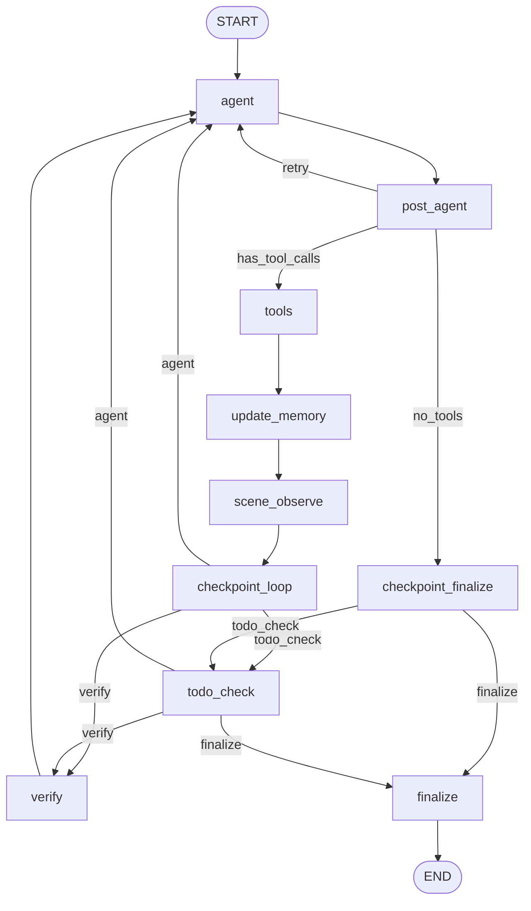

# Visual-Aware Scene Agent Optimization

## Current Gaps

The current workflow has the agent **decide** when to render. In practice, LLMs frequently skip visual checks, hallucinate spatial relationships, and claim completion without evidence. The VIGA reference shows a better pattern: **automated visual feedback** after every scene mutation, with the Verifier analyzing discrepancies from multiple viewpoints.

Key gaps in your current system:

- No automatic scene-camera maintenance; cameras are ad-hoc and agent-controlled
- `verify_node` only runs when explicitly triggered (render path + agent_decision flag)
- The verify prompt is simple match/mismatch; it does not produce structured edit suggestions (camera, objects, layout, environment) like VIGA's Verifier
- No scene-level multi-view rendering that auto-updates as bbox changes
- Agent system prompt doesn't enforce "visual evidence before every claim"

---

## Architecture: New Graph Flow




The key addition is the `**scene_observe**` node between `update_memory` and `checkpoint_loop`. This node runs automatically after tool execution and handles the two-tier camera system.

---

## Task 1: New MCP Tool — `update_scene_cameras`

Add a new tool in `[mcp_server/tools/multimodal/camera_tools.py](mcp_server/tools/multimodal/camera_tools.py)` that the `scene_observe` node calls internally (not agent-invoked).

**What it does:**

1. Calls `get_scene_info` to get all mesh objects and their world bounding boxes
2. Computes the union AABB of all mesh objects (same algorithm as `camera_initialize_viewpoints` in `reference/viga_addon/server.py` lines 783-887)
3. Places 4 cameras at bbox corners with elevation, looking at center — using the FOV-based distance formula from `reference/viga_addon/server.py` lines 353-388:

```python
max_dimension = max(dimensions)
sensor_width = 36.0
fov_horizontal = 2 * math.atan(sensor_width / (2 * focal_mm))
distance = (max_dimension / math.tan(fov_horizontal / 2)) * 1.5
```

1. Renders from all 4 cameras, returns 4 images stitched or as a list
2. Names cameras deterministically: `SceneCamera_NE`, `SceneCamera_NW`, `SceneCamera_SE`, `SceneCamera_SW`
3. These cameras are **recreated each call** (positions update as scene bbox changes)

Register it in `[mcp_server/tool_registry.py](mcp_server/tool_registry.py)` as always-on (no gate), but it is **not** exposed to the agent as a callable tool — it is called by the graph node directly via Blender connection.

---

## Task 2: New Graph Node — `scene_observe`

Add a new node in `[scene_agent/agent/nodes.py](scene_agent/agent/nodes.py)`:

```python
def scene_observe_node(state: AgentState) -> Dict[str, Any]:
```

**Trigger logic** (not every round — only when scene mutated):

- Check `last_tool_batch_names` for scene-mutating tools: `execute_blender_code`, `import_glb_model`, `download_polyhaven_asset`, `generate_trellis2_model`, `import_retrieved_asset`, `download_sketchfab_model`, `generate_infinigen_assets`, any `import_*` or `generate_*`
- If no scene mutation detected, pass through (return empty dict)

**When triggered:**

1. Call `update_scene_cameras` via Blender connection (not MCP tool call — direct runtime call)
2. Get back 4 rendered images (one per scene camera)
3. Stitch into a 2x2 grid or concatenate horizontally
4. Inject as a `HumanMessage` with `image_url` content into state messages
5. Update `persistent_cameras` in state with the 4 camera names
6. Update `last_render_path` with the composite image path
7. Store camera params in `camera_renderings` state field

This ensures the agent **always sees the scene** after mutations without needing to call any tool.

---

## Task 3: Enhanced Verify Node — Structured Feedback

Upgrade `[scene_agent/vlm/verification.py](scene_agent/vlm/verification.py)` `verify_render_with_references()` to return VIGA-style structured feedback.

Change the VLM prompt from simple match/mismatch to structured analysis following `reference/VIGA/tools/verifier_base.py` lines 23-26:

```python
VERIFY_PROMPT = """Analyze discrepancies between the rendered scene and the target. Report:
1) Camera: Are viewpoints adequate? Any occlusions or missing objects in frame?
2) Objects: Are all requested objects present? Any missing/extraneous?
3) Layout: Does spatial arrangement match? Suggest concrete transforms if not.
4) Environment: Lighting, background, ambience match?
5) Overall: match|partial|mismatch status.

Return JSON: {
  "status": "match|partial|mismatch",
  "camera_feedback": "...",
  "object_feedback": "...",
  "layout_feedback": "...",
  "environment_feedback": "...",
  "edit_suggestions": ["concrete suggestion 1", "concrete suggestion 2"],
  "reason": "short summary"
}"""
```

The `verify_node` in `nodes.py` should inject this structured feedback as a `ToolMessage(name="verification")` so the agent reads the detailed edit suggestions and acts on them.

---

## Task 4: Auto-Verify After Scene Observe

Modify the graph routing in `[scene_agent/agent/graph.py](scene_agent/agent/graph.py)`:

Currently: `tools -> update_memory -> checkpoint_loop -> [todo_check | verify | agent]`

New: `tools -> update_memory -> scene_observe -> checkpoint_loop -> [todo_check | verify | agent]`

Adjust `_route_after_loop_checkpoint`:

- If `scene_observe` just produced new renders AND the task has reference images or user text, **always route to verify** before returning to agent
- This makes verification automatic, not opt-in

Wire the new node:

```python
builder.add_node("scene_observe", scene_observe_node)
builder.add_edge("update_memory", "scene_observe")
builder.add_edge("scene_observe", "checkpoint_loop")
```

---

## Task 5: Prompt Overhaul

Rewrite `[scene_agent/agent/prompts.py](scene_agent/agent/prompts.py)` to enforce visual-first workflow:

**Key additions to `SYSTEM_PROMPT`:**

- State that 4 scene cameras are automatically maintained; the agent should NOT create/modify scene cameras
- The agent receives a multi-view composite image after every scene mutation automatically
- Object-level cameras (`camera_act`, `camera_observe`, `render_from_objects`) are for targeted inspection of specific objects
- The agent should use object-level cameras when: focusing on a specific object, checking fine detail, verifying an individual placement
- After verification feedback, the agent should address each issue category (camera, objects, layout, environment)
- Add a rule: "Never claim the scene is correct without reviewing the latest auto-rendered multi-view image"

**Key additions to `ASSET_CREATION_STRATEGY`:**

- Phase 0.5: "After scene grounding, the system will automatically render 4 scene-level views. Review them before planning."
- Phase 1 update: Emphasize `camera_act(action="focus")` and `camera_observe` are for **object-level** inspection, not scene-level (scene-level is automatic)
- Phase 4 (multimodal feedback): "You will automatically receive verification feedback after renders. Address each flagged issue before moving on."

**Update `<agent_decision>` schema:**

- Add `visual_issues_addressed: list[str]` — issues from last verification that were addressed
- Add `next_focus_objects: list[str]` — objects to inspect with object-level cameras next

---

## Task 6: State Schema Updates

In `[scene_agent/agent/state.py](scene_agent/agent/state.py)`, add:

```python
# Scene camera state — updated by scene_observe_node
scene_camera_params: Annotated[dict, merge_dicts]
# { "SceneCamera_NE": {"location": [...], "rotation": [...], "focal_mm": 50.0}, ... }

last_scene_observe_round: NotRequired[int]
# Tool round when scene_observe last rendered (skip if unchanged)

scene_bbox: NotRequired[dict]
# {"center": [x,y,z], "dimensions": [w,h,d]} — union AABB of all mesh objects
```

These enable the `scene_observe_node` to skip re-rendering when bbox hasn't changed.

---

## Task 7: Strategy Prompt Update

In `[mcp_server/tools/strategy.py](mcp_server/tools/strategy.py)` `asset_creation_strategy_text()`:

Add a new Phase 0.5 section after scene grounding:

```
0.5. Automatic scene observation (system-managed):
    - After every scene mutation, 4 scene-level cameras auto-update and render.
    - You will see a multi-view composite image in the conversation.
    - These cameras track the full scene bounding box — do NOT modify them manually.
    - Use camera_act() and camera_observe() only for object-level targeted inspection.
```

---

## Files to Modify


| File                                                                                         | Change                                                                             |
| -------------------------------------------------------------------------------------------- | ---------------------------------------------------------------------------------- |
| `[scene_agent/agent/graph.py](scene_agent/agent/graph.py)`                                   | Add `scene_observe` node, rewire edges                                             |
| `[scene_agent/agent/nodes.py](scene_agent/agent/nodes.py)`                                   | Implement `scene_observe_node`, enhance verify injection                           |
| `[scene_agent/agent/state.py](scene_agent/agent/state.py)`                                   | Add `scene_camera_params`, `last_scene_observe_round`, `scene_bbox`                |
| `[scene_agent/agent/prompts.py](scene_agent/agent/prompts.py)`                               | Overhaul system prompt for visual-first workflow                                   |
| `[scene_agent/vlm/verification.py](scene_agent/vlm/verification.py)`                         | Structured VIGA-style feedback prompt                                              |
| `[mcp_server/tools/multimodal/camera_tools.py](mcp_server/tools/multimodal/camera_tools.py)` | Add `update_scene_cameras()` function                                              |
| `[mcp_server/tools/strategy.py](mcp_server/tools/strategy.py)`                               | Add Phase 0.5 auto-observation section                                             |
| `[mcp_server/tool_registry.py](mcp_server/tool_registry.py)`                                 | No change needed — new function is called internally, not registered as agent tool |


