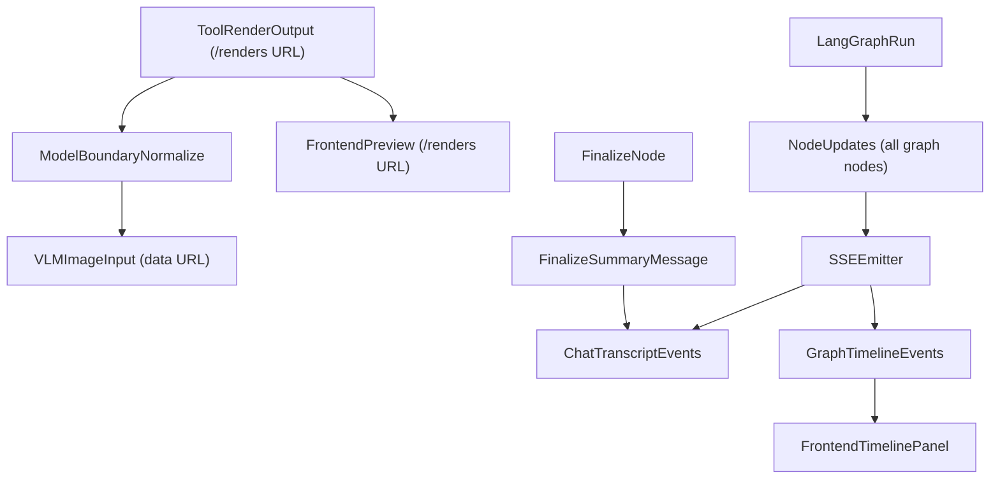

# Fix Render Delivery And Node Visibility

## What Is Confirmed Now

- `verify` currently produces `ToolMessage(name="verification")` in [scene_agent/agent/nodes.py](scene_agent/agent/nodes.py), but stream forwarding can miss non-`messages` payloads once token stream starts in [scene_agent/interfaces/api.py](scene_agent/interfaces/api.py).
- `todo_check` and `finalize` currently update state only (no message objects), so they are not visible in frontend chat flow.
- Most graph nodes in [scene_agent/agent/graph.py](scene_agent/agent/graph.py) are not surfaced as first-class frontend events; current flow is message-centric and loses node-by-node observability.
- Image payloads passed to model-side messages can be relative `/renders/...` URLs or markdown image links, which external VLM providers cannot fetch directly.

## Implementation Plan

1. **Model-bound image normalization (keep frontend light URLs unchanged)**
  - In [scene_agent/agent/nodes.py](scene_agent/agent/nodes.py), add shared helpers to resolve `/renders/<file>` to local render files and convert them to `data:image/...` URLs when preparing VLM-facing `HumanMessage` image blocks.
  - Update `_path_to_data_url`, `_payload_to_data_url`, `_persist_render_image`, and scene-observe image assembly to support `/renders/...` inputs robustly.
  - Preserve existing markdown/`/renders/...` behavior for frontend tool-preview rendering.
2. **Verification path robustness for relative render URLs**
  - In [scene_agent/vlm/verification.py](scene_agent/vlm/verification.py), make `_image_to_data_url` accept `/renders/...` by resolving to local files before `open()`.
  - Ensure verify path works for: local file path, `file://`, `/renders/...`, and already-encoded `data:` URLs.
3. **Generic node-event protocol from backend (low coupling, high extensibility)**
  - In [scene_agent/interfaces/api.py](scene_agent/interfaces/api.py), emit a normalized SSE `graph_node` event for each node update seen in `updates` mode, with fields like `node`, `step_index`, `update_keys`, optional `messages`, and sanitized `state_patch`.
  - Avoid hardcoding node-specific frontend contracts where possible; keep node-specific logic in backend serializer mapping only when necessary for redaction/normalization.
  - Remove/adjust the `saw_message_stream` gate so tool/state messages from `updates/values` are not dropped when token deltas are active.
  - Target coverage for nodes in [scene_agent/agent/graph.py](scene_agent/agent/graph.py): `agent`, `post_agent`, `tools`, `update_memory`, `scene_observe`, `checkpoint_loop`, `checkpoint_finalize`, `todo_check`, `verify`, `finalize` (best-effort where runtime conditions skip nodes).
4. **Finalize user-facing summary message**
  - In [scene_agent/agent/nodes.py](scene_agent/agent/nodes.py), update `finalize_node` to emit a concise assistant-visible summary message of the just-finished build (what was completed, verification/todo status, and finish reason).
  - Keep this summary deterministic and state-derived (no extra model call) to avoid latency/cost regression and maintain reliability.
  - Ensure summary appears in normal chat transcript and also as part of timeline node details.
5. **Frontend timeline panel for full node sequence visibility**
  - Extend stream event typing in [web/src/api/types.ts](web/src/api/types.ts) to include generic `graph_node` events and optional normalized payloads.
  - In [web/src/App.tsx](web/src/App.tsx), parse and store ordered graph events per thread without coupling to specific node names.
  - Add a timeline component (e.g., under [web/src/components](web/src/components)) rendered in [web/src/components/ChatTab.tsx](web/src/components/ChatTab.tsx), with generic fallback rendering for unknown future nodes.
  - Keep chat transcript focused on user/assistant/tool messages while timeline handles execution internals.
6. **Regression coverage + verification checklist**
  - Update/add backend tests in [tests/unit/test_render_image_pipeline.py](tests/unit/test_render_image_pipeline.py) for `/renders/...` -> data URL conversion and verify compatibility.
  - Add stream tests in [tests/integration/test_chat_stream.py](tests/integration/test_chat_stream.py) (and/or unit tests around stream normalization) to assert graph node events are emitted in order and include finalize summary behavior.
  - Add unit tests for `finalize_node` message emission and summary content stability.
  - Manual UI check: timeline reflects node order and status; chat still shows assistant + tool outputs without duplication.
7. **Real GeminiProvider integration test (opt-in, no mock)**
  - Add a new integration test file in [tests/integration](tests/integration) (e.g., `test_vlm_live_gemini.py`) that invokes the real [scene_agent/vlm/providers.py](scene_agent/vlm/providers.py) `GeminiProvider`.
  - Gate execution with `RUN_INTEGRATION=1` and presence of `GEMINI_API_KEY` (or configured `gemini_api_key`) so default test runs remain stable and cost-safe.
  - Build a tiny deterministic image fixture at runtime (e.g., red square on white background), pass it as an `image_url` data URL, and enforce:
    - **Reachability assertion**: provider call succeeds and returns parseable non-empty response.
    - **Minimal semantic assertion**: structured response correctly identifies core attribute (e.g., dominant color is red and shape is square) with tolerant matching rules.
  - Keep prompt strict JSON-only to reduce flaky parsing and include retry-safe diagnostics on assertion failures.

## Live Test Guardrails

- Real-provider tests are integration-only and opt-in by env flags.
- Test should skip (not fail) when credentials are absent.
- Assertions should be minimal but meaningful to avoid fragile model-behavior coupling.

## Data Flow (After Change)

