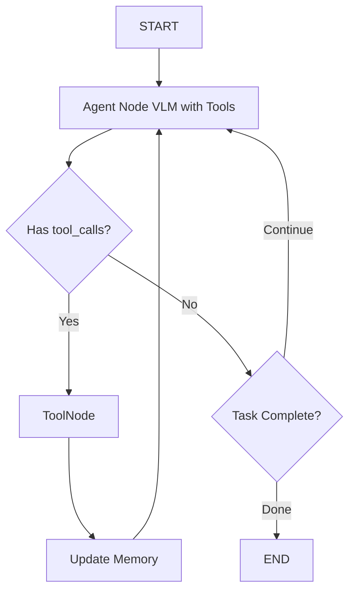

# 3D Scene Agent Framework Implementation

## Architecture Overview

The agent uses a **LangGraph state machine** following best practices with proper state reducers, checkpointing, and streaming. The core VLM drives decision-making with native tool binding, and the agent maintains persistent scene state across sessions.

**LangGraph Best Practices Applied:**

- TypedDict state with `Annotated` reducers for proper state management
- Native MCP integration via `langchain-mcp-adapters` (see [GitHub](https://github.com/langchain-ai/langchain-mcp-adapters))
- MemorySaver checkpointing for state persistence across sessions
- Streaming support with `.astream()` for real-time updates
- ToolNode for automatic tool execution following LLM calls
- Proper message handling with LangChain message types
- **Simplified architecture**: Perception and rendering are tools, not separate nodes



**Key Insight**: `get_scene_info`, `render_from_camera`, and other perception/rendering operations are **tools** that the agent chooses when to call, not hardcoded nodes in the graph.

## Project Structure

```
3DSceneAgent/
├── agent/
│   ├── graph.py          # LangGraph state machine
│   ├── state.py          # State definitions (TypedDict)
│   ├── nodes.py          # Node implementations
│   └── prompts.py        # System prompts for VLM
├── tools/
│   ├── blender_tools.py  # MCP tool wrappers
│   └── base.py           # Tool base classes
├── memory/
│   ├── scene_memory.py   # Object tracking (ID/Name/Position/Size)
│   └── camera_memory.py  # Camera rendering history
├── rag/
│   ├── retriever.py      # BPY script retrieval (placeholder)
│   └── vector_store.py   # ChromaDB/FAISS wrapper
├── vlm/
│   ├── providers.py      # OpenAI/Anthropic/Gemini clients
│   └── base.py           # Abstract VLM interface
├── interfaces/
│   ├── cli.py            # Command-line interface
│   └── api.py            # FastAPI REST server
├── config.py             # Configuration management
├── requirements.txt      # Dependencies
└── main.py              # Entry point
```

## LangGraph Best Practices Applied

This implementation follows official LangGraph best practices from [langchain-mcp-adapters](https://github.com/langchain-ai/langchain-mcp-adapters):

1. **State Management**: TypedDict with Annotated reducers (`add_messages`, custom merge functions)
2. **Native MCP Integration**: Use `langchain-mcp-adapters` for seamless Blender connection
3. **Standard Agent Pattern**: Agent-Tools loop where agent decides when to perceive/render
4. **Checkpointing**: MemorySaver for state persistence and session management
5. **Streaming**: `.astream()` for real-time responses in CLI and API
6. **ToolNode**: Built-in tool execution with `tools_condition` routing
7. **Proper Graph Construction**: Explicit START/END, conditional routing, partial state updates
8. **Message Types**: LangChain message classes (HumanMessage, AIMessage, ToolMessage)

## Implementation Steps

### 1. Core State and Memory ([agent/state.py](agent/state.py), [memory/](memory/))

**State Schema (LangGraph Best Practice - TypedDict with Reducers):**

```python
from typing import TypedDict, Annotated, Sequence
from langchain_core.messages import BaseMessage
from langgraph.graph.message import add_messages
from operator import add

class TodoItem(TypedDict):
    """Individual todo item for task tracking"""
    id: str
    description: str
    status: str  # "pending" | "in_progress" | "completed" | "failed"
    created_at: str
    completed_at: str | None

class AgentState(TypedDict):
    # Messages with built-in reducer for proper message accumulation
    messages: Annotated[Sequence[BaseMessage], add_messages]
    
    # Scene objects - merges dicts, allowing incremental updates
    scene_objects: Annotated[dict, lambda x, y: {**x, **y}]
    
    # Persistent cameras - uses add operator for list accumulation
    persistent_cameras: Annotated[list[str], add]
    
    # Camera renderings - merge strategy for dict updates
    camera_renderings: Annotated[dict, lambda x, y: {**x, **y}]
    
    # Todo tracking - merge by id for task management
    todos: Annotated[list[TodoItem], lambda x, y: merge_todos(x, y)]
    
    # Simple fields (last write wins)
    current_task: str
    iteration_count: int
    last_error: str | None

def merge_todos(existing: list[TodoItem], new: list[TodoItem]) -> list[TodoItem]:
    """Merge todos by id, updating existing ones with same id"""
    todo_dict = {todo["id"]: todo for todo in existing}
    for todo in new:
        todo_dict[todo["id"]] = todo
    return list(todo_dict.values())
```

**Key Benefits:**

- `add_messages` reducer properly handles message history with tool calls
- Custom reducers prevent state overwrites, enable incremental updates
- `merge_todos` allows updating specific todos without overwriting the entire list
- Type hints improve IDE support and catch errors early

**Memory Classes:**

- `SceneMemory`: Tracks objects from `get_scene_info()` results, structured as dict
- `CameraMemory`: Stores renderings with timestamps, auto-prunes old entries
- `TodoManager`: Creates, updates, and tracks todos for complex tasks

### 2. VLM Provider Abstraction ([vlm/](vlm/))

**Base Interface:** Abstract class with `generate()` method accepting messages + images

**Providers:**

- `OpenAIProvider`: Uses `gpt-4o` with vision support
- `AnthropicProvider`: Uses `claude-3.5-sonnet` or `claude-4`
- `GeminiProvider`: Uses `gemini-2.0-flash`

**Configuration:** Environment variables `VLM_PROVIDER` and `VLM_API_KEY`

### 3. Tool Integration with Native MCP Support ([tools/blender_tools.py](tools/blender_tools.py))

**LangGraph Best Practice: Use `langchain-mcp-adapters`**

Based on the [official langchain-mcp-adapters](https://github.com/langchain-ai/langchain-mcp-adapters), connect to the Blender MCP server:

```python
from langchain_mcp_adapters.client import MultiServerMCPClient
from langchain_mcp_adapters.tools import load_mcp_tools

# Option 1: Single server (if Blender is the only MCP server)
from mcp import ClientSession
from mcp.client.streamable_http import streamablehttp_client

async with streamablehttp_client("http://localhost:9876/mcp") as (read, write, _):
    async with ClientSession(read, write) as session:
        await session.initialize()
        tools = await load_mcp_tools(session)

# Option 2: Multiple servers (if you have Blender + other MCP servers)
client = MultiServerMCPClient({
    "blender": {
        "transport": "http",
        "url": "http://localhost:9876/mcp"
    }
})
tools = await client.get_tools()
```

**Available Tools (auto-discovered from MCP server):**

All tools from [reference/server.py](reference/server.py) become available:

- **Perception tools**: `get_scene_info`, `get_object_info`, `get_viewport_screenshot`
- **Rendering tools**: `render_from_objects`, `render_from_camera`
- **Asset management**: `search_polyhaven_assets`, `download_polyhaven_asset`, `set_texture`, `search_3d_assets_by_text`, `import_retrieved_asset`, `generate_trellis2_model`
- **Camera tools**: `create_camera_from_objects`, `create_camera_from_params`
- **Code execution**: `execute_blender_code` (with RAG integration hook)

**Benefits:**

- No manual tool wrapping needed
- Automatic schema validation from MCP
- Native error handling
- The agent decides when to perceive/render (not hardcoded)

### 4. LangGraph State Machine ([agent/graph.py](agent/graph.py), [agent/nodes.py](agent/nodes.py))

**Simplified Architecture: Standard Agent-Tools Pattern**

Following [langchain-mcp-adapters examples](https://github.com/langchain-ai/langchain-mcp-adapters#using-with-langgraph-stategraph), we use the standard LangGraph agent pattern where the agent decides which tools to call (including perception/rendering).

**Node Implementations:**

1. **Agent Node** - VLM reasoning with all tools bound
```python
def agent_node(state: AgentState) -> dict:
    """VLM with bound tools - decides when to perceive, render, manipulate"""
    llm_with_tools = llm.bind_tools(tools)
    response = llm_with_tools.invoke(state["messages"])
    return {"messages": [response]}
```

2. **ToolNode** - Automatic tool execution (built-in)
```python
from langgraph.prebuilt import ToolNode
tool_node = ToolNode(tools)  # Executes any tool the agent calls
```

3. **Update Memory Node** - Parse tool results and update scene state
```python
def update_memory_node(state: AgentState) -> dict:
    """Parse messages to extract scene updates from tool results"""
    last_messages = state["messages"][-10:]  # Recent messages
    
    # Parse scene_objects from get_scene_info results
    scene_updates = {}
    for msg in last_messages:
        if isinstance(msg, ToolMessage):
            if "get_scene_info" in msg.name:
                scene_updates = parse_scene_info(msg.content)
    
    # Check for todo updates in assistant messages
    # Agent can include todo updates in structured format
    todo_updates = extract_todo_updates(last_messages)
    
    result = {}
    if scene_updates:
        result["scene_objects"] = scene_updates
    if todo_updates:
        result["todos"] = todo_updates
    
    return result
```


**Routing Functions:**

```python
def should_continue(state: AgentState) -> str:
    """Route based on whether agent has tool_calls"""
    messages = state["messages"]
    last_message = messages[-1]
    
    # If agent wants to call tools, go to tools node
    if hasattr(last_message, "tool_calls") and last_message.tool_calls:
        return "tools"
    
    # Otherwise, we're done
    return END
```

**Graph Construction (Following langchain-mcp-adapters Pattern):**

```python
from langgraph.graph import StateGraph, START, END, MessagesState
from langgraph.prebuilt import ToolNode, tools_condition
from langgraph.checkpoint.memory import MemorySaver
from langchain.chat_models import init_chat_model

# Initialize model and tools
model = init_chat_model("openai:gpt-4o")

# Load MCP tools (including perception/rendering)
from langchain_mcp_adapters.client import MultiServerMCPClient
client = MultiServerMCPClient({
    "blender": {
        "transport": "http",
        "url": "http://localhost:9876/mcp"
    }
})
tools = await client.get_tools()

# Define agent node
def call_model(state: AgentState):
    response = model.bind_tools(tools).invoke(state["messages"])
    return {"messages": [response]}

# Build graph
builder = StateGraph(AgentState)
builder.add_node("agent", call_model)
builder.add_node("tools", ToolNode(tools))
builder.add_node("update_memory", update_memory_node)

# Connect nodes
builder.add_edge(START, "agent")
builder.add_conditional_edges(
    "agent",
    tools_condition,  # Built-in: routes to "tools" if tool_calls exist
)
builder.add_edge("tools", "update_memory")
builder.add_edge("update_memory", "agent")

# Compile with checkpointing
memory = MemorySaver()
app = builder.compile(checkpointer=memory)
```

### 5. System Prompts ([agent/prompts.py](agent/prompts.py))

**Main System Prompt:**

```
You are an expert 3D artist and Blender specialist with deep knowledge of:
- 3D scene composition, lighting, and camera placement
- Blender's Python API (bpy) for procedural modeling
- Spatial reasoning and object placement in 3D space
- Materials, textures, and PBR workflows

Your capabilities:
- Understand and analyze 3D scenes from rendered images
- Use tools to search, import, and manipulate 3D assets
- Write and execute BPY scripts for complex operations
- Create cameras and render scenes from multiple viewpoints

Guidelines for tool usage:
- Use get_scene_info() when you need to check current scene state
- Use render_from_camera() or render_from_objects() to visualize results
- Verify object bounding boxes to prevent clipping/overlap
- Prefer asset libraries (Retrieval/PolyHaven/TRELLIS2) over procedural generation
- Use execute_blender_code() only when necessary, with retrieved examples
- Create persistent cameras to monitor scene from multiple angles

Task planning and tracking (IMPORTANT):
For complex tasks (3+ steps), break them down into subtasks:

1. At the start of a complex task, create a plan:
   <todos>
   - [pending] Import wooden table model
   - [pending] Position table at origin
   - [pending] Add coffee cup on table
   - [pending] Set up lighting and camera
   - [pending] Render final scene
   </todos>

2. As you work, update todo status in your responses:
   <todos>
   - [completed] Import wooden table model
   - [in_progress] Position table at origin
   - [pending] Add coffee cup on table
   - [pending] Set up lighting and camera
   - [pending] Render final scene
   </todos>

3. Mark items as completed, in_progress, or failed as you go
4. If a todo fails, create new todos to fix the issue

This helps track progress and makes your reasoning transparent.

Remember: You decide when to perceive and render - not every step requires it.
Only call tools when you need information or want to take action.
```

**Include asset_creation_strategy prompt** from [reference/server.py](reference/server.py) lines 908-965

### 6. RAG System Placeholder ([rag/](rag/))

**Structure:**

- `vector_store.py`: ChromaDB wrapper with methods `add_documents()`, `search()`
- `retriever.py`: `retrieve_bpy_examples(query, top_k=3)` returns relevant code snippets

**Placeholder Implementation:**

- Empty vector store with TODO comments
- Mock retrieval that returns generic BPY template
- Documentation on how to add BPY docs later (embedding + ingestion pipeline)

### 7. Interfaces with Streaming Support

**CLI with Streaming ([interfaces/cli.py](interfaces/cli.py)):**

```python
# LangGraph Best Practice: Use .astream() for streaming
async def run_cli():
    config = {"configurable": {"thread_id": "cli-session"}}
    
    while True:
        user_input = input("You: ")
        
        # Stream responses
        async for event in app.astream(
            {"messages": [HumanMessage(content=user_input)]},
            config=config
        ):
            if "agent" in event:
                print(event["agent"]["messages"][-1].content)
                
                # Display current todos if they exist
                state = event.get("agent", {})
                if "todos" in state:
                    display_todos(state["todos"])
                    
            elif "render" in event:
                display_image(event["render"]["camera_renderings"])

def display_todos(todos: list[TodoItem]):
    """Pretty print current todo list with status"""
    if not todos:
        return
    
    print("\n📋 Task Progress:")
    for todo in todos:
        status_icon = {
            "pending": "⏳",
            "in_progress": "🔄",
            "completed": "✅",
            "failed": "❌"
        }.get(todo["status"], "❓")
        print(f"  {status_icon} {todo['description']}")
```

**Features:**

- Interactive REPL with streaming responses
- Commands: `/new` (new scene), `/render`, `/cameras`, `/save`, `/load`, `/exit`
- Display images inline (iTerm2) or save to disk
- Thread-based session persistence

**API with Streaming ([interfaces/api.py](interfaces/api.py)):**

```python
from fastapi import FastAPI
from fastapi.responses import StreamingResponse

@app.post("/chat")
async def chat_stream(message: str, thread_id: str):
    async def event_stream():
        config = {"configurable": {"thread_id": thread_id}}
        async for event in app.astream(
            {"messages": [HumanMessage(content=message)]},
            config=config
        ):
            yield json.dumps(event) + "\n"
    
    return StreamingResponse(event_stream(), media_type="text/event-stream")
```

**Endpoints:**

- `POST /chat`: Streaming SSE endpoint
- `GET /scene/{thread_id}`: Get scene state for session
- `GET /todos/{thread_id}`: Get current todos for session
- `GET /threads`: List all sessions
- `POST /checkpoint/{thread_id}`: Save checkpoint
- `WebSocket /ws`: Real-time bidirectional streaming

### 8. Configuration ([config.py](config.py))

**Environment Variables:**

- `VLM_PROVIDER`: openai|anthropic|gemini (default: openai)
- `VLM_API_KEY`: API key for chosen provider
- `VLM_MODEL`: Optional model override
- `BLENDER_HOST`: localhost (default)
- `BLENDER_PORT`: 9876 (default)
- `RETRIEVAL_API_HOST`: localhost (default)
- `RETRIEVAL_API_PORT`: 8001 (default)
- `RAG_ENABLED`: true|false (default: false for placeholder)

**Settings Class:** Pydantic BaseSettings for validation

### 9. Dependencies ([requirements.txt](requirements.txt))

```
# LangGraph ecosystem (with MCP support)
langgraph>=0.2.50
langchain>=0.3.0
langchain-core>=0.3.0
langchain-mcp-adapters>=0.2.0  # Native MCP adapter - see https://github.com/langchain-ai/langchain-mcp-adapters
langchain-openai>=0.2.0
langchain-anthropic>=0.3.0
langchain-google-genai>=2.0.0

# API and interfaces
fastapi>=0.115.0
uvicorn>=0.32.0
websockets>=12.0

# Configuration and utilities
pydantic>=2.10.0
pydantic-settings>=2.6.0
python-dotenv>=1.0.0

# RAG and embeddings
chromadb>=0.5.0
langchain-community>=0.3.0

# Image handling
pillow>=11.0.0

# CLI output
rich>=13.9.0

# Utilities
requests>=2.32.0
aiohttp>=3.9.0
```

### 10. Entry Point ([main.py](main.py))

```python
import argparse

def main():
    parser = argparse.ArgumentParser()
    parser.add_argument("--mode", choices=["cli", "api"], default="cli")
    parser.add_argument("--host", default="0.0.0.0")
    parser.add_argument("--port", type=int, default=8000)
    args = parser.parse_args()
    
    if args.mode == "cli":
        from interfaces.cli import run_cli
        run_cli()
    else:
        from interfaces.api import run_api
        run_api(host=args.host, port=args.port)
```

## Key Design Decisions

1. **Standard Agent Pattern**: Perception/rendering are tools (not nodes), agent decides when to call them
2. **Task Planning & Tracking**: Agent creates and maintains todos for complex tasks, inspired by coding agent best practices
3. **LangGraph Best Practices**: TypedDict state with reducers, ToolNode, checkpointing, streaming
4. **Native MCP Integration**: Use `langchain-mcp-adapters` following [official examples](https://github.com/langchain-ai/langchain-mcp-adapters)
5. **Modular VLM**: Abstract provider interface allows swapping models without changing agent logic
6. **State Reducers**: `add_messages`, `merge_todos`, and custom reducers prevent state overwrites
7. **Checkpointing**: MemorySaver enables session persistence and debugging
8. **Scene Memory**: Parse tool results to track scene state (not hardcoded perception)
9. **Streaming First**: `.astream()` for real-time user feedback, including todo updates in both CLI and API
10. **RAG Placeholder**: Future-proof design without blocking current development

## Testing Strategy

- Unit tests for each node
- Todo management tests (create, update, complete, fail)
- Integration test with mock Blender responses
- End-to-end test with actual Blender connection (requires Blender running)
- VLM provider tests with mock responses
- Test complex multi-step tasks to verify todo tracking

Please record the requirements and dump the development progress in a single concise file, don't create any other markdown/txt docs/files.