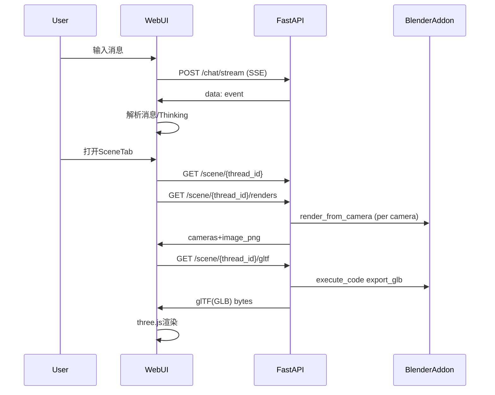

# Web Chat + Scene UI Plan

## Architecture Summary

- Frontend: Vite + React + TypeScript in `3DSceneAgent/web/`, localStorage 维护对话与设置，SSE 接收流式消息，three.js 渲染 glTF 场景。
- Backend: 在 `interfaces/api.py` 增加 scene 专用接口（渲染相机图、导出 glTF），复用 Blender socket 命令（通过 `execute_code` 导出 glTF）。

## Backend changes

- Add scene helper functions in [`interfaces/api.py`](interfaces/api.py) (or a small new helper module if needed) to:
  - 获取相机列表：调用 `get_scene_info` 并筛出 `type == "CAMERA"` 的对象。
  - 渲染相机图：循环 `render_from_camera`，返回 `{camera_name, image_base64}` 列表。
  - 导出场景 glTF：通过 `execute_code` 调用 `bpy.ops.export_scene.gltf` 生成 `GLB`，FastAPI 以 `model/gltf-binary` 返回文件。
- New endpoints (names可微调):
  - `GET /scene/{thread_id}/renders` → 返回所有相机的 PNG（base64）。
  - `GET /scene/{thread_id}/gltf` → 返回 GLB 文件流。
- Keep existing `/scene` and `/todos` for SceneTab info display.

## Frontend structure (Vite)

- Create `web/` app with:
  - `web/src/api/client.ts` 统一封装 API（SSE + REST），支持可配置 base URL。
  - `web/src/state/` 轻量状态（useState/useReducer + localStorage）。
  - `web/src/components/`：
    - `ChatLayout` (侧栏 + 主区)
    - `ThreadList` (新建/删除/切换)
    - `ChatTab` + `SceneTab` (tabs)
    - `MessageList`, `MessageItem`, `ThinkingBlock`
    - `SceneInfoPanel`, `TodosPanel`, `RenderGallery`, `GltfViewer`
  - `web/src/theme.css` 使用 CSS 变量实现优雅主题（默认深色 + 可切换配色）。

## Streaming + Thinking parsing

- SSE 读取 `/chat/stream`：
  - 参照 CLI 去重策略：对 `event.messages` 取最后一条 `content`，hash 去重。
  - 解析 `<thinking>...</thinking>` 标签（大小写兼容），内容折叠显示。
  - 保留 assistant 的最终回答文本用于主消息显示。

## Scene Tab behavior

- Scene 信息：调用 `/scene/{thread_id}` 展示对象结构、相机列表。
- Todos：调用 `/todos/{thread_id}` 并与 SSE 推送增量合并。
- Render 图像：点击按钮触发 `/scene/{thread_id}/renders` 并在 `RenderGallery` 中展示。
- GLTF 预览：点击按钮拉取 `/scene/{thread_id}/gltf`，通过 three.js `GLTFLoader` 加载。
- 环境光：提供 2-3 个内置光照预设（如 Studio/Warm/Cool），切换时更新 `AmbientLight` + `DirectionalLight` 配置。

## Implementation todos

- **backend-scene-api**: 在 `interfaces/api.py` 添加 scene 渲染/导出接口与 Blender 调用逻辑。
- **frontend-scaffold**: 初始化 `web/` Vite React TS 工程与基础页面结构。
- **frontend-chat**: 实现聊天流式 UI、Thinking 折叠、对话管理（localStorage）。
- **frontend-scene**: 实现 SceneTab（scene info、todos、渲染图、glTF viewer）。
- **theme-settings**: 设置页（backend URL、主题/配色）并持久化。