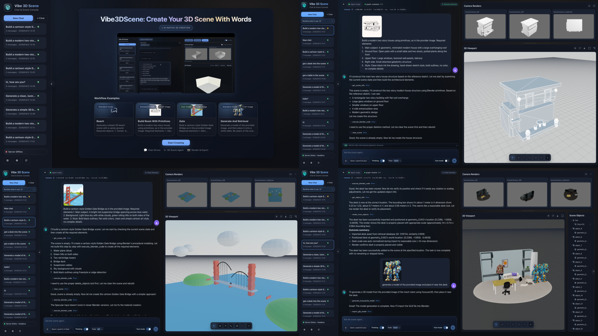
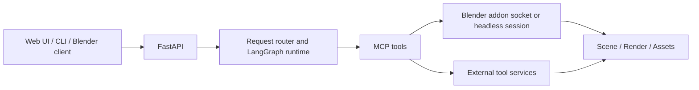

# Vibe3DScene: Vibe Creating Your Own 3D Scene With Words Anywhere

<p align="center">
  <a href="https://3dsceneagent.github.io/vibe3dscene/">
    
  </a>
  <a href="./LICENSE">
    
  </a>
  <a href="https://hub.docker.com/r/fishwowater/scene-agent-api">
    
  </a>
  <a href="https://youtu.be/rnZelKViTbk">
    
  </a>
  <a href="https://vibe3dscene.vercel.app">
    
  </a>
</p>




## Table of Contents
- [1. Overview](#1-overview)
- [2. Quickstart](#2-quickstart)
- [3. Repository Structure](#3-repository-structure)
- [4. Documentation Map](#4-documentation-map)
- [5. Acknowledgements](#5-acknowledgements)
- [License](#license)
- [Contributing](#contributing)

## 1. Overview

### Video Demo


### Introduction

Vibe3DScene is a Blender-connected 3D scene agent built around a modular LangGraph runtime, MCP tools, and web/API/CLI interfaces.

- From the workflow perspective, the project now uses a router-driven agentic runtime that can choose between `direct_mode` and `plan_mode`, manage todos explicitly, run in `fast_mode` when full verification is unnecessary, and optionally switch into an experimental dual-agent topology.
- From the systems perspective, the backend can run Blender in `headless` mode behind an API or pair with a local Blender client. Redis-backed ownership, checkpointing, and persisted session state support single-worker and multi-worker deployments.
- From the tooling perspective, the MCP layer unifies scene control, rendering, retrieval, reconstruction, and 3D generation tools, while external tool servers are decoupled into the sibling `3DAgentTools` stack.

### High-Level Runtime



For the exact runtime graph and deployment topologies, see:

- [Runtime Workflow](./docs/architecture/runtime-workflow.md)
- [System Architecture](./docs/architecture/system-architecture.md)
- [Roadmap](./docs/roadmap.md)
- [How This Differs from `blender-mcp + cc`](./docs/differ_from_blendermcp+cc.md)
- [CHANGELOG](./CHANGELOG.md)

## 2. Quickstart

### 2.1 Prerequisites

- Python 3.11+
- Blender 3.6+
- Node.js 18+ for the frontend
- Redis for recommended persistence and multi-worker coordination
- Docker if you want to run external tool services in containers

### 2.2 Install

```bash
git clone --recurse-submodules https://github.com/3DSceneAgent/Vibe3DScene
cd Vibe3DScene

python -m venv .venv
source .venv/bin/activate
pip install -r requirements.txt

cp .env.example .env
# fill in provider keys and runtime configuration
```

If you also want the optional external tool stack:

```bash
git clone --recurse-submodules https://github.com/3DSceneAgent/3DAgentTools ../3DAgentTools
```

### 2.3 Common Run Modes

| Goal | Command |
| --- | --- |
| Run API in headless mode | `./scripts/run_headless.sh` |
| Run API for a local Blender client | `./scripts/run_local_client.sh` |
| Run API manually | `python main.py --mode api --port 8000` |
| Run CLI | `python main.py --mode cli` |
| Run frontend dev server | `cd web && npm install && npm run dev` |
| Run tests | `pytest` |

After the backend starts, open the web app and point it at `http://localhost:8000`.

If you want single-agent `verify` to add internal geometry penetration checks on top of the existing VLM visual check, enable:

- `SCENE_AGENT_ENABLE_PENETRATION_VERIFY=true`
- optional tuning via `SCENE_AGENT_PENETRATION_THRESHOLD_M` (default `0.02`), `SCENE_AGENT_PENETRATION_MAX_CANDIDATE_PAIRS`, and `SCENE_AGENT_PENETRATION_MAX_REPORTED_PAIRS`

### 2.4 Setup References

- Installation, runtime modes, single-worker and multi-worker startup: [Startup and Deployment Guide](./docs/deployment/startup-and-deployment.md)
- Tool servers and external services: [Tool Servers](./docs/deployment/tool-servers.md)
- MCP server, tool categories, and gating: [MCP Server and Tools](./docs/integrations/mcp-server-and-tools.md)
- Environment variables and provider configuration: [Configuration Reference](./docs/reference/configuration.md)
- Major project version updates: [CHANGELOG](./CHANGELOG.md)
- Near-term priorities and known issues: [Roadmap](./docs/roadmap.md)
- Design discussion versus `blender-mcp + cc`: [How This Differs from `blender-mcp + cc`](./docs/differ_from_blendermcp+cc.md)

## 3. Repository Structure

```text
scene_agent/     Core runtime: graph, sessions, memory, providers, API/CLI
mcp_server/      MCP server runtime, tool gating, and tool registry
web/             React + TypeScript frontend (Vite)
addon/           Blender addon code and packaging for headless runtime support
tests/           Unit, integration, contract, and manual test suites
scripts/         Local helpers, smoke tests, validation, and cleanup tools
../3DAgentTools/ Optional sibling checkout for external tool services
```

## 4. Documentation Map

- [Runtime Workflow](./docs/architecture/runtime-workflow.md)
  - Exact runtime graph, state flow, `direct_mode` vs `plan_mode`, single-agent vs dual-agent, evaluator behavior, image routing, and persistence touchpoints.
- [System Architecture](./docs/architecture/system-architecture.md)
  - High-level layers, single-worker vs multi-worker deployment, owner-proxy behavior, Redis coordination, and persisted sessions.
- [Startup and Deployment Guide](./docs/deployment/startup-and-deployment.md)
  - Local setup, macOS/Linux prerequisites, single-worker and multi-worker startup flows, and Docker entry points.
- [MCP Server and Tools](./docs/integrations/mcp-server-and-tools.md)
  - MCP server role, tool categories, runtime gating, mode constraints, and optional external services.
- [Tool Servers](./docs/deployment/tool-servers.md)
  - External `3DAgentTools` stack, expected services, startup options, and host/port coordination.
- [Configuration Reference](./docs/reference/configuration.md)
  - Provider, API, session, persistence, tool, and frontend-related environment variables.
- [Roadmap](./docs/roadmap.md)
  - Near-term workflow improvements, product expansion directions, local-client priorities, and currently known UI/runtime issues.
- [How This Differs from `blender-mcp + claude code`](./docs/differ_from_blendermcp+cc.md)
  - Design differences in agent orchestration, headless execution, multimodal tooling, and web-side editing support.
- [CHANGELOG](./CHANGELOG.md)
  - Date-based summary of major updates.

## 5. Acknowledgements

- [Blender-MCP](https://github.com/ahujasid/blender-mcp)
- [VIGA](https://github.com/Fugtemypt123/VIGA)
- [LangGraph](https://github.com/langchain-ai/langgraph)
- [LangChain](https://github.com/langchain-ai/langchain)
- [FastAPI](https://fastapi.tiangolo.com/)
- [Model Context Protocol (MCP)](https://modelcontextprotocol.io/)
- [langchain-mcp-adapters](https://github.com/langchain-ai/langchain-mcp-adapters)
- [Blender](https://www.blender.org/)
- [PolyHaven](https://polyhaven.com/)
- [TRELLIS.2](https://github.com/microsoft/TRELLIS.2)
- [Sketchfab](https://sketchfab.com/)
- [Hyper3D Rodin](https://hyper3d.ai/)
- [Tripo AI](https://www.tripo3d.ai/)

## License

Apache License 2.0. See [LICENSE](./LICENSE).

## Contributing

Please read [CONTRIBUTING.md](./CONTRIBUTING.md) before opening pull requests.
