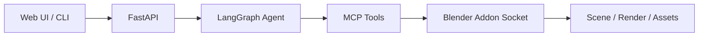

# 3DSceneAgent

[](#1-overview)
[](https://github.com/3DSceneAgent/3DSceneAgent/stargazers)
[](./LICENSE)
[](#1-overview)

LangGraph-based 3D scene agent for Blender. It accepts natural-language scene requests, orchestrates MCP tools, and can run with either an existing Blender client (`local-client`) or auto-managed Blender sessions (`headless`).

## Table of Contents
- [1. Overview](#1-overview)
- [2. Installation and Backend Setup](#2-installation-and-backend-setup)
- [3. Supported Tools and Tool Servers](#3-supported-tools-and-tool-servers)
- [4. Usage Modes](#4-usage-modes)
- [5. Frontend](#5-frontend)
- [6. Core Environment Variables](#6-core-environment-variables)
- [7. Acknowledgements](#7-acknowledgements)
- [License](#license)
- [Contributing](#contributing)

## 1. Overview

### Website and Demo
- Website: add your project website link here.
- Demo Page: add your public demo link here.
- YouTube: add your YouTube demo link here.

MP4 placeholder (replace `YOUR_DEMO_VIDEO.mp4` with your real file path or URL):

<video controls preload="metadata" width="100%">
  <source src="YOUR_DEMO_VIDEO.mp4" type="video/mp4" />
  Your browser does not support the video tag.
</video>

### High-Level Flow



Detailed workflow and deployment diagrams:
- [Agentic Workflow and Deployment Topologies](./docs/architecture/agentic-workflow.md)
- [Multiprocess Migration Plan](./docs/architecture/multiprocess-migration-plan.md)

### Repository Structure

```text
scene_agent/     Core runtime: agent graph, sessions, VLM providers, API/CLI
mcp_server/      MCP server runtime and tool registry
web/             React + TypeScript frontend (Vite)
addon/           Blender addon
tool_servers/    Dockerized TRELLIS2 / Retrieval / PCG services
scripts/         Local launch helpers (headless/local-client)
tests/           Unit / integration / contract / manual tests
```

## 2. Installation and Backend Setup

### Prerequisites
- Python 3.10+
- Blender 3.6+
- Node.js 18+ (required for frontend only)
- Redis (recommended for headless multi-worker/session coordination)
- Docker (optional, for tool servers)

### Install Python Dependencies

```bash
python -m venv .venv
source .venv/bin/activate
pip install -r requirements.txt
```

### Download Blender 4.2 (Cached)

Use the helper script to download Blender release packages with cache reuse.
Supported targets: `macos-x64`, `linux-x86-64`.

```bash
# auto-detect host platform (only macos-x64 / linux-x86-64)
python scripts/download_blender_4_2.py

# explicitly download macOS x64 package (cached in ~/.cache/3dsceneagent/blender)
python scripts/download_blender_4_2.py --platform macos-x64
```

For Docker multiprocess builds, set:
- `INSTALL_BLENDER=true`
- `BLENDER_VERSION=4.2.15`

Note: Docker multiprocess workers are pinned to `linux/amd64` and install Blender `linux-x86-64` only.

### Configure Environment

```bash
cp .env.example .env
```

Minimum required environment variables:

| Variable | Description |
| --- | --- |
| `VLM_PROVIDER` | Default model provider (`openai`, `anthropic`, `gemini`). |
| `OPENAI_API_KEY` / `ANTHROPIC_API_KEY` / `GEMINI_API_KEY` | Provider API key. You can also use `VLM_API_KEY` as fallback. |
| `BLENDER_MODE` | `local-client` or `headless`. |
| `API_PORT` | API bind port (default `8000`). |

Recommended for headless mode:

| Variable | Description |
| --- | --- |
| `REDIS_URL` | Redis control-plane URL for ownership/checkpoint/session coordination. |
| `BLENDER_HEADLESS_CMD` | Blender executable command (default `blender`). |
| `BLENDER_HEADLESS_ARGS` | Command template to start headless addon server. |
| `SESSION_SHARED_STORAGE_ROOT` | Persistent per-thread `.blend` storage root. |

### Run Backend

Run single API worker directly (current baseline):

```bash
cd /Users/fishwowater/projects/3DSceneAgent
python main.py --mode api --host 0.0.0.0 --port 8000 --workers 1
```

Run multi-worker deployment (Docker + owner-proxy):

```bash
cd /Users/fishwowater/projects/3DSceneAgent
cp docker/.env.multiprocess.example docker/.env.multiprocess
# edit docker/.env.multiprocess and set provider/API key
docker compose -f docker-compose.multiprocess.yml up --build
```

Run multi-worker deployment on macOS without Docker gateway (nginx + local workers):

```bash
cd /Users/fishwowater/projects/3DSceneAgent
./scripts/run_multiprocess_nginx_local.sh
# stop
./scripts/stop_multiprocess_nginx_local.sh
```

Notes for macOS local multiprocess:
- Script loads env from `docker/.env.multiprocess` first (or `.env` if not found).
- You can override env source via `SCENE_AGENT_ENV_FILE=/path/to/env`.
- If Blender binary is missing on macOS x64, it auto-downloads cached DMG and prompts you to install it.

Smoke test (recommended after startup):

```bash
# health + owner/proxy + mcp-tools
python scripts/smoke_multiprocess_local.py --gateway-url http://127.0.0.1:18000 --worker1-url http://127.0.0.1:18001 --worker2-url http://127.0.0.1:18002 --skip-chat

# include /chat
python scripts/smoke_multiprocess_local.py --gateway-url http://127.0.0.1:18000 --worker1-url http://127.0.0.1:18001 --worker2-url http://127.0.0.1:18002
```

or use helper scripts:

```bash
# Default BLENDER_MODE=headless
./scripts/run_headless.sh

# Default BLENDER_MODE=local-client
./scripts/run_local_client.sh
```

Run CLI:

```bash
python main.py --mode cli
```

## 3. Supported Tools and Tool Servers

### MCP Tool Categories

| Category | Tools |
| --- | --- |
| Scene inspection and control | `get_scene_info`, `get_object_info`, `get_viewport_screenshot`, `execute_blender_code`, `import_glb_model` |
| Camera and rendering | `render_from_objects`, `render_from_camera`, `camera_observe`, `camera_act`, `camera_set_pose` |
| Session persistence | `undo_last_snapshot`, `get_session_persistence_status` |
| PolyHaven retrieval | `search_polyhaven_assets`, `download_polyhaven_asset`, `set_texture` |
| Objaverse retrieval (conditional) | `search_3d_assets_by_text`, `import_retrieved_asset` |
| Sketchfab (conditional) | `search_sketchfab_models`, `get_sketchfab_model_preview`, `download_sketchfab_model` |
| 3D generation (conditional) | `generate_trellis2_model`, `generate_hyper3d_model_via_text`, `generate_hyper3d_model_via_images`, `poll_rodin_job_status`, `import_generated_asset`, `generate_hunyuan3d_model` |
| PCG (conditional) | `get_infinigen_available_assets`, `generate_infinigen_assets` |

Conditional tool gates:
- `ENABLE_RODIN=true` and `RODIN_API_KEY` (with `BLENDER_MODE` in `local-client`/`headless`).
- `ENABLE_TRELLIS2=true` and `BLENDER_MODE=headless`.
- `ENABLE_HUNYUAN=true` and `BLENDER_MODE=headless`.
- `ENABLE_RETRIEVAL=true` for retrieval tools.
- `ENABLE_INFINIGEN=true` for PCG tools.
- `ENABLE_SKETCHFAB=true` and `SKETCHFAB_API_KEY` for Sketchfab tools.
- Invalid combos fail MCP startup:
  - More than one of `ENABLE_RODIN`, `ENABLE_TRELLIS2`, `ENABLE_HUNYUAN`.
  - Both `ENABLE_RETRIEVAL=true` and `ENABLE_SKETCHFAB=true`.

### Tool Servers (Sub-deployments)

`tool_servers/` includes Docker Compose deployment for:
- TRELLIS2 (`:8001`)
- AssetRetrieval3D (`:8002`)
- PCGIntegrator3D (`:8003`)
- PostgreSQL for retrieval backend

Deployment steps:

```bash
cd tool_servers
cp .env.example .env
# edit .env toggles and ports
./start_tool_servers.sh
```

Stop:

```bash
cd tool_servers
./stop_tool_servers.sh
```

If you change ports in `tool_servers/.env`, sync the root `.env` values used by MCP runtime:
- `TRELLIS2_HOST` / `TRELLIS2_PORT`
- `RETRIEVAL_API_HOST` / `RETRIEVAL_API_PORT`
- `INFINIGEN_HOST` / `INFINIGEN_PORT`

## 4. Usage Modes

### A) Headless Mode + Web

1. Configure `.env`:
   - `BLENDER_MODE=headless`
   - provider API key(s)
   - headless command vars (`BLENDER_HEADLESS_CMD`, `BLENDER_HEADLESS_ARGS`)
2. Start backend:

```bash
./scripts/run_headless.sh
```

3. Start frontend:

```bash
cd web
npm install
npm run dev
```

4. Open the web app and set backend URL to `http://localhost:8000`.
5. Send the first chat request with a new `thread_id`; headless Blender/MCP sessions are created on demand.

### B) Local-Client Mode + Blender

1. Install addon from `addon/` into Blender and enable it.
2. In Blender sidebar (`BlenderMCPVision`), start the addon socket server on configured port (default `9876`).
3. Configure `.env`:
   - `BLENDER_MODE=local-client`
   - `BLENDER_HOST` / `BLENDER_PORT` (matching addon server)
4. Start backend + MCP:

```bash
./scripts/run_local_client.sh
```

5. Use API/CLI/Web against `http://localhost:8000`.

### C) Blender + Cursor/Claude Code (External Workflow)

If you want a direct Blender MCP workflow in coding assistants (not tied to this repository runtime), see:
- [ahujasid/blender-mcp](https://github.com/ahujasid/blender-mcp)

This is an external friendly-link workflow and is separate from `3DSceneAgent` backend/session architecture.

## 5. Frontend

Development:

```bash
cd web
npm install
npm run dev
```

Production build and lint:

```bash
cd web
npm run build
npm run lint
```

Backend integration notes:
- Frontend expects the API endpoints under your configured backend base URL.
- Recommended local backend: `http://localhost:8000`.

## 6. Core Environment Variables

### Model and Provider

| Variable | Default | Description |
| --- | --- | --- |
| `VLM_PROVIDER` | `GEMINI` in template | Default provider for new threads (`openai`, `anthropic`, `gemini`). |
| `VLM_MODEL` | `gpt-4o` | Default model override for selected provider. |
| `VLM_API_KEY` | empty | Fallback key when provider-specific key is not set. |
| `OPENAI_API_KEY` / `ANTHROPIC_API_KEY` / `GEMINI_API_KEY` | empty | Provider-specific API keys. |
| `VLM_OPENAI_MODELS` / `VLM_ANTHROPIC_MODELS` / `VLM_GEMINI_MODELS` | comma-separated | Exposed provider model catalogs. |

### Backend and Session Runtime

| Variable | Default | Description |
| --- | --- | --- |
| `BLENDER_MODE` | `headless` in template | Runtime mode: `local-client` or `headless`. |
| `API_PORT` | `8000` | API port. |
| `API_WORKERS` | `1` | API process workers. |
| `API_WORKER_ID` | `worker-1` | Worker identity in multi-worker ownership routing. |
| `API_WORKER_ADVERTISE_URL` | `http://127.0.0.1:8000` | Worker URL used for owner proxy forwarding. |
| `REDIS_URL` | `redis://localhost:6379/0` | Redis control plane for leases/checkpoint/session metadata. |
| `SESSION_LEASE_TTL_SECONDS` | `20` | Session ownership lease TTL. |
| `SESSION_HEARTBEAT_INTERVAL_SECONDS` | `5` | Lease heartbeat interval. |
| `SESSION_OWNER_UNREACHABLE_GRACE_SECONDS` | `10` | Grace period before takeover. |

### Headless Blender and MCP Process Control

| Variable | Default | Description |
| --- | --- | --- |
| `BLENDER_HEADLESS_CMD` | `blender` | Headless Blender binary/command. |
| `BLENDER_HEADLESS_ARGS` | see template | Startup args template with `{host}` / `{port}` placeholders. |
| `BLENDER_HEADLESS_LOG_DIR` | `/tmp/scene_agent_headless_logs` | Headless logs directory. |
| `BLENDER_HEADLESS_BASE_PORT` | `9876` | Base port for headless session allocation. |
| `BLENDER_MCP_BASE_PORT` | `9877` | Base port for per-session MCP allocation. |
| `BLENDER_MCP_CMD` / `BLENDER_MCP_ARGS` | `python` / `mcp_server/server.py` | Headless MCP startup command. |
| `SESSION_SHARED_STORAGE_ROOT` | `/tmp/scene_agent_sessions` | Persistent `.blend` storage root. |
| `SESSION_IDLE_TIMEOUT_SECONDS` | `600` | Auto-stop idle session timeout. |
| `SESSION_MAX_SNAPSHOTS` | `20` | Snapshot retention for undo. |

### Tool Integration Switches

| Variable | Description |
| --- | --- |
| `ENABLE_RODIN`, `RODIN_API_KEY`, `RODIN_MODE` | Enable Hyper3D Rodin generation tools. |
| `ENABLE_HUNYUAN`, `HUNYUAN3D_SECRET_ID`, `HUNYUAN3D_SECRET_KEY` | Enable Tencent Hunyuan3D generation tool. |
| `ENABLE_TRELLIS2`, `TRELLIS2_HOST`, `TRELLIS2_PORT` | Enable TRELLIS2 generation tool and endpoint routing. |
| `ENABLE_RETRIEVAL`, `RETRIEVAL_API_HOST`, `RETRIEVAL_API_PORT` | Enable retrieval search/import tools. |
| `ENABLE_INFINIGEN`, `INFINIGEN_HOST`, `INFINIGEN_PORT` | Enable PCG/Infinigen tools. |
| `ENABLE_SKETCHFAB`, `SKETCHFAB_API_KEY` | Enable Sketchfab search/download tools. |

## 7. Acknowledgements

- [LangGraph](https://github.com/langchain-ai/langgraph)
- [LangChain](https://github.com/langchain-ai/langchain)
- [FastAPI](https://fastapi.tiangolo.com/)
- [Model Context Protocol (MCP)](https://modelcontextprotocol.io/)
- [langchain-mcp-adapters](https://github.com/langchain-ai/langchain-mcp-adapters)
- [Blender](https://www.blender.org/) and Blender Python API
- [Poly Haven](https://polyhaven.com/)
- [TRELLIS](https://github.com/microsoft/TRELLIS)
- [Sketchfab](https://sketchfab.com/)
- [Hyper3D Rodin](https://hyper3d.ai/)

## License

Apache License 2.0. See [LICENSE](./LICENSE).

## Contributing

Please read [CONTRIBUTING.md](./CONTRIBUTING.md) before opening pull requests.
