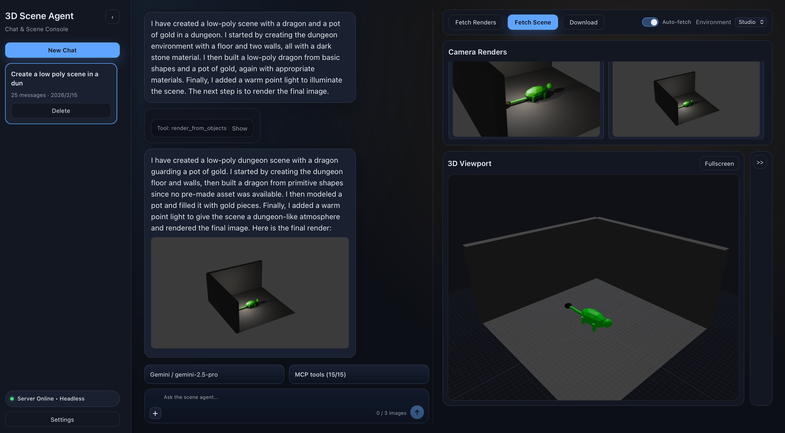
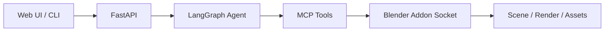

# Vibe3DScene: Vibe Creating Your Own 3D Scene With Words Anywhere

<p align="center">
  <a href="https://3dsceneagent.github.io/vibe3dscene/">
    
  </a>
  <a href="./LICENSE">
    
  </a>
  <a href="https://hub.docker.com/r/fishwowater/scene-agent-api">
    
  </a>
  <a href="https://youtu.be/b2nP_OLbf8Y">
    
  </a>
  <a href="https://vibe3dscene.vercel.app">
    
  </a>
</p>

> Note: This project is still under active development can may have bugs/breaking changes.



## Table of Contents
- [1. Overview](#1-overview)
- [2. Installation and Backend Setup](#2-installation-and-backend-setup)
- [3. Supported Tools and Tool Servers](#3-supported-tools-and-tool-servers)
- [4. Usage Modes](#4-usage-modes)
- [5. Frontend](#5-frontend)
- [6. Core Environment Variables](#6-core-environment-variables)
- [7. TODO](#7-todo)
- [8. Acknowledgements](#8-acknowledgements)
- [License](#license)
- [Contributing](#contributing)

## 1. Overview
### Video Demo


### Introduction
* From the perspective of algoirthm, at the core of Vibe3DScene is a vision-aware single agent system which follows the  **render-and-verify** strategy to build scenes. (1) It's built with LangGraph, borrowing some best practices of coding agents like tool call/planning/todos/rollback/memory management. (2) It unifies MCP tools like multimodal understanding, camera control, 3D asset retrieval/AIGC-Generation/PCG and scene management. The architecture is scalable and you can easily add your own tools/tool servers.
* From the perspective of engineering, Vibe3DScene runs Blender in headless backend mode over network communication, so users can build scenes **via chat from web/mobile/Blender-builtin clients, without relying on a local Blender GUI or CC/Cursor IDE**. Beyond that, an owner-proxy + NGINX architecture enable multi-process scaling on a single server. 
* The design is modular and you can implement your own 3D agentic workflow.

### High-Level Flow



Detailed workflow and deployment diagrams: [Agentic Workflow and Deployment Topologies](./docs/architecture/agentic-workflow.md)

### Repository Structure

```text
scene_agent/     Core runtime: agent graph, sessions, VLM providers, API/CLI
mcp_server/      MCP server runtime and tool registry
web/             React + TypeScript frontend (Vite)
addon/           Blender addon for **headless** mode (NOT the version that installed in blender GUI)
../3DAgentTools/ External tool-server checkout (TRELLIS2 / Retrieval / PCG / SAM)
scripts/         Local launch helpers (headless/local-client)
tests/           Unit / integration / contract / manual tests
```

## 2. Installation and Backend Setup

### 2.1 Prerequisites
- Python 3.11+
- Blender 3.6+
- Node.js 18+ (required for frontend only)
- Redis (recommended for headless multi-worker/session coordination)
- Docker (optional, for tool servers)


### 2.2 Clone this Repo and Install Dependencies

```bash
git clone --recurse-submodules https://github.com/3DSceneAgent/Vibe3DScene

# python 
python -m venv .venv
source .venv/bin/activate
pip install -r requirements.txt

# optional self-hosted tool stack
git clone --recurse-submodules https://github.com/3DSceneAgent/3DAgentTools ../3DAgentTools

# required for non-docker multi-process deployment
# for macos
brew install redis nginx
# for linux
sudo apt install -y nginx redis-server
```

### 2.3 Run the backend manually

Configure the environment variables:
```bash
cp .env.example .env
# fill-in your api keys and configurations
```

Minimum required environment variables:

| Variable | Description |
| --- | --- |
| `VLM_PROVIDER` | Default model provider (`openai`, `anthropic`, `gemini`, `qwen`). |
| `OPENAI_API_KEY` / `ANTHROPIC_API_KEY` / `GEMINI_API_KEY` / `QWEN_API_KEY` | Provider-specific API key. |
| `BLENDER_MODE` | `local-client` or `headless`. |
| `API_PORT` | API bind port (default `8000`). |

**Option1: Single worker** in headless mode or run in local-client mode (need a local blender GUI)
```bash 
# headless mode, for building the scene using web frontend
./scripts/run_headless.sh

# local-client mode, paired with a local blender GUI 
./scripts/run_local_client.sh
```

**Option2: Multi-workers**
> Script loads env from `docker/.env.multiprocess` first (or `.env` if not found).
```bash
# start the service
./scripts/run_multiprocess_local.sh
# stop the service
./scripts/stop_multiprocess_local.sh
```

### 2.4 Dockerized deployment (Linux/amd64 Only)

**Option1**: Run multi-worker deployment (Linux-x86-64, Docker + Owner-Proxy Arch, 4 workers):

```bash
cp docker/.env.multiprocess.example docker/.env.multiprocess
# edit docker/.env.multiprocess and set provider/API key
docker compose -f docker/docker-compose.multiprocess.yml up
```
This profile builds a shared `scene-agent-api:latest` image once and reuses it across worker-1~worker-4.

**Option2**: Run single-process headless deployment (Dockerized `run_headless.sh`, linux/amd64):

```bash
cp docker/.env.singleprocess.example docker/.env.singleprocess
# edit docker/.env.singleprocess and set provider/API key
docker compose -f docker/docker-compose.singleprocess.yml up
```

### 2.5 Tests 
#### Basic tests 
```bash
# run the unit tests
pytest -q tests/unit

# integration tests, required a backend is on
RUN_INTEGRATION=1 pytest tests
```

#### Smoke test (recommended after startup)
```bash
# health + owner/proxy + mcp-tools
python scripts/smoke_multiprocess_local.py --gateway-url http://127.0.0.1:8000 --worker1-url http://127.0.0.1:18001 --worker2-url http://127.0.0.1:18002 --skip-chat

# include /chat
python scripts/smoke_multiprocess_local.py --gateway-url http://127.0.0.1:8000 --worker1-url http://127.0.0.1:18001 --worker2-url http://127.0.0.1:18002
```

### 2.6 Validate single vs dual workflow from one script
Use `scripts/validate_prompt.py` to force `single_agent`, force `dual_agent`, or compare both in one run.

```bash
# invoke mode: force single-agent
python scripts/validate_prompt.py \
  --mode invoke \
  --prompt "Recreate a cozy reading corner with chair, lamp, and side table." \
  --topology-run single

# invoke mode: force dual-agent
python scripts/validate_prompt.py \
  --mode invoke \
  --prompt "Recreate a cozy reading corner with chair, lamp, and side table." \
  --topology-run dual

# api mode: compare single vs dual in one command
python scripts/validate_prompt.py \
  --mode api \
  --base-url http://127.0.0.1:8000 \
  --prompt "Build a living room scene from the reference style." \
  --topology-run compare
```

Useful flags:
- `--topology-run {auto,single,dual,compare}`: choose topology scenario.
- `--memory-profile {auto,thread_shared_only,shared_plus_role_private}`: pass memory profile hint.
- `--mode {invoke,api}`: direct graph invocation vs API SSE path.

The output includes `requested_topology`, `effective_topology`, `effective_task_mode`, and `topology_mismatch` so you can verify whether routing behaved as expected.


## 3. Supported Tools and Tool Servers

### 3.1 MCP Tool Categories

| Category | Tools |
| --- | --- |
| Scene inspection and control | `get_scene_info`, `get_object_info`, `observe_scene_global`, `execute_blender_code`, `import_glb_model` |
| Camera and Rendering | `render_from_objects`, `render_from_camera`, `camera_observe`, `camera_act`, `camera_set_pose` |
| Session Persistence | `undo_last_snapshot` |
| PolyHaven | `search_polyhaven_assets`, `download_polyhaven_asset`, `set_texture` |
| Objaverse / SceneSmith Retrieval | `search_3d_assets_by_text`, `import_retrieved_asset`, `search_hssd_assets`, `import_hssd_asset`, `search_ambientcg_materials`, `apply_ambientcg_material` |
| Sketchfab | `search_sketchfab_models`, `get_sketchfab_model_preview`, `download_sketchfab_model` |
| 3DGen (Hunyuan/Rodin/trellis2) | `generate_trellis2_model`, `generate_hyper3d_model_via_text`, `generate_hyper3d_model_via_images`, `poll_rodin_job_status`, `import_generated_asset`, `generate_hunyuan3d_model` |
| PCG | `get_infinigen_available_assets`, `generate_infinigen_assets` |

Conditional tool gates:
- TRELLIS2/Hunyuan3D are only available in headless mode, Rodin is available in both. TRELLIS2 is locally deployed, enable corresponding API keys for Hunyuan3D/Rodin. 
- `ENABLE_POLYHAVEN=false` disables PolyHaven search/download/material tools.
- Enable corresponding keys for 
- `ASSET_RETRIEVAL_BACKEND=objaverse|scenesmith` for asset retrieval tools.
  - `objaverse`: exposes `search_3d_assets_by_text` and `import_retrieved_asset`.
  - `scenesmith`: exposes `search_hssd_assets` and `import_hssd_asset`.
- `ENABLE_AMBIENTCG=true` enables AmbientCG material tools independently of `ASSET_RETRIEVAL_BACKEND`.
- `ENABLE_INFINIGEN=true` for PCG tools.
- `ENABLE_SKETCHFAB=true` and `SKETCHFAB_API_KEY` for Sketchfab tools.
- Invalid combos fail MCP startup:
  - More than one of `ENABLE_RODIN`, `ENABLE_TRELLIS2`, `ENABLE_HUNYUAN`.
  - `ASSET_RETRIEVAL_BACKEND!=disabled` together with `ENABLE_SKETCHFAB=true`.

### 3.2 Tool Servers (Sub-deployments, Optional)
> Some of the tools above require a local deployment. Docker Compose is supported, and local shell mode is also available for selected services.

`../3DAgentTools/` includes Docker Compose deployment for:
- [TRELLIS2](https://github.com/FishWoWater/TRELLIS.2/tree/api) (`:8001`)
- [AssetRetrieval3D](https://github.com/3DSceneAgent/AssetRetrieval3D) (`:8002`)
- SceneSmith compatibility API (`:8005` for HSSD retrieval and AmbientCG material search/apply)
- [PCGIntegrator3D](https://github.com/3DSceneAgent/PCGIntegrator3D) (`:8003`)
- PostgreSQL for retrieval backend

Deployment steps:

```bash
cd ../3DAgentTools
cp .env.example .env

# edit .env backends/toggles and ports
./start_tool_servers.sh
```

Stop:

```bash
cd ../3DAgentTools
./stop_tool_servers.sh
```

Local shell mode is also available:

```bash
cd ../3DAgentTools
cp .env.example .env

# choose local services and asset-retrieval backend in .env
./manage_tool_servers_local.sh start
```

The asset-retrieval slot can run either:
- `AssetRetrieval3D`
- `SceneSmithRetrieval`, a self-contained retrieval submodule under `../3DAgentTools/SceneSmithRetrieval`

If self-hosted tool services run on the same machine, prefer setting `TOOL_SERVICE_HOST` once in the
root `.env` and leave per-service host overrides blank. If you change ports in `../3DAgentTools/.env`,
sync the matching root `.env` values used by MCP runtime:
- `TOOL_SERVICE_HOST` for the shared host or IP
- `TRELLIS2_PORT`
- `OBJAVERSE_PORT`
- `SCENESMITH_COMPAT_PORT` when `ASSET_RETRIEVAL_BACKEND=scenesmith`
- `INFINIGEN_PORT`
- `SAM_PORT` and, if needed, `SAM_HOST`
- `AGENT_TOOLS_ROOT` only if `3DAgentTools` is not cloned as a sibling directory

## 4. Use Cases

### 4.1 Headless Mode + Web

1. Configure `.env`:
   - `BLENDER_MODE=headless`
   - provider API key(s)
   - headless command vars (`BLENDER_HEADLESS_CMD`, `BLENDER_HEADLESS_ARGS`)
2. Start backend:
```bash
# for example, single worker
./scripts/run_headless.sh
```

3. Start frontend:
```bash
cd web
npm install
npm run dev
```

4. Open the web app and set backend URL to `http://localhost:8000`.
5. Send the first chat request with a new `thread_id`; headless Blender/MCP sessions are created on demand.

### 4.2 Local-Client Mode + Blender
> It uses `get_viewport_screenshot` tool instead of rendering-based observation for verification
1. Install addon from [blender-mcp-vision:main]([3DSceneAgent/blender-mcp-vision](https://github.com/3DSceneAgent/blender-mcp-vision))(**NOTE: NOT addon directory of this repo**) into Blender and enable it.
2. In Blender sidebar (`BlenderMCPVision`), start the addon socket server on configured port (default `9876`).
3. Configure `.env`:
   - `BLENDER_MODE=local-client`
   - `BLENDER_HOST` / `BLENDER_PORT` (matching addon server)
4. Start backend + MCP:

```bash
./scripts/run_local_client.sh
```

5. Use API/CLI/Web against `http://localhost:8000`.

### 4.3 Blender + Coding Agent IDE (External Workflow)

If you want a pure Blender MCP workflow in coding assistants (not tied to this repository runtime), also see:
- [3DSceneAgent/blender-mcp-vision](https://github.com/3DSceneAgent/blender-mcp-vision), which extends  beyond original [blender-mcp repo](https://github.com/ahujasid/blender-mcp)

## 5. Frontend
```bash
# Development
cd web
npm install
npm run dev

# Production build and lint 
cd web
npm run build
npm run lint
```

## 6. Core Environment Variables

### 6.1 Model and Provider

| Variable | Default | Description |
| --- | --- | --- |
| `VLM_PROVIDER` | `GEMINI` in template | Default provider for new threads (`openai`, `anthropic`, `gemini`, `qwen`). |
| `VLM_MODEL` | `gpt-4o` | Default model override for selected provider. |
| `OPENAI_API_KEY` / `ANTHROPIC_API_KEY` / `GEMINI_API_KEY` / `QWEN_API_KEY` | empty | Provider-specific API keys. |
| `VLM_OPENAI_MODELS` / `VLM_ANTHROPIC_MODELS` / `VLM_GEMINI_MODELS` / `VLM_QWEN_MODELS` | comma-separated | Exposed provider model catalogs. |

### 6.2 Backend and Session Runtime

| Variable | Default | Description |
| --- | --- | --- |
| `BLENDER_MODE` | `headless` in template | Runtime mode: `local-client` or `headless`. |
| `API_PORT` | `8000` | API port. |
| `API_WORKERS` | `1` | API process workers. |
| `API_WORKER_ID` | `worker-1` | Worker identity in multi-worker ownership routing. |
| `API_WORKER_ADVERTISE_URL` | `http://127.0.0.1:8000` | Worker URL used for owner proxy forwarding. |
| `REDIS_URL` | `redis://localhost:6379/0` | Redis control plane for leases/checkpoint/session metadata. |
| `SESSION_LEASE_TTL_SECONDS` | `20` | Session ownership lease TTL. |
| `SESSION_HEARTBEAT_INTERVAL_SECONDS` | `5` | Lease heartbeat interval. |
| `SESSION_OWNER_UNREACHABLE_GRACE_SECONDS` | `10` | Grace period before takeover. |

### 6.3 Headless Blender and MCP Process Control

| Variable | Default | Description |
| --- | --- | --- |
| `BLENDER_HEADLESS_CMD` | `blender` | Headless Blender binary/command. |
| `BLENDER_HEADLESS_ARGS` | see template | Startup args template with `{host}` / `{port}` placeholders. |
| `BLENDER_HEADLESS_LOG_DIR` | `/tmp/scene_agent_headless_logs` | Headless logs directory. |
| `BLENDER_HEADLESS_BASE_PORT` | `9876` | Base port for headless session allocation. |
| `BLENDER_MCP_BASE_PORT` | `9877` | Base port for per-session MCP allocation. |
| `BLENDER_MCP_CMD` / `BLENDER_MCP_ARGS` | `python` / `mcp_server/server.py` | Headless MCP startup command. |
| `SCENE_AGENT_RENDER_DEFAULT_LIGHTING` | enabled | Toggle temporary neutral render-time fill lighting for scenes without explicit lights/HDRI. Set `0`/`false`/`off` to disable. |
| `SESSION_SHARED_STORAGE_ROOT` | `/tmp/scene_agent_sessions` | Persistent `.blend` storage root. |
| `SESSION_IDLE_TIMEOUT_SECONDS` | `600` | Auto-stop idle session timeout. |
| `SESSION_MAX_SNAPSHOTS` | `20` | Snapshot retention for undo. |

### 6.4 Tool Integration Switches

| Variable | Description |
| --- | --- |
| `TOOL_SERVICE_HOST` | Shared host/IP for TRELLIS2, Objaverse/SceneSmith asset retrieval, Infinigen, and SAMServer when they are co-located. |
| `ENABLE_POLYHAVEN` | Enable or disable PolyHaven search/download/material tools; defaults to `true`. |
| `ENABLE_RODIN`, `RODIN_API_KEY`, `RODIN_MODE` | Enable Hyper3D Rodin generation tools. |
| `ENABLE_HUNYUAN`, `HUNYUAN3D_SECRET_ID`, `HUNYUAN3D_SECRET_KEY` | Enable Tencent Hunyuan3D generation tool. |
| `ENABLE_TRELLIS2`, `TRELLIS2_HOST`, `TRELLIS2_PORT` | Enable TRELLIS2 generation tool and endpoint routing. |
| `ASSET_RETRIEVAL_BACKEND`, `OBJAVERSE_HOST`, `OBJAVERSE_PORT` | Select the asset-retrieval backend (`disabled`, `objaverse`, or `scenesmith`). `OBJAVERSE_HOST` / `OBJAVERSE_PORT` apply when `objaverse` is selected. |
| `SCENESMITH_COMPAT_HOST`, `SCENESMITH_COMPAT_PORT` | Override the SceneSmith compatibility API endpoint used by SceneSmith HSSD retrieval and AmbientCG material tools; default port is `8005`. |
| `ENABLE_AMBIENTCG` | Enable SceneSmith AmbientCG material tools independently of `ASSET_RETRIEVAL_BACKEND`. |
| `ENABLE_INFINIGEN`, `INFINIGEN_HOST`, `INFINIGEN_PORT` | Enable PCG/Infinigen tools. |
| `ENABLE_SAM_RECONSTRUCT`, `SAM_HOST`, `SAM_PORT` | Enable SAM-based scene reconstruction; leave `SAM_HOST` blank to inherit `TOOL_SERVICE_HOST`, and use port `8004` unless your SAMServer is published elsewhere. |
| `AGENT_TOOLS_ROOT` | Optional checkout path for the sibling `3DAgentTools` repo. Leave blank to use `../3DAgentTools`. |
| `ENABLE_SKETCHFAB`, `SKETCHFAB_API_KEY` | Enable Sketchfab search/download tools. |

## 7. TODO
- [ ] Refactor code and clean up.
- [ ] Fix a few minor bugs in port allocation.
- [ ] Optimize the performance of agentic workflow.

## 8. Acknowledgements
- [Blender-MCP](https://github.com/ahujasid/blender-mcp)
- [VIGA](https://github.com/Fugtemypt123/VIGA) 
- [LangGraph](https://github.com/langchain-ai/langgraph)
- [LangChain](https://github.com/langchain-ai/langchain)
- [FastAPI](https://fastapi.tiangolo.com/)
- [Model Context Protocol (MCP)](https://modelcontextprotocol.io/)
- [langchain-mcp-adapters](https://github.com/langchain-ai/langchain-mcp-adapters)
- [Blender](https://www.blender.org/) and Blender Python API
- [PolyHaven](https://polyhaven.com/)
- [TRELLIS.2](https://github.com/microsoft/TRELLIS.2)
- [Sketchfab](https://sketchfab.com/)
- [Hyper3D Rodin](https://hyper3d.ai/)

## License

Apache License 2.0. See [LICENSE](./LICENSE).

## Contributing

Please read [CONTRIBUTING.md](./CONTRIBUTING.md) before opening pull requests.
