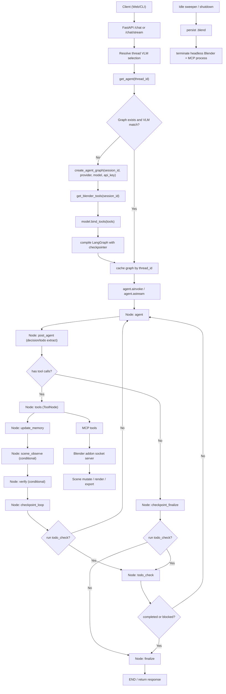
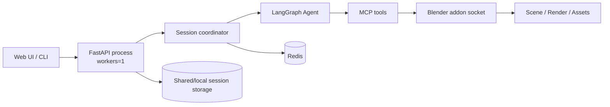
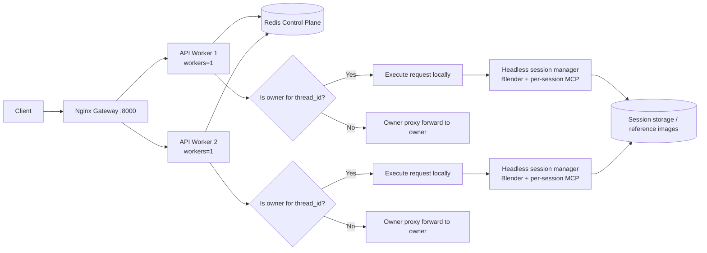

# Agentic Workflow and Deployment Topologies

This document extracts the runtime agentic workflow from `docs/architecture/current-agent-workflow.md` and adds explicit deployment topologies for both single-worker and multi-worker operation.

## 1. Agentic Workflow (Runtime Graph)

The graph uses a **visual-first** architecture where verification is a fixed sequential step (not a conditional branch), and scene-level cameras auto-render after every scene mutation.

### Two Runtime Paths

| Path | Trigger | scene_observe | verify |
|------|---------|---------------|--------|
| **Scene mutation** | import, generate, execute_blender_code, set_texture | Runs (4 scene cameras re-render) | Structured multi-view feedback |
| **Object-level inspection** | camera_act, render_from_objects, camera_observe | Skips (no scene mutation) | Focused object-level feedback + todo context |



### Key Design Decisions

- **verify is sequential, not a routing branch.** It runs between `scene_observe` and `checkpoint_loop` as a fixed step, skipping internally when there is no new unverified render. This ensures visual verification always precedes `todo_check`, preventing premature "completed" claims.
- **scene_observe is conditional.** It only fires when the latest tool batch contains scene-mutating tools. Object-level camera work (camera_act, render_from_objects) skips scene_observe entirely — the agent's own render flows directly to verify.
- **checkpoint_loop routing is simplified** to `todo_check | agent` (two targets instead of three). Verify no longer competes with todo_check for routing priority.

### Local Camera Persistence Policy (Object-Level)

- `scene_observe` remains **ephemeral** and bbox-driven for global diagnostics. It does not maintain a persistent 4-camera pool.
- Object-level tools (`camera_observe`, `render_from_objects`, `camera_act`) use a **persistent local work-camera pool** in the Blender addon (`Camera_Work_*`).
- Reuse path:
  - `render_from_objects(..., reuse_cameras=True)` and `camera_observe(..., reuse_cameras=True)` first query `CameraManager.find_matching_camera(...)`.
  - If no suitable camera is found, a new local work camera is created and registered.
- Eviction path (to avoid camera explosion):
  - Invalid local cameras are removed first.
  - Idle local cameras are removed after TTL (`LOCAL_CAMERA_IDLE_TTL_SECONDS`, default `900`).
  - Remaining overflow is trimmed by LRU up to `LOCAL_CAMERA_POOL_MAX_SIZE` (default `24`).
  - Active/focused cameras are protected from eviction.

### Verification Input Policy

- **Global verification (`render_source=scene_observe`)**
  - Input render: scene-level auto observation output.
  - Targets: full user request + optional uploaded reference images.
- **Local verification (`render_source=agent_camera`)**
  - Input render: latest object-level render from `camera_act`/`render_from_*`/`camera_observe`.
  - Targets: user request + optional references + current in-progress/pending todo context.
  - Goal: make local refinement checks align with current todo objectives rather than only coarse global intent.

## 2. Single-Worker Architecture

Single-worker means one API process serving requests directly.



Reference startup command (current baseline):

```bash
cd /Users/fishwowater/projects/3DSceneAgent
python main.py --mode api --host 0.0.0.0 --port 8000 --workers 1
```

## 3. Multi-Worker Architecture (Docker + Gateway + Owner Proxy)

In multi-worker mode, every API instance still runs with `--workers 1`. Horizontal scaling is achieved by running multiple API processes/containers behind a gateway.



Request routing behavior:
- Any worker can receive the request from gateway.
- Worker checks Redis ownership/lease for `thread_id`.
- Owner executes locally.
- Non-owner forwards request/stream to owner through `owner_proxy`.

## 4. Multi-Worker Docker Quickstart

```bash
cd /Users/fishwowater/projects/3DSceneAgent
cp docker/.env.multiprocess.example docker/.env.multiprocess
# edit docker/.env.multiprocess (provider and API keys)
docker compose -f docker/docker-compose.multiprocess.yml up --build
```

Gateway endpoint:
- `http://localhost:8000`

Related files:
- `docker/docker-compose.multiprocess.yml`
- `docker/nginx/multiprocess.conf`
- `scene_agent/session/owner_proxy.py`
- `docs/architecture/multiprocess-migration-plan.md`
