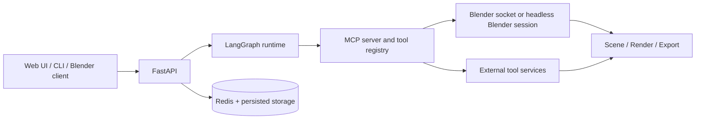
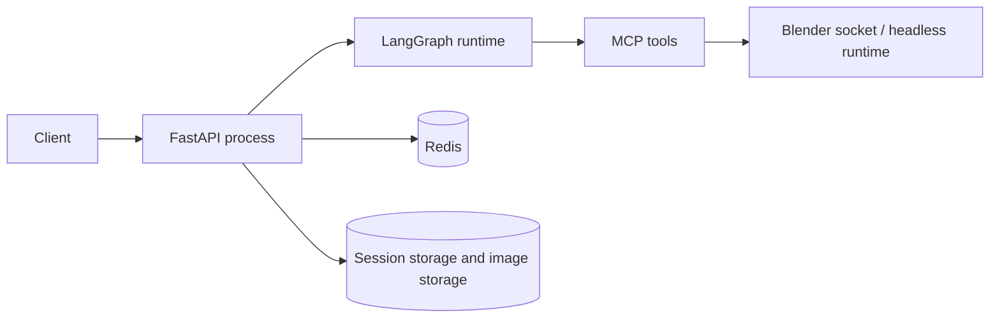
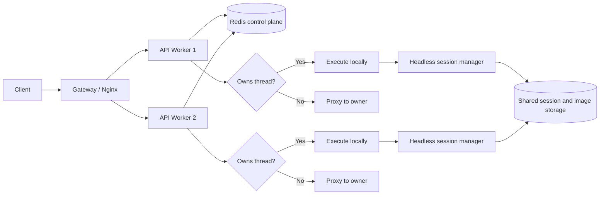

# Architecture and Deployment Overview

Last updated: 2026-03-30

This document provides a high-level view of the current Vibe3DScene architecture, deployment topologies, and system boundaries. For the exact runtime graph and node-level control flow, see [Current Agent Workflow](./current-agent-workflow.md).

## 1. End-to-End Runtime Layers



The runtime is composed of five major layers:

1. Client layer
   - Web UI, CLI, and Blender-connected client flows
2. API layer
   - FastAPI endpoints for chat, streaming, scene artifacts, threads, images, runtime control, and diagnostics
3. Graph layer
   - LangGraph-based workflow execution, memory, verification, and todo/evaluator control
4. Tool layer
   - MCP server, Blender tools, retrieval/generation tools, and external service adapters
5. Durability and coordination layer
   - Redis-backed ownership/checkpointing plus persisted scene and image storage

## 2. Runtime Roles

### FastAPI

The API layer is responsible for:

- request ownership resolution
- thread-level provider/model resolution
- graph reuse or rebuild
- streaming transport
- thread/runtime management APIs
- history, image, and artifact access

### LangGraph runtime

The graph runtime is responsible for:

- request initialization
- reference-image context preparation
- routing into `direct_mode` or `plan_mode`
- single-agent or experimental dual-agent execution
- verification and evaluator-based convergence

### MCP server

The MCP layer is the bridge between the agent runtime and the tool surface.

It handles:

- tool registration
- tool gating from environment and runtime mode
- connections to Blender tools
- connections to optional external retrieval/generation/reconstruction services

### Blender runtime

Blender can run in two broad ways:

- `local-client`
  - the backend connects to an already running Blender addon
- `headless`
  - the backend launches and manages per-thread Blender/MCP runtime processes

### External tool services

Optional services such as TRELLIS2, SceneSmith compatibility APIs, SAM reconstruction, retrieval backends, PCG, and other generators are deployed outside this repository in the sibling `3DAgentTools` stack.

## 3. Single-Worker Topology

Single-worker mode is the simplest deployment. One API process owns requests directly and uses Redis only as an optional durability and coordination backend.



Typical use cases:

- local development
- single-machine experiments
- debugging agent/tool behavior without owner-proxy forwarding

Representative startup commands:

```bash
python main.py --mode api --port 8000
./scripts/run_headless.sh
./scripts/run_local_client.sh
```

## 4. Multi-Worker Topology

In multi-worker mode, horizontal scaling is handled outside the graph itself. Each API instance still runs as a single logical worker for thread ownership.



Important properties:

- Redis stores thread ownership and lease metadata
- any worker can receive the initial request
- only the owner executes that thread locally
- non-owner workers proxy requests and streams to the owner
- persisted storage allows the owner runtime to recover thread state after restarts or worker changes

## 5. Owner Proxy, Redis, and Persisted State

These three pieces are what make multi-worker operation practical.

### Owner proxy

The owner-proxy layer ensures thread affinity without forcing the external gateway to understand application state.

It allows:

- sticky execution per `thread_id`
- request forwarding to the current owner
- better safety for long-running streams

### Redis

Redis acts as the control plane for:

- worker registration
- thread ownership and leases
- checkpointer persistence when available
- session/runtime metadata

### Persisted storage

Persistent filesystem storage is used for:

- `.blend` files for headless session recovery
- uploaded reference images
- retry snapshots and artifacts
- scene exports and renders

## 6. Where MCP and Tool Servers Sit

The MCP server belongs to this repository. The heavier tool services do not.

Current separation:

- in-repo
  - MCP runtime
  - tool registry
  - Blender-facing tools
  - service adapters and gating logic
- out-of-repo
  - TRELLIS2
  - retrieval backends
  - SceneSmith compatibility APIs
  - SAM reconstruction service
  - PCG services
  - supporting databases and service-level compose stacks

This split makes the core agent runtime lighter to develop and deploy while keeping optional GPU- and service-heavy components isolated.

For the exact tool/service breakdown, see:

- [MCP Server and Tools](../integrations/mcp-server-and-tools.md)
- [Tool Servers](../deployment/tool-servers.md)

## 7. Relationship Between Runtime Workflow and System Architecture

These two architecture documents intentionally serve different purposes:

- [Current Agent Workflow](./current-agent-workflow.md)
  - exact runtime graph
  - node responsibilities
  - todo lifecycle
  - verification contract
  - `fast_mode`
  - image routing
- this document
  - system boundaries
  - deployment modes
  - ownership model
  - durability and coordination layers
  - placement of MCP and external services

## 8. Operational Summary

At a high level, the project now behaves like a layered scene-agent platform rather than a single monolithic Blender bot:

- requests enter through FastAPI
- runtime control lives in LangGraph
- tool invocation is mediated by MCP
- Blender and external services execute the actual scene, rendering, retrieval, and generation work
- Redis and persisted storage provide coordination and recovery

That separation is what enabled the recent additions around `fast_mode`, dual-agent experimentation, externalized tool servers, persisted thread recovery, and the newer frontend/runtime UX.
