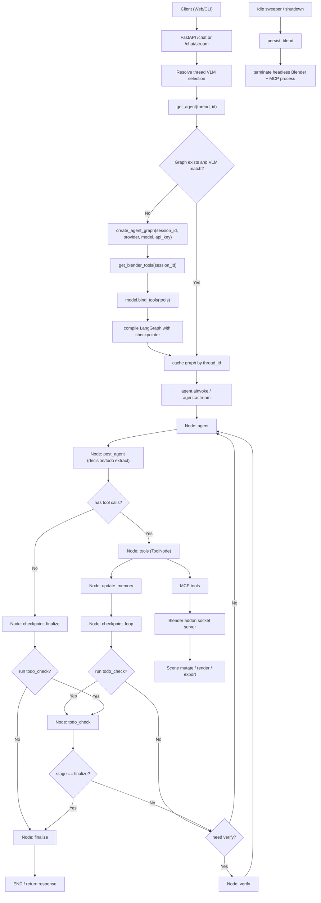
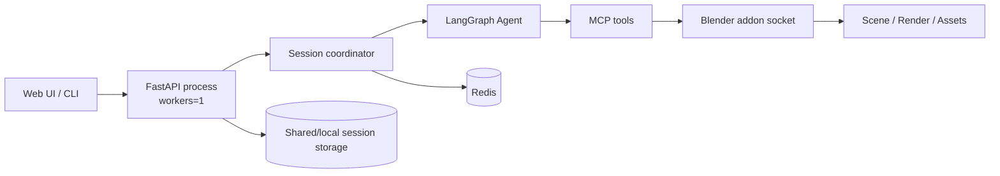
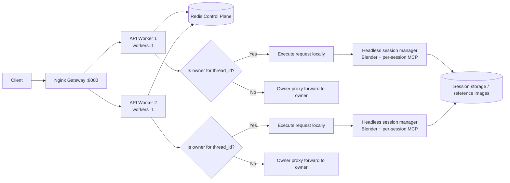

# Agentic Workflow and Deployment Topologies

This document extracts the runtime agentic workflow from `docs/architecture/current-agent-workflow.md` and adds explicit deployment topologies for both single-worker and multi-worker operation.

## 1. Agentic Workflow (Runtime Graph)



## 2. Single-Worker Architecture

Single-worker means one API process serving requests directly.



Reference startup command (current baseline):

```bash
cd /Users/fishwowater/projects/3DSceneAgent
python main.py --mode api --host 0.0.0.0 --port 8000 --workers 1
```

## 3. Multi-Worker Architecture (Docker + Gateway + Owner Proxy)

In multi-worker mode, every API instance still runs with `--workers 1`. Horizontal scaling is achieved by running multiple API processes/containers behind a gateway.



Request routing behavior:
- Any worker can receive the request from gateway.
- Worker checks Redis ownership/lease for `thread_id`.
- Owner executes locally.
- Non-owner forwards request/stream to owner through `owner_proxy`.

## 4. Multi-Worker Docker Quickstart

```bash
cd /Users/fishwowater/projects/3DSceneAgent
cp docker/.env.multiprocess.example docker/.env.multiprocess
# edit docker/.env.multiprocess (provider and API keys)
docker compose -f docker-compose.multiprocess.yml up --build
```

Gateway endpoint:
- `http://localhost:8000`

Related files:
- `docker-compose.multiprocess.yml`
- `docker/nginx/multiprocess.conf`
- `scene_agent/session/owner_proxy.py`
- `docs/architecture/multiprocess-migration-plan.md`
