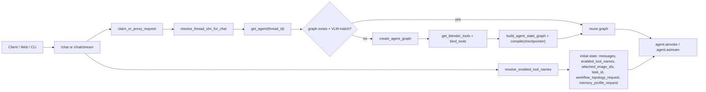
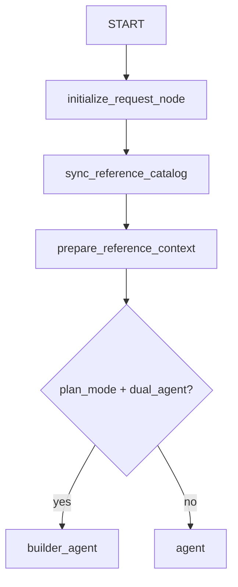
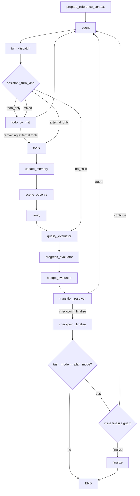
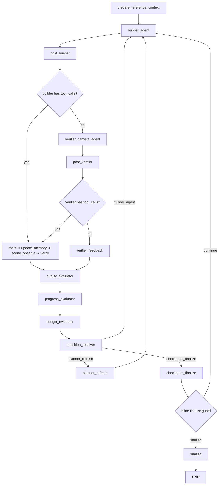
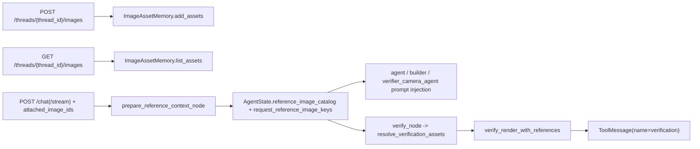

# 当前后端 Agent Workflow 架构（Router-Free / Single / Dual）

更新时间：2026-03-05

本文基于当前后端实现代码核对，重点覆盖：
- API Router 到 Graph 执行入口
- 无 Router 的请求初始化结点（`initialize_request`）
- `single_agent` 拓扑
- `dual_agent` 拓扑（仅 `plan_mode`）
- 图片资产、参考图注入与 verify 主链

核对的核心代码：
- `scene_agent/interfaces/api/routes_chat.py`
- `scene_agent/interfaces/api/shared.py`
- `scene_agent/agent/graph.py`
- `scene_agent/agent/graph_factory.py`
- `scene_agent/agent/context_manager.py`
- `scene_agent/agent/convergence.py`
- `scene_agent/agent/nodes/router.py`（当前仅保留 `initialize_request_node`）
- `scene_agent/agent/nodes/agents.py`
- `scene_agent/agent/nodes/evaluators.py`
- `scene_agent/agent/nodes/execution.py`
- `scene_agent/agent/nodes/verification.py`
- `scene_agent/agent/todo_protocol.py`
- `scene_agent/agent/todo_state.py`
- `scene_agent/agent/tool_policy.py`
- `scene_agent/agent/workflow_profiles.py`
- `scene_agent/memory/reference_image_memory.py`

---

## 1. API Router 与 Graph 入口

关键点：
- 请求级可传 `workflow_topology`、`memory_profile`、`attached_image_ids`，在 `routes_chat.py` 透传为 `workflow_topology_request`、`memory_profile_request`、`attached_image_ids`。
- `get_agent(thread_id)` 按线程缓存 graph，并在 provider/model 变化时重建并迁移状态。
- checkpointer 优先 Redis，不可用时回退 `InMemorySaver`（`redis_checkpointer.py`）。

---

## 2. 请求初始化（无独立 Router 结点）

当前入口已移除 `route_mode` / `clarification` 分支，改为固定初始化结点：

关键点：
- 不再有独立 Router LLM 调用；每个请求不再先做 `RouterDecision`。
- 不再有 `clarification_node -> END` 的硬停止路径。
- `initialize_request_node` 的策略：
  - 默认 `task_mode = plan_mode`
  - `task_intent = continue_existing_plan`（当存在未完成 todo）否则 `direct_request`
  - 初始化宽预算（沿用 `plan_mode` 预算）
  - 解析 `workflow_topology_request` 与 `memory_profile_request`
- `route_after_sync_reference_catalog` 现在总是进入 `prepare_reference_context`。

说明：
- `scene_agent/agent/nodes/shared.py` 中仍保留部分历史 Router 相关 helper（如 `invoke_router_decision`），但已不在当前主图执行路径中。

---

## 3. Single-Agent 拓扑（当前主干）

关键点：
- `agent` 后进入 `turn_dispatch`，将内部 `todo_update` 与外部工具调用分流。
- `todo_commit` 只提交 todo 状态，不触发 `tools -> update_memory -> scene_observe -> verify`。
- `verify` 后固定进入 evaluator 链（`quality -> progress -> budget -> transition_resolver`）。
- `quality_evaluator` 已接入 convergence guard（重复失败 / 振荡 / 连续 catastrophic）。
- `checkpoint_finalize` 内联执行 finalize guard，`finalize_guard` 不再是独立图结点。

与本轮调整相关：
- `scene_observe` 失败路径仅返回 `{"last_render_path": None}`，不再注入“请手动渲染”的系统提示。
- 当 `last_render_path` 为空时，`verify_node` 会跳过本轮验证（返回 `verify_forced_recovery=False`）。

---

## 4. Dual-Agent 拓扑（仅 `plan_mode`）

关键点：
- `verifier_camera_agent` 是可调用相机/渲染工具的 agent。
- `builder` 与 `verifier` 工具域由 `tool_policy.py` 控制：
  - `builder_default` 默认排除相机/渲染工具域。
  - `verifier_default` 仅允许相机/渲染观察工具域。
- `transition_resolver` 是确定性规则结点，优先级：
  1. budget_exhausted
  2. done
  3. catastrophic
  4. replan
  5. continue

---

## 5. 图片资产与 Verify 路径（与 workflow 绑定）

关键点：
- 对外公开接口只有 `/images`（`reference-images`、`image-bindings` 已从 API 层移除）。
- `attached_image_ids` 明确标识“本轮附件”；有附件时，本轮附件就是该请求唯一参考图集合。
- 本轮无附件时，不会自动注入线程历史全量图片；由 helper model 从 `reference_image_catalog` 中按需选择至多 1 张。
- helper 不可用或失败时，不再做 token-overlap 猜图兜底；直接不附加历史参考图。

---

## 6. 验证与评估链状态语义（当前）

关键点：
- `verify_node` 异常（渲染访问/VLM 调用失败）时输出 `status="error"`，不再伪装成 `mismatch`。
- `quality_evaluator` 将 `error/skipped` 映射为 `quality_eval.status="skipped"`，避免将系统故障计入 mismatch streak。
- `verifier_feedback.confidence` 不再使用硬编码魔法值；仅在上游给出可信置信度时透传。

---

## 7. 当前实现的关键差异（相对 2026-02-28 版）

- 主图入口由 `route_mode` 改为 `initialize_request`，并删除 `clarification` 终止分支。
- 取消独立 Router LLM 调用；任务复杂度判断更多由主 agent + evaluator 链在执行中完成。
- `scene_observe` 失败恢复为“静默失效旧渲染路径”（`last_render_path=None`），不再提示手动渲染。
- SSE 内部节点过滤名从 `route_mode` 迁移为 `initialize_request`（`verify` 过滤行为保持）。
- `todo_commit`、`convergence guard`、`checkpoint_finalize` 内联 finalize guard 等近期主干机制保持不变。
