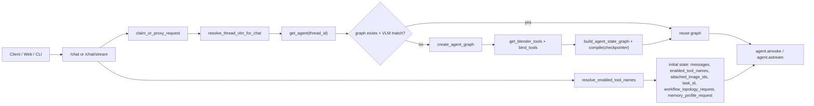
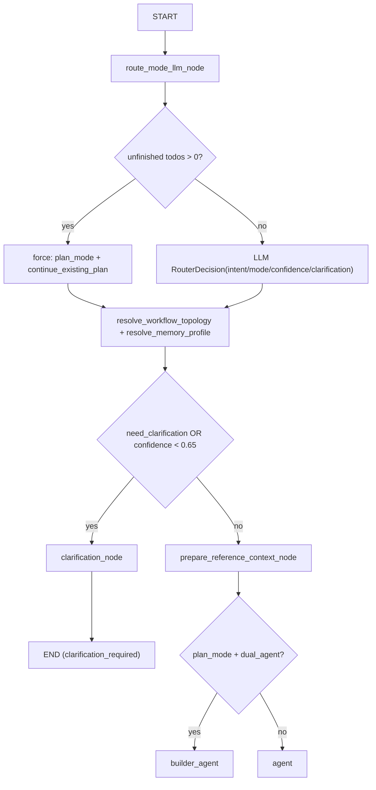
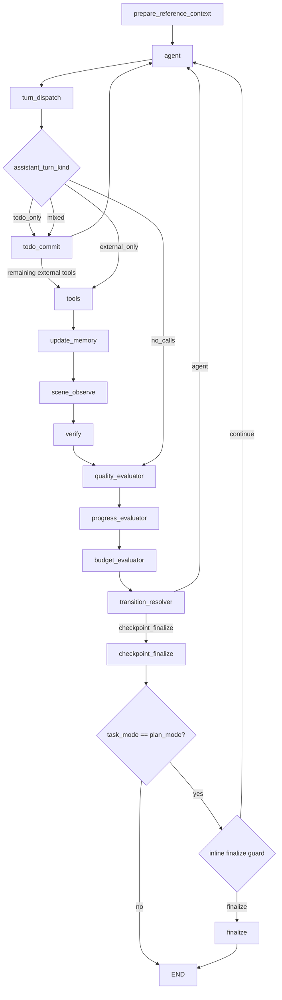
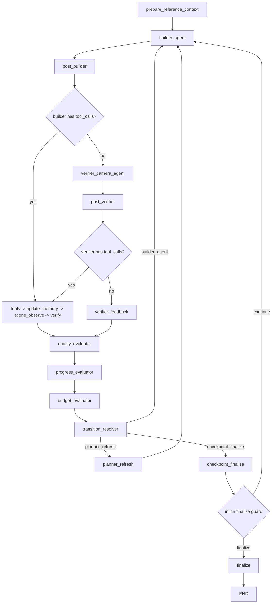
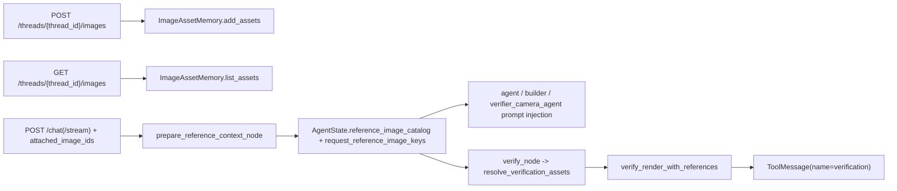

# 当前后端 Agent Workflow 架构（Router / Single / Dual）

更新时间：2026-02-28

本文基于当前后端实现代码核对，重点覆盖：
- API Router 到 Graph 执行入口
- `route_mode` 路由器（含 topology 选择）
- `single_agent` 拓扑
- `dual_agent` 拓扑（仅 `plan_mode`）
- 与近期三份方案/实现文档对应的落地状态

核对的核心代码：
- `scene_agent/interfaces/api/routes_chat.py`
- `scene_agent/interfaces/api/shared.py`
- `scene_agent/agent/graph.py`
- `scene_agent/agent/graph_factory.py`
- `scene_agent/agent/context_manager.py`
- `scene_agent/agent/convergence.py`
- `scene_agent/agent/nodes/router.py`
- `scene_agent/agent/nodes/agents.py`
- `scene_agent/agent/nodes/evaluators.py`
- `scene_agent/agent/nodes/execution.py`
- `scene_agent/agent/nodes/verification.py`
- `scene_agent/agent/todo_protocol.py`
- `scene_agent/agent/todo_state.py`
- `scene_agent/agent/tool_policy.py`
- `scene_agent/agent/workflow_profiles.py`
- `scene_agent/memory/reference_image_memory.py`

---

## 1. API Router 与 Graph 入口

关键点：
- 请求级可传 `workflow_topology`、`memory_profile`、`attached_image_ids`，在 `routes_chat.py` 透传为 `workflow_topology_request`、`memory_profile_request`、`attached_image_ids`。
- `get_agent(thread_id)` 按线程缓存 graph，并在 provider/model 变化时重建并迁移状态。
- checkpointer 优先 Redis，不可用时回退 `InMemorySaver`（`redis_checkpointer.py`）。

---

## 2. Router 架构（`route_mode` + topology 解析）

关键点：
- `dual_agent` 只在 `plan_mode` 生效，非 `plan_mode` 强制降级 `single_agent`。
- `auto` topology 由 `ENABLE_PLANMODE_DUAL_AGENT` 控制。
- Router 同时初始化预算与角色状态：`max_request_agent_turns`、`max_request_tool_batches`、`active_role` 等。
- `prepare_reference_context_node` 只在每次用户请求开头运行一次：若本轮携带 `attached_image_ids`，本轮附件即成为该请求唯一的参考图集合；否则由轻量 helper model 从 `AgentState.reference_image_catalog` 中按需选择至多 1 张。

---

## 3. Single-Agent 拓扑（当前主干）

关键点：
- `agent` 后不再直接进入 `post_agent`；已改为 `turn_dispatch`，负责解析本轮 `AIMessage`，区分内部 `todo_update` 与外部 Blender tool calls。
- 新增 `todo_commit` 独立结点：结构化 todo 更新在这里提交，不走 `tools -> update_memory -> scene_observe -> verify` 链，因此不会为一次计划更新额外触发渲染与验证。
- `verify` 后固定进入 evaluator 链（`quality -> progress -> budget -> transition_resolver`）。
- `verify` 的 catastrophic 只产出信号，不再自动注入恢复工具调用。
- `scene_observe` 仅在最近工具批次包含 scene mutation 时生效。
- `quality_evaluator` 已接入 convergence guard：识别重复失败 / 振荡 / 连续 catastrophic 后，给出指导性重试或直接熔断。
- 仅 `plan_mode` 会进入 `finalize` 节点；`conversation_mode` / `single_action_mode` 在 `checkpoint_finalize` 后直接 `END`。
- `agent` 提示词注图不再按线程全量注入；只读取 `prepare_reference_context_node` 产出的 `request_reference_image_keys`。
- `agent` 上下文注入已接入 `context_manager`，只投影关键近因消息与历史摘要，不再全量注入 `state["messages"]`。
- `checkpoint_finalize` 现在内联执行 finalize guard：直接基于当前 todo 快照判断“继续执行”还是“允许收尾”，不再进入独立 `finalize_guard` 结点。
- `finalize_guard` 作为独立图结点已退出主路径；同名 state 仍保留为一份由 `checkpoint_finalize` 写出的终态快照，供 summary / observability 复用。
- finalize guard 不再用硬编码 `stagnation_count` 驱动主循环停机；single-agent 主循环稳定性已转由 evaluator 链中的 budget + convergence 负责。

---

## 4. Dual-Agent 拓扑（仅 `plan_mode`）

关键点：
- `verifier_camera_agent` 是可调用相机/渲染工具的 agent，不是纯文本评审器。
- `verifier_camera_agent` 现在与 `builder_agent` / `agent` 共用同一套请求级参考图（来自 `request_reference_image_keys`），不再排除上传参考图。
- `builder` 与 `verifier` 工具域由 `tool_policy.py` 控制：
  - `builder_default` 默认排除相机/渲染工具域。
  - `verifier_default` 仅允许相机/渲染观察工具域。
- `transition_resolver` 是确定性规则节点，优先级：
  1. budget_exhausted
  2. done
  3. catastrophic
  4. replan
  5. continue

---

## 5. 图片资产与 Verify 路径（与 workflow 绑定）

关键点：
- 对外公开接口只有 `/images`（`reference-images`、`image-bindings` 已从 API 层移除）。
- 内部仍保留 role 绑定模型：`question_image/object_reference/scene_reference/style_reference/verification_reference`。
- 上传图片的二进制与元数据仍由 `ImageAssetMemory` 管理；`AgentState` 只保存命名后的轻量 catalog（`asset_id/stored_path/caption/use_count` 等）。
- `attached_image_ids` 明确标识“本轮附件”；有附件时，本轮附件就是该请求唯一参考图集合。
- 本轮无附件时，不再自动把线程历史图片全部注入；改由 helper model 从 `reference_image_catalog` 中按需选择至多 1 张，并复用于 `agent` / `verifier_camera_agent` / `verify_node`。

---

## 6. 与三份文档的对应关系（落地到代码）

### 6.1 `agentic-workflow-refactor-proposal-2026-02-25.md`
已落地：
- LLM 结构化 Router + clarification 分支。
- single/dual 共用 evaluator 主链。
- `transition_resolver` 确定性路由。

代码位置：
- `scene_agent/agent/nodes/router.py`
- `scene_agent/agent/nodes/evaluators.py`
- `scene_agent/agent/graph_factory.py`

### 6.2 `agentic-workflow-abstraction-and-planmode-dual-agent-plan-2026-02-26.md`
已落地：
- 抽象层：`workflow_profiles.py`、`tool_policy.py`、`memory_scope.py`、`graph_factory.py`。
- `plan_mode` 下可选 dual-agent，且只在 `plan_mode` 生效。
- `planner_refresh` 最小重规划节点已接入主图。

代码位置：
- `scene_agent/agent/workflow_profiles.py`
- `scene_agent/agent/tool_policy.py`
- `scene_agent/agent/memory_scope.py`
- `scene_agent/agent/nodes/evaluators.py`

### 6.3 `image-asset-workflow-refactor-implementation-2026-02-26.md`
已落地：
- 图片资产 API 统一为 `/threads/{thread_id}/images`。
- `verify` 走 task + role 语义解析，并支持自动绑定。
- legacy `reference-images` 仅在 memory/store 层保留兼容包装，不再公开 API。

代码位置：
- `scene_agent/interfaces/api/routes_assets.py`
- `scene_agent/agent/nodes/verification.py`
- `scene_agent/memory/reference_image_memory.py`
- `scene_agent/memory/reference_image_store.py`

---

## 7. 当前实现的关键差异说明（相对早期版本）

- single-agent 已从 `post_agent` 演进为 `turn_dispatch -> todo_commit`：
  - `turn_dispatch` 负责确定性拆分内部 todo 更新与外部工具调用。
  - `todo_commit` 只提交计划状态，不触发额外 render/verify。
- 主图不再接 `blocked_recovery -> blocked_recovery_action`，恢复策略改为由 agent 根据 catastrophic 信号自主修复。
- Router / Evaluator / Topology 已模块化拆分，不再集中在单一 `nodes.py` 文件。
- API 层已拆为多 router 模块（`routes_chat/routes_assets/routes_scene/routes_runtime/routes_system`），不再是单一 `api.py`。
- SSE 用户消息流对内部节点做了可见性约束：`route_mode`（以及 `verify` 的非 tool token）不会直接显示到聊天消息中。
- `finalize_guard` 已不再作为独立结点存在于主图；相关状态快照改由 `checkpoint_finalize` 内联写入。
