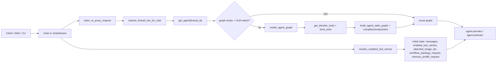
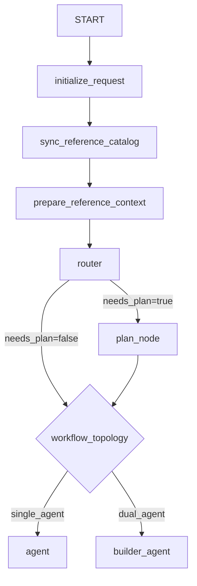
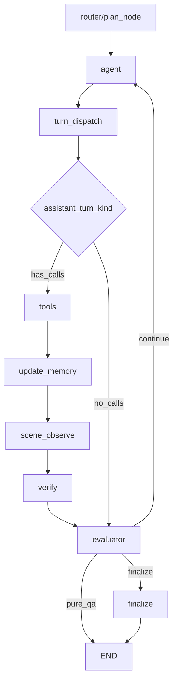
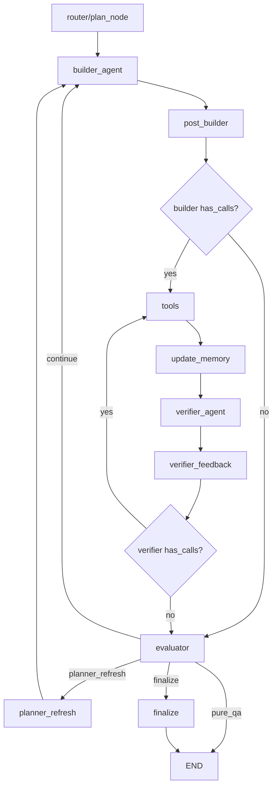

# 当前后端 Agent Workflow 架构（Router + Plan + Evaluator）

更新时间：2026-03-07

本文基于当前主干代码核对，覆盖：
- API Router 到 Graph 执行入口
- `initialize_request + router + plan_node` 请求前置链
- `single_agent` 与 `dual_agent` 两套执行拓扑
- `verification_result` 统一状态契约
- 单一 `evaluator` 的路由与 todo 生命周期管理

核对的核心代码：
- `scene_agent/interfaces/api/routes_chat.py`
- `scene_agent/interfaces/api/shared.py`
- `scene_agent/agent/graph.py`
- `scene_agent/agent/graph_factory.py`
- `scene_agent/agent/nodes/router.py`
- `scene_agent/agent/nodes/agents.py`
- `scene_agent/agent/nodes/evaluators.py`
- `scene_agent/agent/nodes/verification.py`
- `scene_agent/agent/nodes/shared.py`
- `scene_agent/agent/nodes/finalize.py`
- `scene_agent/agent/todo_protocol.py`
- `scene_agent/agent/todo_state.py`
- `scene_agent/vlm/verification.py`

---

## 1. API Router 与 Graph 入口



关键点：
- `get_agent(thread_id)` 按线程缓存 graph，provider/model 变化时会重建并迁移可迁移状态。
- checkpointer 优先 Redis，不可用时回退 `InMemorySaver`。
- 请求级透传 `workflow_topology_request`、`memory_profile_request`、`attached_image_ids`。

---

## 2. 请求前置链（Initialize + Router + Plan）



关键点：
- `initialize_request` 不再初始化内部预算控制，主要负责拓扑、记忆配置和请求计数器初始化。
- `router` 使用结构化输出 `RouterDecision(needs_plan, reasoning)`。
- 存在未完成 todo 时，`router` 强制 `needs_plan=true`（继续既有计划）。
- `plan_node` 使用结构化输出分解 todos；若模型返回空列表，自动生成单条 fallback todo。

---

## 3. Single-Agent 拓扑（当前主干）



关键点：
- `turn_dispatch` 仅做二分：`has_calls` / `no_calls`。
- 不再有 `todo_commit`、`quality/progress/budget/transition` evaluator 链。
- `verify` 输出统一契约到 `state["verification_result"]`，`evaluator` 仅读此字段决策。

---

## 4. Dual-Agent 拓扑（与单代理同 evaluator 契约）



关键点：
- 双代理链中没有 `scene_observe` 节点；verifier 自主使用 camera/render 工具做观察。
- `verifier_feedback` 同时承担：
  - verifier tool-call 路由（有调用则回 tools 回路）
  - 无调用时提取 `verification_result`
  - verifier turn 计数
- builder 无调用时不经过 verifier，直接进入 evaluator 作为 stall 情况处理。

---

## 5. `verification_result` 统一契约

统一字段（写入 `AgentState["verification_result"]`）：

```python
{
  "status": "working" | "done",
  "reason": str,
  "edit_suggestions": list[str],
}
```

来源：
- single-agent：`verify_node` 写入。
- dual-agent：`verifier_feedback` 在 verifier 停止调用工具时写入。

消费方：
- 仅 `evaluator_node`。
- evaluator 不再从 message 历史反解析 verification 来决策。

---

## 6. 单一 Evaluator 规则

`evaluator_node` 统一处理所有路由和 todo 状态迁移：
- Pure QA：`!has_todos && !request_tool_batches && !routed_to_plan` -> `END`（跳过 finalize）。
- Plan 模式：
  - `verification_result.status=done` -> active todo 标记 `completed`。
  - `working/None` -> 增加 `current_todo_stall_count`。
  - 到阈值 `K_SKIP=3` 时，active todo 标记 `skipped`。
  - dual-agent 且 stall 达 `K_REPLAN=2` 且有 replan 配额 -> `planner_refresh`。
- Direct 模式：
  - `done` -> finalize。
  - 否则累加 `overall_stall_count`，达到阈值后 finalize。

并行能力：
- evaluator 内部仍整合 convergence guard（重复失败/振荡检测）。

---

## 7. Todo 生命周期所有权

当前所有权边界：
- `plan_node` 负责创建 todo（`apply_todo_actions`）。
- `evaluator_node` 负责 todo 状态迁移（`completed` / `skipped`）。
- Agent 本身不再管理 todo 状态。

协议更新：
- `todo_protocol.py` 已加入 `skipped`。
- `TODO_TERMINAL_STATUSES` 包含 `skipped`。

---

## 8. Verify 与 Finalize

Verify：
- `verify_node` 直接执行 VLM 结构化验证。
- VLM 主路径使用 `with_structured_output`，失败时回退到 JSON 文本解析路径。

Finalize：
- `finalize` 由 evaluator 显式路由触发（不再经过 checkpoint/finalize guard 链）。
- 总结文本为自然语言（2-3句），包含 skipped 统计信息。
- pure QA 路径不进入 finalize，直接 `END`。

---

## 9. SSE 内部节点过滤

`routes_chat.py` 内部节点过滤集合已覆盖：
- `initialize_request`
- `sync_reference_catalog`
- `prepare_reference_context`
- `router`
- `plan_node`
- `verify`
- `evaluator`
- `verifier_feedback`

目的：避免内部模型 token（router/plan/evaluator/verifier_feedback）泄露到前端流。

---

## 10. 与旧架构的关键差异（摘要）

- 从 Router-Free 固定 `plan_mode` 改为显式 `router` 决策。
- 从四段 evaluator 链改为单一 `evaluator_node`。
- 删除 `todo_update` 内部工具与 `todo_commit` 主路径依赖。
- 删除请求内部 budget stop 控制主链依赖。
- dual-agent 改为 verifier 自主观察回路，`verifier_feedback` 吸收 post-verifier 职责。
- 新增 `verification_result` 统一契约，single/dual 共用 evaluator 决策逻辑。
