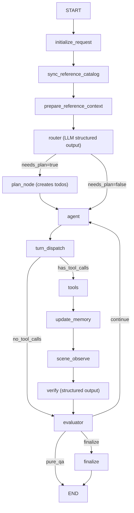
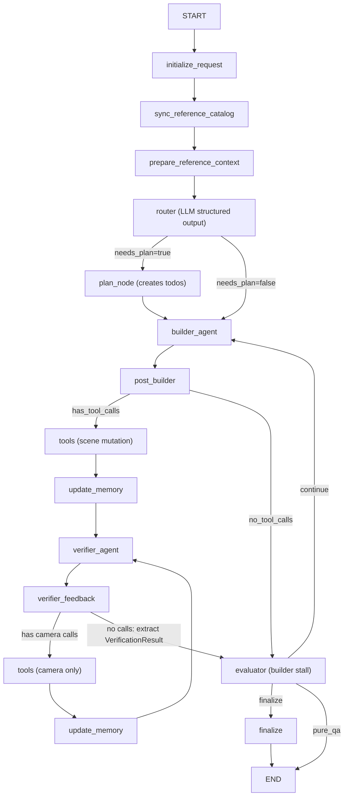

# Agentic Workflow Optimization

## Current Problems Recap

1. **No routing = premature termination**: Without a router, `initialize_request` always sets `plan_mode`. When the agent makes no tool calls on the first turn, `turn_dispatch(no_calls)` flows to `quality_evaluator` -> `progress_evaluator`, which judges `done` (no todos + no verification evidence), causing premature finalization even for legitimate scene-editing requests.
2. **Evaluator chain is over-segmented**: 4 evaluator nodes (`quality` -> `progress` -> `budget` -> `transition`) create complex state flow but serve what is logically a single gating decision.
3. **Budget mechanism is rigid and unnecessary**: Mode-specific budgets (`conversation: 2 turns`, `single_action: 3 turns`, `plan: 50 turns`) were designed for the old router era; users want external budget control.
4. **Verify output is fragile**: Raw JSON parsing via `_extract_json()` in `[scene_agent/vlm/verification.py](scene_agent/vlm/verification.py)` (line 72-83) is unreliable; no structured output schema.
5. **Finalize summary is mechanical**: Template-based `_build_finalize_summary()` in `[shared.py](scene_agent/agent/nodes/shared.py)` (line 1143-1196) produces rigid "Result / Todo Progress / Verification Highlights / Suggested Next Action" blocks.

## Proposed Architecture

### Single-Agent Path




Key simplification: Agent no longer has a `todo_update` tool. `turn_dispatch` becomes a binary decision (tool calls or not). `todo_commit` node is removed. The evaluator solely owns todo state transitions based on verify output.

### Dual-Agent Path

In dual-agent mode, the builder agent handles scene mutations and the verifier agent independently verifies by controlling its own observation process (inspired by [VIGA's architecture](reference/VIGA/docs/architecture.md) where the verifier owns camera/viewpoint tools).



Key design principles:
- **No `scene_observe` node in the dual-agent pipeline.** The verifier agent owns its observation process entirely. After builder's `tools -> update_memory`, control passes directly to `verifier_agent`. The verifier uses `observe_scene_global` / `render_from_camera` / `render_from_objects` / `camera_observe` etc. as its first actions, inspects the renders, and optionally investigates further with additional camera tools — all within its own agentic loop (VIGA-style).
- **`post_verifier` is eliminated.** `verifier_feedback` absorbs its responsibilities: tool-call routing (has camera calls -> tools loop; no calls -> extract result), verifier turn counting, and `VerificationResult` extraction. This reduces one graph node.
- **Builder no-call path skips verifier.** If builder makes no tool calls, nothing changed in the scene — the evaluator handles it directly as a builder stall (increment stall counter, route back). No wasted verifier VLM call.
- **Single-agent vs dual-agent asymmetry is intentional.** Single-agent keeps `scene_observe -> verify (non-LLM)` because the non-LLM verify node cannot call tools. Dual-agent replaces both with `verifier_agent` (agentic observation + judgment in one).
- **Verifier prompt enforces observation-first.** System prompt: "Before making any judgment, render the scene using observation tools. Analyze renders against the current objective (active todo or user request) and reference images. Output your assessment only after visual inspection."
- **Verifier tool domain** remains `VERIFIER_CAMERA_TOOLS` from [`tool_policy.py`](scene_agent/agent/tool_policy.py) line 12-24: `observe_scene_global`, `camera_observe`, `render_from_camera`, `render_from_objects`, `camera_act`, `camera_set_pose`, `get_scene_info`, `get_object_info`, `get_viewport_screenshot`.
- `evaluator` uses the same gating logic as single-agent — reads the verification result, manages todo state, determines routing. Routes to `builder_agent` when continuing in dual mode.
- `planner_refresh` is preserved: evaluator can route to `planner_refresh -> builder_agent` when sustained stalls are detected.

## Detailed Design

### 1. Light Router Node (NEW)

**File**: `[scene_agent/agent/nodes/router.py](scene_agent/agent/nodes/router.py)`

- Replace `initialize_request_node` with a two-step flow: `initialize_request_node` (state init, no LLM) + `router_node` (LLM decision).
- `router_node` uses `with_structured_output` on the VLM to produce:

```python
class RouterDecision(BaseModel):
    needs_plan: bool  # True = complex task requiring decomposition
    reasoning: str    # Short rationale
```

- Prompt includes: user message text, whether reference images are attached, whether unfinished todos exist from previous turns.
- If `unfinished_todos > 0`, force `needs_plan=True` (skip LLM call) to continue existing plan.
- Router output determines the conditional edge: `needs_plan=True` -> `plan_node`, else -> `agent`.
- Remove: `MODE_CONVERSATION`, `MODE_SINGLE_ACTION` from constants/state. Keep only a boolean `has_plan` or reuse `task_mode` with just `plan_mode` / `direct_mode`.
- Remove: all clarification-related code (`invoke_router_decision`, `RouterDecision.need_clarification`, legacy markers in `constants_router.py`).

### 2. Plan Node (NEW)

**File**: New function in `[scene_agent/agent/nodes/agents.py](scene_agent/agent/nodes/agents.py)` or a new `planning.py`

- `plan_node` uses the VLM with `with_structured_output` to decompose the user request into an ordered todo list:

```python
class PlannedTodo(BaseModel):
    title: str
    description: str

class PlanOutput(BaseModel):
    todos: list[PlannedTodo]
```

- Input context: user message, reference images (if any), current scene objects.
- Output: Creates todos via `apply_todo_actions()` with status `pending`, sets first as `active_todo_id`.
- Always produces at least 1 todo. If the VLM produces 0, create a single fallback todo from the user request text.

### 3. Verify Node Restructure

**File**: `[scene_agent/agent/nodes/verification.py](scene_agent/agent/nodes/verification.py)` + `[scene_agent/vlm/verification.py](scene_agent/vlm/verification.py)`

- Replace raw JSON prompt + `_extract_json()` with `with_structured_output`. The schema is intentionally flat — no per-todo assessment list, because the evaluator processes one active todo at a time and the top-level `status` already tells it what it needs:

```python
class VerificationResult(BaseModel):
    status: Literal["working", "done"]
    reason: str
    edit_suggestions: list[str] = Field(default_factory=list)
```

- Verify input context: render image + reference images (if any) + active pending todo description (if any, else user request text). The prompt asks: "Is the current objective satisfied in this render?"
- `status="working"`: render does not yet satisfy the objective (maps from old mismatch/partial).
- `status="done"`: render satisfies the objective (maps from old match/pass).
- Verification no longer carries a separate scene-break flag; unresolved renders remain `status="working"`.
- Verify uses a single VLM structured-output path, with raw JSON extraction as fallback.
- The existing flow where `no_calls` -> `evaluator` (skipping verify) remains unchanged.

### 3b. Unified `verification_result` State Contract (NEW)

**Files**: [`verification.py`](scene_agent/agent/nodes/verification.py), [`evaluators.py`](scene_agent/agent/nodes/evaluators.py), dual-agent `verifier_feedback` implementation

- Add a single canonical state field: `verification_result: dict | None` (normalized to `VerificationResult` shape).
- **Single-agent source**: `verify_node` writes `verification_result` after structured verification.
- **Dual-agent source**: `verifier_feedback` writes `verification_result` when verifier finishes observation and emits judgment (no more camera tool calls).
- **Evaluator contract**: `evaluator_node` reads only `state["verification_result"]` and never re-parses message history for decision logic.
- If a turn has no fresh verification evidence (for example, no tool calls), evaluator treats `verification_result=None` and executes stall logic.

### 4. Merged Evaluator (REPLACE 4 nodes with 1)

**File**: `[scene_agent/agent/nodes/evaluators.py](scene_agent/agent/nodes/evaluators.py)`

Replace `quality_evaluator_node`, `progress_evaluator_node`, `budget_evaluator_node`, `transition_resolver_node` with a single `evaluator_node`. **The evaluator is the sole owner of todo state transitions** — it reads canonical `verification_result.status` and directly calls `apply_todo_actions()` to mark todos as done/skipped. The agent never touches todo state.

```
evaluator_node(state):
    verify = state.get("verification_result")  # VerificationResult or None
    has_todos = has_pending_todos(state)
    has_tool_calls = request_tool_batches > 0
    current_todo_id = active_todo_id
    routed_to_plan = state.get("routed_to_plan", False)
    is_dual = workflow_topology == "dual_agent"
    agent_target = "builder_agent" if is_dual else "agent"
    
    # Path A: Pure Q&A — no plan, no tool calls ever made → END (skip finalize)
    if not has_todos and not has_tool_calls and not routed_to_plan:
        return transition_next = END
    
    # Path B: Has pending todos (plan mode or continuing plan)
    if has_todos and current_todo_id:
        if verify and verify.status == "done":
            apply_todo_actions: mark current_todo_id → done (completed)
            advance active_todo_id to next pending todo
            reset current_todo_stall_count to 0
            if no more pending todos → return transition_next = "finalize"
            return transition_next = agent_target
        else:  # working or no verify (agent made no tool calls)
            increment current_todo_stall_count
            if is_dual and current_todo_stall_count >= K_REPLAN and replan_budget_remaining(state):
                return transition_next = "planner_refresh"
            if current_todo_stall_count >= K_SKIP:
                apply_todo_actions: mark current_todo_id → skipped
                advance active_todo_id to next pending todo
                reset current_todo_stall_count to 0
                if no more pending todos → return transition_next = "finalize"
            return transition_next = agent_target
    
    # Path D: Direct mode with tool calls (no todos)
    if verify and verify.status == "done":
        return transition_next = "finalize"
    else:
        increment overall_stall_count
        if overall_stall_count >= K_SKIP:
            return transition_next = "finalize"
        return transition_next = agent_target
```

- `K_SKIP` (skip/finalize stall threshold) = configurable constant, default 3.
- `K_REPLAN` (dual-agent planner refresh threshold) = configurable constant, default 2.
- Keep convergence guard integration (oscillation / repeat-loop detection from `[convergence.py](scene_agent/agent/convergence.py)`) as an internal check within this evaluator.
- State changes: add `current_todo_stall_count: int`, `overall_stall_count: int`, `routed_to_plan: bool`, `verification_result: dict | None`. Add single `evaluator_result: dict` (replaces `quality_eval`, `progress_eval`, `budget_eval`).

### 4b. Add `skipped` Status to Todo Protocol

**File**: [`scene_agent/agent/todo_protocol.py`](scene_agent/agent/todo_protocol.py), [`scene_agent/agent/state.py`](scene_agent/agent/state.py)

The evaluator marks stalled todos as `skipped`, but the current protocol only allows `pending | in_progress | completed | failed` (line 21) and `superseded` (via the `supersede` action). `skipped` is not a valid status and will fail `TodoActionModel` validation.

Changes:
- Add `"skipped"` to the `set_status` action's allowed values in `TodoActionModel.status` (line 21): `Literal["pending", "in_progress", "completed", "failed", "skipped"]`.
- Add `"skipped"` to `TODO_TERMINAL_STATUSES` (line 13): `frozenset({"completed", "failed", "superseded", "skipped"})`.
- Update `TodoItem.status` comment in [`state.py`](scene_agent/agent/state.py) (line 16) and `TodoVersion.status` comment (line 28) to include `"skipped"`.
- The evaluator's `apply_todo_actions` call will use `action="set_status", status="skipped"`.
- Update finalize counting and context generation to include `skipped` (for example `_collect_current_todo_counts()` and summary payload fields) so skipped todos are visible in final summary and workflow metadata.

### 4c. Remove todo_update Tool from Agent

- Remove `todo_update` from the agent's tool set (it was an internal pseudo-tool defined in `[todo_protocol.py](scene_agent/agent/todo_protocol.py)`).
- Remove `todo_commit_node` from `[execution.py](scene_agent/agent/nodes/execution.py)`.
- Simplify `turn_dispatch_node`: no longer needs to split `todo_update` calls from external calls. It becomes a binary check: `has_tool_calls` or `no_tool_calls`.
- Remove `pending_todo_updates` from state, `assistant_turn_kind` distinctions (`mixed`, `todo_only`) — only `has_calls` / `no_calls` remain.
- The agent's system prompt no longer mentions todo management. The agent focuses on scene edits; it receives the current active todo as context (via system prompt injection) but does not modify todo state.
- Update [`scene_agent/agent/prompts.py`](scene_agent/agent/prompts.py) to remove all `todo_update()` instructions and replace them with evaluator-owned todo semantics ("perform scene edits and renders; workflow evaluator manages todo lifecycle").

### 5. Remove Budget Mechanism

**Files to modify**:

- `[constants_workflow.py](scene_agent/agent/nodes/constants_workflow.py)`: Remove `REQUEST_BUDGET_DEFAULTS`, `MODE_CONVERSATION`, `MODE_SINGLE_ACTION`.
- `[shared.py](scene_agent/agent/nodes/shared.py)`: Remove `request_budget()` function, remove budget-related state initialization in `initialize_request_node`.
- `[graph.py](scene_agent/agent/graph.py)`: Remove `_agent_turn_budget_exhausted()` helper and all budget checks in routing functions.
- `[agents.py](scene_agent/agent/nodes/agents.py)`: Remove `request_stop_reason` setting in `turn_dispatch_node`.
- `[execution.py](scene_agent/agent/nodes/execution.py)`: Remove budget checks in `update_memory_node`.
- State: Remove or ignore `max_request_agent_turns`, `max_request_tool_batches`, `request_stop_reason` fields. Keep `request_agent_turns` and `request_tool_batches` as counters for metadata/logging only.

### 6. Update Finalize Node

**File**: `[shared.py](scene_agent/agent/nodes/shared.py)` - `compose_finalize_summary()`, `_build_finalize_summary()`

- The `_build_finalize_summary_with_model()` path already exists and uses the VLM to produce natural language. Make this the primary path.
- Rewrite the prompt to produce a conversational summary, not the rigid "Result / Todo Progress / Verification Highlights / Suggested Next Action" template.
- New prompt guidance: "Summarize what was accomplished in 2-3 natural sentences. Mention any items that were skipped. Match the user's language."
- Fallback (`_build_finalize_summary`) should also produce more natural text instead of the current template.
- Update `_collect_current_todo_counts()` and `_build_finalize_summary_context()` to include `skipped_count`, and ensure skipped todos are included in both model-based and fallback summaries.
- Graph routing: evaluator routes to `"finalize"` or `END` (not through `checkpoint_finalize`). Remove `checkpoint_finalize` / `checkpoint_gate_node` / `finalize_guard_node` intermediaries.

### 7. Update Graph Topology

**File**: [`graph.py`](scene_agent/agent/graph.py), [`graph_factory.py`](scene_agent/agent/graph_factory.py)

Nodes to **remove**:

- `quality_evaluator`, `progress_evaluator`, `budget_evaluator`, `transition_resolver` (replaced by single `evaluator`)
- `todo_commit` (evaluator now owns todo state)
- `checkpoint_finalize`, `checkpoint_gate_node`, `finalize_guard_node` (evaluator routes directly to `finalize` or `END`)
- `blocked_recovery`, `blocked_recovery_action`

Nodes to **add**:

- `router` (LLM structured output)
- `plan_node` (LLM todo decomposition)
- `evaluator` (merged gatekeeper + todo state manager)

Nodes **kept and updated** (dual-agent):

- `builder_agent`, `post_builder`, `verifier_camera_agent` (renamed to `verifier_agent`), `verifier_feedback`, `planner_refresh`
- `post_verifier`: **removed** — responsibilities merged into `verifier_feedback`.
- `post_builder`: remove budget exhaustion checks; keep turn counting and builder stall tracking. Route to `evaluator` when builder makes no tool calls (stall), to `tools -> update_memory -> verifier_agent` when builder has calls.
- `verifier_feedback`: absorbs post_verifier's turn counting + tool-call dispatch. If verifier has camera tool calls -> route to `tools -> update_memory -> verifier_agent` (loop). If no calls -> extract `VerificationResult` (working/done), increment verifier turn count, route to `evaluator`.
- No `scene_observe` in the dual-agent pipeline — verifier agent controls its own observation via camera/render tools (VIGA-style).

Routing edges (single-agent path):

- `prepare_reference_context` -> `router` (conditional: `plan_node` or `agent`)
- `turn_dispatch` -> `tools` (has tool calls) or `evaluator` (no tool calls)
- `verify` -> `evaluator`
- `evaluator` -> `agent` / `finalize` / `END`

Routing edges (dual-agent path):

- `router` -> `plan_node` (conditional) -> `builder_agent`
- `post_builder` -> `tools -> update_memory -> verifier_agent` (has calls) or `evaluator` (no calls, builder stall)
- `verifier_feedback` -> `tools -> update_memory -> verifier_agent` (has camera calls, observation loop) or `evaluator` (no calls, judgment extracted)
- `evaluator` -> `builder_agent` / `planner_refresh` / `finalize` / `END`
- `planner_refresh` -> `builder_agent`

### 8. SSE Node Filtering (P2)

**File**: [`routes_chat.py`](scene_agent/interfaces/api/routes_chat.py) line 46-53

The current `_INTERNAL_NON_USER_MESSAGE_NODES` frozenset filters internal node tokens from the SSE stream:

```python
_INTERNAL_NON_USER_MESSAGE_NODES = frozenset({
    "verify",
    "initialize_request",
    "sync_reference_catalog",
    "prepare_reference_context",
})
```

New nodes `router`, `plan_node`, and `evaluator` produce internal LLM calls whose tokens must not leak to the frontend. Update to:

```python
_INTERNAL_NON_USER_MESSAGE_NODES = frozenset({
    "verify",
    "initialize_request",
    "sync_reference_catalog",
    "prepare_reference_context",
    "router",
    "plan_node",
    "evaluator",
    "verifier_feedback",
})
```

### 9. Cleanup

- Remove `invoke_router_decision()` and old `RouterDecision` model from shared.py (replaced by new structured router).
- Remove legacy markers in `constants_router.py` (`_PLAN_INTENT_MARKERS`, `_ACTION_INTENT_MARKERS`, `_IMAGE_QA_MARKERS`).
- Remove `todo_update` tool from agent tool set; keep `todo_protocol.py` module (it still defines `TodoActionModel` used by evaluator and plan_node via `apply_todo_actions`).
- Keep dual-agent role model/tool policy domains (`ROLE_BUILDER`, `ROLE_VERIFIER`, `TOPOLOGY_DUAL`, role-private memory, tool_policy domains) intact while updating routing/nodes per Section 7.

### 10. Test Updates

- Update all tests in `tests/unit/` that reference removed nodes/evaluators.
- Key test files to update: `test_agent_graph_reference_routing.py`, `test_agent_workflow_control.py`, `test_evaluator_cluster.py`, `test_router_llm_node.py`, `test_verify_node.py`, `test_prompt_strategy.py`.
- Add new tests: `test_router_structured_output.py`, `test_plan_node.py`, `test_merged_evaluator.py`, `test_dual_agent_evaluator_routing.py`, `test_verification_result_contract.py`.
- Add regression tests for: (a) evaluator reads only `verification_result` state; (b) dual-agent stalls route to `planner_refresh`; (c) skipped todos are counted in finalize summary/context.

## Risk Assessment

- **Medium risk**: Graph topology + evaluator unification across single/dual paths introduces broad coupling changes (routing, node contracts, state fields). Mitigation: enforce a single `verification_result` contract and add path-specific regression tests.
- **Medium risk**: Verify `with_structured_output` depends on VLM provider support. Keep fallback to JSON parsing for providers/models that fail structured output, and log fallback activation for observability.
- **Medium risk**: Removing budget + `todo_update` + `todo_commit` touches tool policy, prompts, dispatch logic, and state schema simultaneously. Mitigation: migrate prompt/tool contract first, then delete dead paths after tests pass.
- **Low risk**: Router misjudge — both direct and plan modes remain executable. A misjudged "direct" for a complex task loses todo granularity but still converges via evaluator stall handling.
