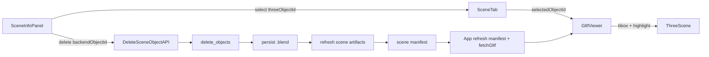

# 3D Viewport / Hierarchy / `.blend` 回传实施计划

日期：2026-04-08

相关代码路径：
- [web/src/components/GltfViewer.tsx](web/src/components/GltfViewer.tsx)
- [web/src/components/SceneInfoPanel.tsx](web/src/components/SceneInfoPanel.tsx)
- [web/src/components/SceneTab.tsx](web/src/components/SceneTab.tsx)
- [web/src/App.tsx](web/src/App.tsx)
- [web/src/App.css](web/src/App.css)
- [web/src/api/client.ts](web/src/api/client.ts)
- [web/src/api/types.ts](web/src/api/types.ts)
- [web/src/state/types.ts](web/src/state/types.ts)
- [scene_agent/interfaces/api/routes_scene.py](scene_agent/interfaces/api/routes_scene.py)
- [scene_agent/interfaces/api/models.py](scene_agent/interfaces/api/models.py)
- [scene_agent/interfaces/api/shared.py](scene_agent/interfaces/api/shared.py)
- [mcp_server/tools/base.py](mcp_server/tools/base.py)
- [addon/blender_mcpv_addon/server_runtime_mixin.py](addon/blender_mcpv_addon/server_runtime_mixin.py)
- [addon/blender_mcpv_addon/server_scene_tools_mixin.py](addon/blender_mcpv_addon/server_scene_tools_mixin.py)

---

## 1. 本次决策

- `unlit shader` 直接进入本轮实现。
- hierarchy 选中高亮仍然是前端 viewport 侧能力，不需要后端参与。
- hierarchy 删除不再是“本地预览删除”，而是以后端 Blender 场景为准的真实删除。
- 删除成功后必须让后续 `Download GLTF` 与 `Download BLEND` 都反映删除结果。
- 样式改造继续保留：panel 折叠按钮移到 panel 最右侧中线位置，不同 object type 使用不同图标。

---

## 2. 直接结论

### 2.1 删除回传到 `.blend` 可行性

可行，而且现有后端已经具备核心删除链路：

- MCP 已有 `delete_objects` 工具。
- Blender addon 已支持 `delete_objects` 执行。
- scene-mutating command 已能触发自动持久化。
- `/scene/{thread_id}/blend` 本来就会从 Blender 当前场景导出 `.blend`。

因此真正新增的工作不是“如何删”，而是：

- 前端如何稳定识别“当前选中的 hierarchy node 对应 Blender 的哪个 object”。
- 删除成功后如何把 persisted artifact、manifest、前端 viewport 一起刷新，避免下载和显示继续落到旧场景。

### 2.2 当前实现的关键约束

- 现在 hierarchy 的 `id` 是前端 `THREE.Object3D.uuid`，不能直接回传给 Blender。
- 当前 `SceneHierarchyNode` 只有 `id / name / type / children`，缺少 Blender-facing identity。
- 当前 `Download GLTF` 在有 manifest 时优先下载 persisted artifact，而不是前端内存里的 Three.js scene。
- 当前 persisted artifact 的 URL 是稳定路径 `/threads/{thread_id}/scene-artifacts/latest.glb`，如果不做 revision/cache-busting，刷新后可能继续命中旧缓存。

---

## 3. 现状风险点

### 3.1 hierarchy 当前没有稳定后端标识

当前 hierarchy 是在 [web/src/components/GltfViewer.tsx](web/src/components/GltfViewer.tsx) 里从 glTF runtime object tree 直接构造的。  
这意味着：

- `selectedObjectId` 只能在前端本次加载里使用。
- 它适合做 bbox/highlight。
- 它不适合做后端删除主键。

### 3.2 当前下载语义与“本地场景状态”脱钩

[web/src/App.tsx](web/src/App.tsx) 中 `downloadGltf()` 的现状是：

- 若 `sceneManifest.gltf_url` 存在，则优先走 persisted artifact 下载。
- 否则才走 `/scene/{thread_id}/gltf` 现导。

这意味着如果删除只更新前端 viewport 而不刷新 persisted artifact：

- viewport 看起来删掉了。
- `Download GLTF` 仍可能下到旧文件。
- `Download Current BLEND` 也会继续导出未删除的 Blender 场景。

### 3.3 仅用 visible name 直接删不够鲁棒

虽然 Blender object name 通常唯一，但稳定鲁棒版不应把“UI 显示名”直接当作 destructive API 的唯一主键。风险包括：

- glTF 节点名和 Blender object name 未来可能分叉。
- 未来如果前端想显示 prettier label，就会和删除主键耦合。
- 后续若支持 rename，visible name 与 stable identity 必须分离。

---

## 4. 正式方案

### 4.1 总体思路

采用“后端 authoritative delete + 前端选中高亮”的双轨设计：

- 选中高亮只依赖前端 glTF object tree。
- 删除动作只依赖后端稳定对象标识。
- 删除成功后由后端立即刷新 `.blend` 与 persisted GLB artifact。
- 前端再统一刷新 manifest 与 glTF blob，确保显示与下载一致。

### 4.2 稳定对象标识设计

前端需要同时保留两种身份：

- `threeObjectId`
  - 用于本次 glTF 加载内的选中、高亮、展开状态、删除前 UI 定位。
- `backendObjectId`
  - 用于透传到后端执行真实删除。
  - 本轮建议直接采用 Blender object identity 字段，而不是继续复用前端 `uuid`。

建议扩展 [web/src/state/types.ts](web/src/state/types.ts) 的 `SceneHierarchyNode`：

- `id: string`
  - 保持当前语义，继续用前端 runtime uuid。
- `name: string`
  - 继续作为 UI label。
- `type: string`
  - 继续用于 UI icon / type badge。
- `children: SceneHierarchyNode[]`
- `backendObjectId?: string | null`
  - 后端删除主键。
- `backendObjectName?: string | null`
  - 可用于调试、提示文案、返回结果对齐。
- `deletable?: boolean`
  - 没有稳定后端 identity 时显式禁用删除按钮。

### 4.3 稳定 identity 的来源

本轮推荐的鲁棒方案是：

- 在 Blender object 上引入 namespaced custom property，例如 `scene_agent_object_id`。
- 该字段首次缺失时自动生成并写回 `.blend`。
- glTF 导出链路把该字段带到 node extras。
- 前端从 `object.userData` 读取它，并写进 `SceneHierarchyNode.backendObjectId`。

推荐同时带两个字段：

- `scene_agent_object_id`
- `scene_agent_object_name`

原因：

- `object_id` 作为真正稳定主键。
- `object_name` 作为后端日志、返回结果、用户提示和 fallback 对照。

### 4.4 metadata 透传方式

优先路径：

- 在 [scene_agent/interfaces/api/routes_scene.py](scene_agent/interfaces/api/routes_scene.py) 的 GLB 导出路径中启用 glTF extras 透传。
- 导出前保证 Blender object 的 `scene_agent_object_id` 与 `scene_agent_object_name` 已存在。
- 前端 GLTFLoader 读到后，可从 `THREE.Object3D.userData` 直接拿到 metadata。

设计要求：

- 不把 UI visible name 当作唯一删除主键。
- 不依赖当前 `THREE.Object3D.name` 和 Blender name 永远一一相等。
- 如果个别 node 缺少 `backendObjectId`，该 node 仍可被选中高亮，但删除按钮应禁用。

### 4.5 删除 API 设计

新增后端接口，建议放在 [scene_agent/interfaces/api/routes_scene.py](scene_agent/interfaces/api/routes_scene.py)：

- `POST /scene/{thread_id}/objects/delete`

请求字段建议：

- `backend_object_id: string`
- `backend_object_name?: string | null`
- `mode?: "cascade"`

本轮建议先只支持：

- `mode = "cascade"`

原因：

- 当前 MCP `delete_objects` 默认就支持 cascade。
- UI 上点掉 hierarchy node，大多数情况下用户预期就是删掉该 node 及其子树。
- `detach_keep_world` 与 `reparent_to_parent_keep_world` 会引入明显更复杂的产品语义，不适合这轮顺手加入。

返回字段建议：

- `thread_id`
- `backend_object_id`
- `backend_object_name`
- `deleted_names: string[]`
- `scene_revision: number`
- `manifest_generated_at_ms: number | null`
- `has_persisted_blend: boolean`

### 4.6 删除 API 的服务端行为

服务端处理顺序建议固定为：

1. `claim_or_proxy_request()`
2. 确认 thread 对应 Blender session 可用
3. 通过 stable identity 解析到当前 Blender object
4. 调用现有 `delete_objects`
5. 立即持久化 session blend
6. 立即刷新 scene artifact manifest 与 `latest.glb`
7. 返回删除结果与新 `scene_revision`

关键点：

- 不要只删 Blender 内存态而不刷新 persisted artifact。
- 不要把 artifact refresh 留给前端异步猜测。
- 删除接口本身就应该保证“成功返回时，下载语义已经一致”。

后端复用现有能力：

- 删除执行：复用 [mcp_server/tools/base.py](mcp_server/tools/base.py) / [addon/blender_mcpv_addon/server_scene_tools_mixin.py](addon/blender_mcpv_addon/server_scene_tools_mixin.py) 的 `delete_objects`
- `.blend` 持久化：复用现有 session persistence / `save_blend`
- artifact 刷新：复用 [scene_agent/interfaces/api/shared.py](scene_agent/interfaces/api/shared.py) 的 `persist_thread_scene_artifacts_sync()`

### 4.7 manifest / cache-busting 设计

这一点必须写进实现范围，否则删除后前端和下载可能仍然看到旧 GLB。

当前 [scene_agent/interfaces/api/shared.py](scene_agent/interfaces/api/shared.py) 的 `build_thread_artifact_gltf_url()` 返回固定路径：

- `/threads/{thread_id}/scene-artifacts/latest.glb`

本轮建议同时做两件事：

- `scene_revision` 每次删除后递增或刷新为新时间戳。
- `gltf_url` 或前端解析后的实际请求 URL 带上 `?rev={scene_revision}`。

这样可以解决：

- persisted GLB 文件内容已变但 URL 路径不变
- 浏览器 / loader / CDN 继续命中旧缓存

### 4.8 前端删除交互

删除按钮仍然保留在 hierarchy row 右侧，仅在 hover 或选中时出现。  
但因为现在删除会真实写回 `.blend`，前端需要最小保护：

- 第一版建议在点击 `x` 后加一次确认
- 最简单可接受的实现是 `window.confirm`
- 后续若体验需要，再升级为 inline confirm row 或 popover confirm

前端行为建议：

1. 点击 row 时更新 `selectedObjectId`
2. `GltfViewer` 根据 `selectedObjectId` 绘制 bbox + highlight
3. 点击 `x` 时：
   - 若 node 没有 `backendObjectId`，直接拒绝
   - 若用户取消确认，直接返回
   - 发起删除 API
   - 删除过程中禁用当前 row 的二次删除
4. 删除成功后：
   - 清空选中态
   - 刷新 manifest
   - 调用 `fetchGltf(threadId)` 拉取最新 blob URL
   - 必要时刷新 scene metadata
5. 删除失败时：
   - 保留旧 hierarchy
   - 给出 action error

### 4.9 为什么前端仍要显式 `fetchGltf()`

即便删除 API 已经刷新了 persisted artifact，前端仍应主动跑一次 [web/src/App.tsx](web/src/App.tsx) 里的 `fetchGltf()`：

- 当前 viewer 优先吃 `thread.gltfUrl`
- `fetchGltf()` 会生成新的 `blob:` URL，天然绕开缓存
- 这比单纯依赖 manifest 里的稳定路径更可靠

同时前端还需要刷新 manifest，因为：

- `downloadGltf()` 在 manifest 存在时优先下载 persisted artifact
- 不刷新 manifest，下载菜单仍可能引用旧 revision 语义

### 4.10 hierarchy 与 viewport 的职责边界

职责边界建议固定如下：

- `SceneInfoPanel`
  - 渲染 tree
  - 维护 hover / selected / delete affordance
  - 不直接操作 Three.js scene
- `SceneTab`
  - 维护 `selectedObjectId`
  - 维护删除中状态
  - 串联 `SceneInfoPanel` / `GltfViewer` / App callback
- `GltfViewer`
  - 维护基于 `selectedObjectId` 的 bbox/highlight
  - 从 glTF runtime object tree 构建 hierarchy
  - 解析 glTF node metadata 到 hierarchy node
- `App`
  - 发起删除 API
  - 更新 thread 的 manifest、gltfUrl、actionError、loading

---

## 5. 四个 feature 的细化计划

### 5.1 Feature 1: `unlit shader`

目标：

- 在 viewport 的 `Light` 下拉中新增 `Shading` 控件。
- 支持 `Lit / Unlit` 两个模式。

实现决策：

- `Unlit` 使用 `MeshBasicMaterial` 思路。
- 必须保存并恢复原材质。
- 必须复制至少这些字段：
  - `map`
  - `color`
  - `opacity`
  - `transparent`
  - `alphaMap`
  - `alphaTest`
  - `side`
  - `vertexColors`
- 临时创建的 unlit material 在切回 `Lit` 或模型重载时必须被释放。

涉及文件：

- [web/src/components/GltfViewer.tsx](web/src/components/GltfViewer.tsx)
- [web/src/components/SceneTab.tsx](web/src/components/SceneTab.tsx)
- [web/src/App.css](web/src/App.css)

### 5.2 Feature 2: hierarchy 选中高亮

目标：

- 点击 hierarchy node 时，在 viewport 中显示：
  - 目标 object 的 bbox
  - 半透明高亮 overlay
- 切换选择或清空选择时，旧高亮必须完全清理。

实现决策：

- 选中态只使用前端 `threeObjectId`
- 不和后端 identity 混用
- `SceneInfoPanel` row 增加 selected 样式
- `GltfViewer` 维护单一 selection overlay ref，避免残留

涉及文件：

- [web/src/components/SceneInfoPanel.tsx](web/src/components/SceneInfoPanel.tsx)
- [web/src/components/GltfViewer.tsx](web/src/components/GltfViewer.tsx)
- [web/src/components/SceneTab.tsx](web/src/components/SceneTab.tsx)
- [web/src/App.css](web/src/App.css)

### 5.3 Feature 3: hierarchy 删除并回传 `.blend`

目标：

- 点击 `x` 后真实删除 Blender object。
- 后续 `Download Current BLEND` 和 `Download GLTF` 都反映删除。

实现决策：

- 删除主键使用 `backendObjectId`
- 删除执行默认 `cascade`
- 删除成功后服务端同步刷新 persisted `.blend` 与 `latest.glb`
- 前端再刷新 manifest 和 glTF blob URL

涉及文件：

- [scene_agent/interfaces/api/models.py](scene_agent/interfaces/api/models.py)
- [scene_agent/interfaces/api/routes_scene.py](scene_agent/interfaces/api/routes_scene.py)
- [scene_agent/interfaces/api/shared.py](scene_agent/interfaces/api/shared.py)
- [addon/blender_mcpv_addon/server_scene_tools_mixin.py](addon/blender_mcpv_addon/server_scene_tools_mixin.py)
- [web/src/api/client.ts](web/src/api/client.ts)
- [web/src/api/types.ts](web/src/api/types.ts)
- [web/src/App.tsx](web/src/App.tsx)
- [web/src/components/SceneTab.tsx](web/src/components/SceneTab.tsx)
- [web/src/components/SceneInfoPanel.tsx](web/src/components/SceneInfoPanel.tsx)
- [web/src/state/types.ts](web/src/state/types.ts)

### 5.4 Feature 4: Scene Objects panel 样式

目标：

- panel 折叠按钮移动到整个 panel 最右侧中线位置
- 不同 object type 使用不同 icon
- 删除按钮 hover/selected 时出现

实现决策：

- 折叠按钮不再放在 header flow 中
- panel 使用相对定位，按钮使用绝对定位吸附在右中线
- `Mesh / Light / Camera / Group / Bone / Empty` 使用不同 SVG icon

涉及文件：

- [web/src/components/SceneInfoPanel.tsx](web/src/components/SceneInfoPanel.tsx)
- [web/src/App.css](web/src/App.css)

---

## 6. 数据模型调整

### 6.1 前端 hierarchy node

建议调整 [web/src/state/types.ts](web/src/state/types.ts)：

- `id: string`
- `name: string`
- `type: string`
- `children: SceneHierarchyNode[]`
- `backendObjectId?: string | null`
- `backendObjectName?: string | null`
- `deletable?: boolean`

### 6.2 API DTO

建议在 [scene_agent/interfaces/api/models.py](scene_agent/interfaces/api/models.py) 新增：

- `DeleteSceneObjectRequest`
- `DeleteSceneObjectResponse`

建议字段：

- `backend_object_id: str`
- `backend_object_name: str | None`
- `mode: Literal["cascade"] = "cascade"`
- `deleted_names: list[str]`
- `scene_revision: int | None`
- `manifest_generated_at_ms: int | None`
- `has_persisted_blend: bool`

---

## 7. 关键实现点

### 7.1 Blender identity 初始化

需要新增一个小型 helper，职责是：

- 遍历当前 scene objects
- 为缺失 `scene_agent_object_id` 的对象分配 UUID
- 保证该字段后续导出可见

要求：

- 字段命名必须加 `scene_agent_` 前缀
- 只在缺失时写入
- 不要每次导出都改写已有值

### 7.2 GLB 导出 metadata 透传

在 [scene_agent/interfaces/api/routes_scene.py](scene_agent/interfaces/api/routes_scene.py) 的 GLB export code 里：

- 导出前先确保 identity 存在
- 导出时显式保留 extras
- 前端加载后从 `object.userData` 读取 metadata

### 7.3 前端 hierarchy 构建

在 [web/src/components/GltfViewer.tsx](web/src/components/GltfViewer.tsx) 的 `buildHierarchy()` 里：

- 保持 `id = object.uuid`
- 读取 `object.userData.scene_agent_object_id`
- 读取 `object.userData.scene_agent_object_name`
- 生成 `deletable`

### 7.4 删除后的状态刷新

推荐顺序：

1. 删除 API 返回成功
2. `refreshSceneManifest(threadId)`
3. `fetchGltf(threadId)`
4. 清空本地 selection
5. 允许 hierarchy 随新 glTF 重新构建

不建议：

- 前端乐观地直接从现有 tree 里删掉 node 而不等待后端结果
- 删除成功后只刷新 tree 不刷新 manifest
- 删除成功后只刷新 manifest 不刷新 glTF blob

---

## 8. 测试计划

### 8.1 前端 viewport / hierarchy

- `Light -> Shading -> Unlit` 打开后，模型不再受环境光影响
- 从 `Unlit` 切回 `Lit` 后材质恢复
- 选中 hierarchy node 后出现 bbox + overlay
- 切换到另一个 node 时旧高亮被清理
- 清空选择后高亮完全消失
- hover row 时显示 `x`
- selected row 时也显示 `x`
- 折叠按钮位于 panel 最右侧中线位置
- type icon 与 object type 对应正确

### 8.2 删除回传后端

- 点击删除并确认后，后端真实删除目标 object
- `delete_objects` 使用 exact / strict 语义，不误删其他 object
- 删除 parent node 时按 `cascade` 删除其子树
- 删除成功后当前 viewport 显示最新模型
- 删除成功后重新打开下载菜单，`Download GLTF` 下载到新模型
- 删除成功后 `Download Current BLEND` 导出包含删除结果
- 删除失败时前端 tree 与 viewport 不进入半更新状态

### 8.3 identity / manifest / cache

- 新导出的 glTF node 能读取到 `scene_agent_object_id`
- 删除后 `scene_revision` 发生变化
- persisted `latest.glb` 即使路径不变，也能通过 revision/cache-busting 读取到新内容
- 重新打开 thread 后，新的 persisted artifact 仍可正确还原 hierarchy 和删除能力

### 8.4 自动化测试建议

- 前端：
  - `SceneInfoPanel` 交互测试
  - `GltfViewer` hierarchy metadata 解析测试
  - 删除成功/失败的 App 回调测试
- 后端：
  - `routes_scene.py` 删除接口单测
  - manifest/artifact refresh 单测
  - 删除后下载接口返回最新内容的回归测试

---

## 9. 建议执行顺序

1. 先补稳定 identity 设计与 glTF metadata 透传
2. 再落删除 API 与 artifact refresh
3. 然后接前端删除按钮、确认逻辑和刷新链路
4. 再做 hierarchy 选中高亮
5. 最后做 `unlit` 与 panel 样式收尾

这样安排的原因：

- 删除回传 `.blend` 是这轮最容易留下架构债的部分
- identity 和 artifact 刷新一旦定稳，前端交互层实现会简单很多
- `unlit` 和样式属于局部 UI/render 改动，可以后置，不阻塞主链路

---

## 10. 最终口径

本轮不是“做一个看起来能删的前端假删除”，而是要落一个后端 authoritative 的正式版本：

- hierarchy 选中与高亮是前端局部能力
- hierarchy 删除是 Blender 真实删除
- `.blend` 与 persisted `.glb` 必须和删除结果保持一致
- 下载语义、manifest、cache-busting 都在本轮一起收口

如果后续要扩展：

- `detach_keep_world`
- `reparent_to_parent_keep_world`
- undo / restore
- 批量删除

建议作为下一轮独立增强，不和本次基础删除回传混在一起。
