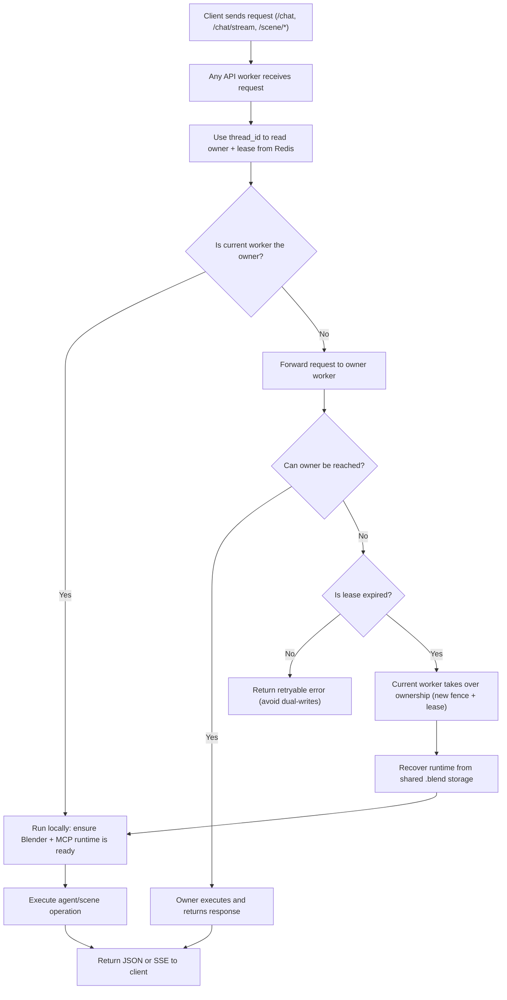

# Redis-Driven Multiprocess Session Architecture Plan

## 1. Summary

This document captures the agreed architecture plan to evolve headless session management from in-process state to a Redis-backed control plane that supports high-scale multiprocess deployment.

Chosen decisions:

- Session routing model: Redis lease ownership as source of truth.
- Conversation checkpointing: migrate from `MemorySaver` to Redis-backed checkpointer.
- Rollout: one-shot cutover (no phased flag rollout).
- Session storage backend: shared POSIX storage for `.blend` and snapshots.
- Redis topology (current): single instance (key design remains cluster-ready).

## 2. Goals and Scope

### 2.1 Goals

- Ensure a single authoritative owner for each `thread_id` across all workers.
- Prevent duplicate headless runtime startup and conflicting writes.
- Support owner failover and session takeover using persisted `.blend`.
- Preserve existing public API semantics (`/chat`, `/chat/stream`, `/scene/*`).

### 2.2 In Scope

- Redis-based session control plane (ownership, lease, heartbeat, idle lifecycle).
- Redis-based LangGraph checkpoint persistence.
- Redis-based reference image metadata (files remain on shared POSIX storage).
- Cross-worker owner proxy routing without relying on LB sticky sessions.

### 2.3 Out of Scope

- Rewriting Blender/MCP wire protocol.
- Breaking changes to frontend API contracts.

## 3. Architecture

### 3.1 Control Plane vs Runtime Plane

- Control plane (Redis): global truth for session ownership, lease token, fencing epoch, activity timestamps, and port allocation records.
- Runtime plane (local process memory): per-worker runtime handles only (PID, socket connection, local lock), not global truth.

### 3.2 Routing Model

For each request with `thread_id`:

1. Resolve ownership via Redis lease.
2. If current worker owns it: execute locally.
3. If another worker owns it: proxy request to owner worker.
4. If owner unavailable and lease expired: claim takeover and execute locally.

### 3.3 Client Request Forwarding Flow (Plain Version)

This section answers one question only: after a client request arrives, how do workers decide who executes it.

Plain rules:

1. Every `thread_id` has exactly one owner worker at a time.
2. Non-owner workers do not execute session mutations locally.
3. If owner is down and lease is expired, takeover is allowed.
4. Takeover always recovers from shared persisted `.blend`.

## 4. Redis Data Model

All keys use prefix `sa` (configurable via `REDIS_KEY_PREFIX`) and session hash-tags for future cluster compatibility.

### 4.1 Session Metadata

- Key: `sa:{session:<sid>}:meta` (HASH)
- Fields:
  - `owner_worker_id`
  - `owner_url`
  - `lease_epoch`
  - `status`
  - `last_active_ms`
  - `host`
  - `blender_port`
  - `mcp_port`
  - `storage_dir`
  - `blend_path`
  - `snapshot_dir`
  - `updated_at_ms`

### 4.2 Lease and Fencing

- Lease key: `sa:{session:<sid>}:lease` (STRING + TTL)
  - Value: `<worker_id>:<lease_epoch>:<uuid>`
- Fencing counter: `sa:{session:<sid>}:fence` (INCR)

### 4.3 Activity Index and Worker Index

- `sa:sessions:last_active` (ZSET) member=`sid`, score=`last_active_ms`
- `sa:worker:<worker_id>:sessions` (SET)
- `sa:workers` (SET)

### 4.4 Port Occupancy

- `sa:ports:<host>:headless` (SET)
- `sa:ports:<host>:mcp` (SET)

### 4.5 Reference Image Metadata

- `sa:ref:<thread_id>:order` (ZSET)
- `sa:ref:<thread_id>:meta:<image_id>` (HASH)

### 4.6 Checkpoint Storage (Custom Saver)

- `sa:ckpt:<thread_id>:<ns>:index` (ZSET)
- `sa:ckpt:<thread_id>:<ns>:<checkpoint_id>` (HASH)
- `sa:ckpt_blob:<thread_id>:<ns>:<channel>:<version>` (STRING)
- `sa:writes:<thread_id>:<ns>:<checkpoint_id>` (HASH/ZSET)

## 5. Core Runtime Flows (Plain Steps)

### 5.1 Request Entry

1. A client request comes in with `thread_id`.
2. The ingress worker checks Redis for current owner + lease.
3. If ingress worker is owner, execute locally.
4. If ingress worker is not owner, proxy to owner.
5. If owner is unreachable and lease is expired, ingress worker takes over and executes locally.

### 5.2 Owner Path

1. Ensure local Blender/MCP runtime exists for that `thread_id`.
2. If runtime is missing, start runtime and load persisted `.blend`.
3. Execute request (`/chat`, `/chat/stream`, `/scene/*`).
4. Persist checkpoint and activity metadata in Redis.
5. Return response directly to caller.

### 5.3 Non-Owner Path

1. Build internal HTTP proxy request to `owner_url`.
2. Copy request payload and required headers.
3. Add `X-Session-Proxy-Hop: 1` to prevent loops.
4. Stream owner response back to client as-is (JSON/SSE).

### 5.4 Takeover Path

1. Detect owner is unreachable.
2. Confirm lease is truly expired in Redis.
3. Atomically claim ownership with a new fencing epoch.
4. Start local runtime and recover from shared persisted `.blend`.
5. Continue processing request as new owner.

### 5.5 Idle Sweeper Path

1. Every worker runs a sweeper loop.
2. Sweeper only handles sessions currently owned by that worker.
3. Before shutdown, re-check lease token and last activity.
4. Persist `.blend`, stop runtime, mark session closed in Redis.

## 6. Code Change Plan

## 6.1 Add New Modules

- `/Users/fishwowater/projects/3DSceneAgent/scene_agent/session/redis_registry.py`
- `/Users/fishwowater/projects/3DSceneAgent/scene_agent/session/session_coordinator.py`
- `/Users/fishwowater/projects/3DSceneAgent/scene_agent/session/local_runtime_manager.py`
- `/Users/fishwowater/projects/3DSceneAgent/scene_agent/session/owner_proxy.py`
- `/Users/fishwowater/projects/3DSceneAgent/scene_agent/agent/redis_checkpointer.py`
- `/Users/fishwowater/projects/3DSceneAgent/scene_agent/memory/reference_image_store.py`

### 6.2 Refactor Existing Modules

- `/Users/fishwowater/projects/3DSceneAgent/scene_agent/blender/session_manager.py`
  - Keep process start/stop primitives.
  - Remove responsibility as global registry.
  - Use as local runtime handle manager only.

- `/Users/fishwowater/projects/3DSceneAgent/scene_agent/interfaces/api.py`
  - Add unified `claim_or_proxy` entry for all `thread_id` endpoints.
  - Move idle sweep logic to Redis-owner aware mode.
  - Implement `/threads` via Redis index.
  - Add owner diagnostics in response headers.

- `/Users/fishwowater/projects/3DSceneAgent/scene_agent/agent/graph.py`
  - Replace `MemorySaver` with Redis checkpointer.

- `/Users/fishwowater/projects/3DSceneAgent/scene_agent/memory/reference_image_memory.py`
  - Replace in-process `_images` with Redis metadata backend.
  - Keep files in shared POSIX path.

- `/Users/fishwowater/projects/3DSceneAgent/scene_agent/config.py`
  - Add Redis and lease configuration.

- `/Users/fishwowater/projects/3DSceneAgent/requirements.txt`
  - Pin `redis` dependency version.

## 7. Interface and Config Changes

### 7.1 Public API Behavior

- Existing endpoints and payloads remain compatible.
- Add optional response headers:
  - `X-Session-Owner`
  - `X-Session-Lease-Epoch`

### 7.2 Health Endpoint

Extend `/health` with:

- `worker_id`
- `redis_ok`
- `redis_latency_ms`

### 7.3 New Configuration

- `REDIS_URL`
- `REDIS_KEY_PREFIX` (default `sa`)
- `SESSION_LEASE_TTL_SECONDS` (default 20)
- `SESSION_HEARTBEAT_INTERVAL_SECONDS` (default 5)
- `SESSION_OWNER_UNREACHABLE_GRACE_SECONDS` (default 10)
- `API_WORKER_ID` (default hostname + pid)
- `API_WORKER_ADVERTISE_URL` (owner proxy target base URL)
- `SESSION_SHARED_STORAGE_ROOT`

## 8. Testing and Acceptance

### 8.1 Unit Tests

- Lease atomicity under concurrent claim/renew/release.
- Fencing correctness (stale owner cannot overwrite current ownership).
- Concurrent port allocation uniqueness.
- Redis checkpointer API contract:
  - `put/get/list/delete_thread`
  - `aput/aget/alist/adelete_thread`
- Reference image metadata ordering and max-count enforcement.

### 8.2 Integration Tests

- Multi-worker same `thread_id` race: only one owner runtime starts.
- Proxy correctness for JSON and SSE streaming.
- Owner crash and automatic takeover with `.blend` recovery.
- Sweeper only shuts down sessions owned by current worker.
- Cross-worker `/todos/{thread_id}` consistency from Redis checkpoint.

### 8.3 Performance Targets

- 100 concurrent distinct `thread_id` startup without port collision.
- 20 concurrent requests on same `thread_id` without double-start.
- Failover takeover and recovery within existing headless timeout budget.

## 9. One-Shot Cutover Procedure

1. Deploy Redis single instance with persistence (AOF enabled).
2. Mount shared POSIX session storage path on all workers.
3. Configure all workers with:
   - `REDIS_URL`
   - `API_WORKER_ADVERTISE_URL`
   - `SESSION_SHARED_STORAGE_ROOT`
4. Deploy new version to all workers simultaneously.
5. Run smoke tests:
   - `/chat/stream`
   - `/scene/{thread_id}`
   - `/scene/{thread_id}/blend`
   - owner failover scenario

Rollback:

- Roll back service version directly to previous release.
- Persisted `.blend` files remain reusable.

## 10. Risks and Mitigations

- Redis single-instance risk:
  - Mitigate with AOF + monitoring/alerts.
  - Keep key strategy cluster-ready for future migration.

- Owner proxy loop risk:
  - Mitigate with hop counter and hard cap.

- Shared storage latency risk:
  - Mitigate with retry and file completeness checks during takeover.

## 11. Explicit Assumptions and Defaults

Assumptions:

- Workers are mutually reachable through `API_WORKER_ADVERTISE_URL`.
- Shared POSIX storage has consistent path and RW permissions across workers.
- HTTP/SSE is primary traffic path for session workloads.
- Single-host deployment is valid: run multiple API processes on different ports, each process with one worker.

Defaults:

- `SESSION_LEASE_TTL_SECONDS=20`
- `SESSION_HEARTBEAT_INTERVAL_SECONDS=5`
- `SESSION_OWNER_UNREACHABLE_GRACE_SECONDS=10`
- `REDIS_KEY_PREFIX=sa`
- `SESSION_SHARED_STORAGE_ROOT=/tmp/scene_agent_sessions` (replace in production).
