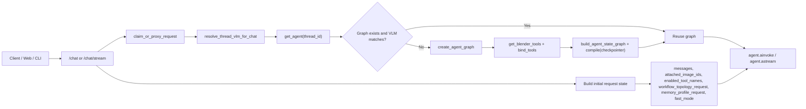
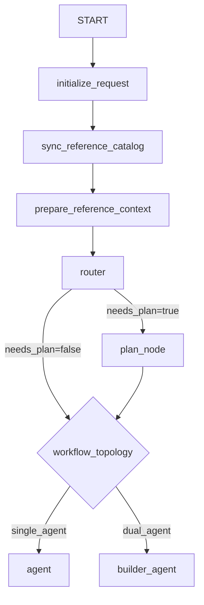
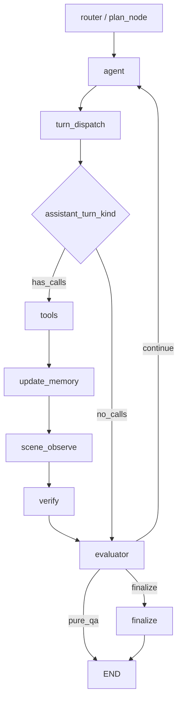
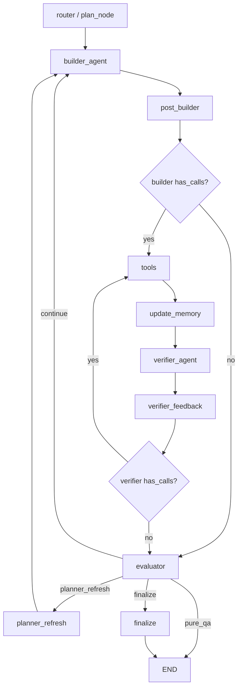

# Runtime Workflow

Last updated: 2026-03-30

This document describes the current runtime graph implemented in the main branch. It is intentionally implementation-facing and focuses on the exact request flow, state contracts, and node responsibilities.

Primary code references:

- `scene_agent/interfaces/api/routes_chat.py`
- `scene_agent/interfaces/api/shared.py`
- `scene_agent/agent/graph.py`
- `scene_agent/agent/graph_factory.py`
- `scene_agent/agent/nodes/router.py`
- `scene_agent/agent/nodes/agents.py`
- `scene_agent/agent/nodes/evaluators.py`
- `scene_agent/agent/nodes/verification.py`
- `scene_agent/agent/state.py`
- `scene_agent/memory/reference_image_memory.py`

## 1. Request Entry and Graph Resolution

Each `/chat` or `/chat/stream` request enters through the FastAPI layer, resolves thread ownership, resolves the thread's VLM configuration, and then reuses or rebuilds the LangGraph instance for that thread.



Important points:

- Graphs are cached by `thread_id`.
- A provider/model change triggers graph rebuild and state migration where possible.
- The graph checkpointer prefers Redis-backed persistence and falls back to in-memory behavior when Redis is unavailable.
- Request-scoped knobs such as `fast_mode`, `attached_image_ids`, topology hints, and memory-profile hints are injected before graph execution begins.

## 2. Workflow Initialization Chain

Every request begins with the same initialization chain before the runtime chooses a single-agent or dual-agent execution path.



### `initialize_request`

`initialize_request` prepares request-scoped state instead of making the main routing decision.

It resolves:

- effective workflow topology
- effective memory profile
- request counters and turn counters
- active role
- `fast_mode`
- replan budget
- base evaluator state

It also applies an important guardrail:

- if `fast_mode=true`, unfinished todos from a previous plan are terminated as `skipped`, because fast mode is forced into direct execution and does not continue a planner-managed todo loop

### `sync_reference_catalog`

This node refreshes the compact thread-level reference image catalog from persisted image assets and bindings. The catalog is stored in graph state so later nodes can route image references without scanning the full raw history.

### `prepare_reference_context`

This node resolves the request-scoped reference image set. It combines:

- explicitly attached image IDs from the current request
- previously uploaded thread assets
- task-scoped image bindings when available
- role-appropriate fallback behavior

The result is a compact request context:

- `request_reference_image_keys`
- `request_reference_image_source`
- `request_reference_image_reason`

### `router`

The router chooses between `direct_mode` and `plan_mode`.

The current behavior is:

- `fast_mode=true` forces `direct_mode`
- existing unfinished todos force `plan_mode`
- otherwise a lightweight structured router model returns `RouterDecision(needs_plan, reasoning)`
- if the router model is unavailable or fails, the system defaults to `plan_mode`

This means the runtime no longer assumes every request should enter a planner-like scene-building loop.

### `plan_node`

`plan_node` runs only when `router.needs_plan=true`. It decomposes the request into todos and seeds the append-only todo history.

If the planner returns no valid todos, the runtime inserts a single fallback todo so the request can still proceed through plan mode deterministically.

## 3. Single-Agent Execution Path

Single-agent remains the default topology.



Key properties:

- `turn_dispatch` only distinguishes `has_calls` vs `no_calls`
- tool execution still flows through `ToolNode`
- `update_memory` consolidates scene/tool artifacts and request bookkeeping
- `scene_observe` gathers fresh scene evidence after mutating tool batches
- `verify` writes the canonical `verification_result`
- `evaluator` owns transition control, not the agent itself

## 4. Dual-Agent Execution Path

Dual-agent is available but still experimental. It is primarily intended for planning-heavy requests and remains under active development.



Key differences from single-agent:

- the builder and verifier are separated by role
- after builder mutations, the verifier decides whether more observation tools are needed
- the dual-agent path does not use the single-agent `scene_observe` node in the same way; the verifier can directly drive camera and render tools
- `verifier_feedback` converts verifier output into the same `verification_result` contract used by single-agent evaluation
- evaluator decisions are shared across topologies

## 5. Direct Mode, Plan Mode, and `fast_mode`

### Direct Mode

`direct_mode` is for requests that do not need a persistent todo plan.

Typical examples:

- straightforward scene edits
- short Q&A requests
- single-action operations
- image-grounded edits that do not require decomposition

Behavior:

- no planner-generated todo list is required
- the evaluator either continues the loop briefly or finalizes the request
- if the request never entered plan mode and produced no tool work, the runtime can exit as pure QA

### Plan Mode

`plan_mode` is for requests that benefit from explicit decomposition.

Typical examples:

- multi-step scene construction
- larger scene redesigns
- iterative reference-driven builds
- requests likely to require retries, staged verification, or replanning

Behavior:

- todos are created through `plan_node`
- the evaluator marks todos `completed` or `skipped`
- dual-agent mode can invoke `planner_refresh` when the current todo stalls and replan budget remains

### `fast_mode`

`fast_mode` is a first-class runtime capability, not just a UI toggle.

When enabled:

- the request is forced into `direct_mode`
- the normal `scene_observe -> verify` cycle is skipped
- the evaluator requires fresh evidence before a mutated scene can finalize
- acceptable evidence includes observation-oriented tools such as `get_scene_info`, `observe_scene_global`, `camera_observe`, `render_from_camera`, `render_from_objects`, or `get_viewport_screenshot`

This mode is intended for latency-sensitive requests where full visual verification would be unnecessary overhead.

## 6. Unified `verification_result` Contract

The runtime now standardizes verification into a single state contract consumed by the evaluator.

Canonical shape:

```python
{
    "status": "working" | "done",
    "reason": str,
    "edit_suggestions": list[str],
}
```

Writers:

- `verify_node` in single-agent mode
- `verifier_feedback_node` in dual-agent mode

Reader:

- `evaluator_node`

This removes older behavior where downstream control flow had to infer progress from message history or node-specific payloads.

## 7. Evaluator Responsibilities and Todo Lifecycle

The evaluator is the main convergence controller for both topologies.

It handles:

- pure-QA early exit
- direct-mode completion vs continued attempts
- todo completion
- todo skipping after stall thresholds
- dual-agent replanning thresholds
- convergence guidance for repeated failures or oscillation

Todo ownership is now split cleanly:

- `plan_node` creates todos
- `evaluator_node` transitions todo status
- the assistant does not directly own todo state mutation

Important todo states include:

- `pending`
- `in_progress`
- `completed`
- `failed`
- `superseded`
- `skipped`

The append-only `todo_versions` history remains the source of truth, while `todos` acts as the latest projected snapshot for display and downstream use.

## 8. Reference Image Management and Dynamic Routing

Reference image handling is no longer just "upload a few images and attach all of them forever."

The current model is:

- thread-level image assets are persisted by the image asset store
- task-level bindings map an image to a specific role
- request preparation resolves the active subset for the current turn
- verification and prompt-building use those resolved assets instead of blindly replaying every historical image

Core concepts:

- `ImageAsset`: persisted thread-level asset metadata
- `ImageBinding`: task-level image-to-role mapping
- `reference_image_catalog`: compact request/runtime projection stored in agent state

Supported roles include:

- `question_image`
- `object_reference`
- `scene_reference`
- `style_reference`
- `verification_reference`

This dynamic routing is what enables image-grounded tool selection, cleaner prompt context, and better short-term memory behavior for long-running threads.

## 9. Retry, Persistence, and Recovery Touchpoints

Several persistence layers now affect runtime behavior directly.

### Graph checkpointing

- the graph checkpointer is used for thread-level LangGraph state
- Redis-backed persistence is preferred for multi-worker safety and restart resilience
- runtime APIs can also read persisted todo state without launching a full headless runtime

### Persisted Blender scene state

- headless sessions persist `.blend` files under shared session storage
- a later request can restart a runtime and recover the last saved scene state for the same `thread_id`

### Persisted image state

- uploaded images are stored on disk
- metadata and bindings are stored through the image asset store
- request preparation and verification can rehydrate these assets instead of depending on ephemeral in-memory-only state

### Retry support

The latest turn can be captured with retry metadata and a pre-retry scene snapshot. This allows the backend to preserve enough state to retry the most recent operation with better continuity than a blind re-send.

At a high level, retry support captures:

- the latest turn metadata
- attached image IDs used for that turn
- a `.blend` snapshot for the pre-retry scene state

## 10. Streaming and Internal Node Visibility

The streaming API filters internal node chatter so frontend consumers do not receive raw router/planner/evaluator internals as ordinary assistant text.

Internal nodes filtered from user-facing SSE include:

- `initialize_request`
- `sync_reference_catalog`
- `prepare_reference_context`
- `router`
- `plan_node`
- `verify`
- `evaluator`
- `verifier_feedback`

This keeps the stream focused on user-visible assistant output, tool activity, and graph progress events rather than internal control tokens.
