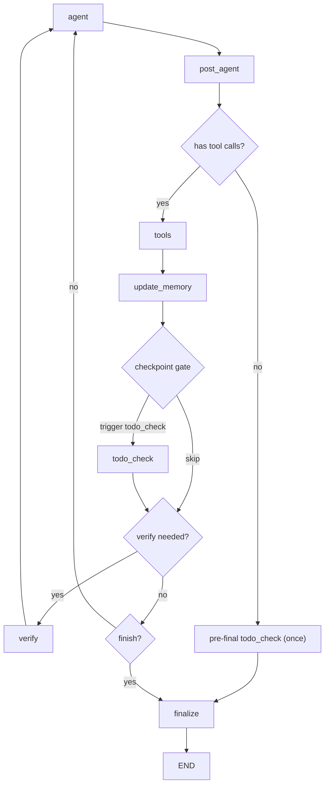

# Agent 中 verify 与 todo_check 的分工与触发策略

更新时间：2026-02-15

本文总结当前讨论达成的方案，目标是让 agent 在复杂任务中有稳定的执行闭环，同时避免简单任务被过度流程化。

---

## 1. 设计目标

- 避免 `verify` 与 `todo_check` 职责重叠。
- 避免每次工具调用都触发进度检查，降低循环开销。
- 支持“无 todo / 不需要 todo”的简单任务自然完成。
- 保留复杂任务的可追踪执行与卡住检测能力。

---

## 2. 职责边界（必须分离）

### 2.1 `verify`（全局结果校验）

- 关注最终或阶段性结果质量是否满足目标。
- 典型输入：渲染结果、参考图、用户请求。
- 输出：match / mismatch、原因、建议。
- 定位：质量门控（quality gate），不是进度管理器。

### 2.2 `todo_check`（执行进度校验）

- 关注计划项是否推进、是否完成、是否停滞。
- 典型输入：当前 todos、最近工具结果、scene memory、迭代计数。
- 输出：`continue` / `completed` / `blocked` / `not_applicable`。
- 定位：过程门控（process gate），不是质量判定器。

---

## 3. 为什么不应“每次工具调用后都做 todo_check”

当前图中，`ToolNode` 的执行粒度是“一个 agent turn 产出的 tool_calls 批次”。  
如果 agent 一次只发一个 tool_call，那么“每次 tools->update_memory”基本等于“每次工具调用”。

对于多步复杂任务，这会导致：

- 检查频率过高，打断 agent 连续操作节奏。
- 每轮都做进度判定，收益低且成本高。
- 容易把局部中间态误判为“未推进”。

结论：`todo_check` 应采用稀疏触发（checkpoint-based），而不是 per-tool 触发。

---

## 4. 触发策略（达成一致版本）

仅在以下条件触发 `todo_check`：

1. 有 todo（state 中存在 todo 列表）且工具回合计数满足 `K` 周期（推荐 `K=3`）。
2. 命中里程碑工具（如渲染、关键场景快照）。
3. 准备结束前（`finalize` 之前）做一次兜底检查。

否则跳过 `todo_check`，继续执行主循环。

---

## 5. 简单任务降级路径（无 todo 也可正常完成）

当任务简单、agent 未规划 todo、或用户请求本就无需计划时：

- `todo_check` 直接返回 `not_applicable`。
- 流程进入 `verify`（如有需要）或 `finalize`。
- 不强制生成 todo，不引入额外思考负担。

这保证了“简单任务快路径”不被复杂治理逻辑拖慢。

---

## 6. 建议工作流（逻辑视图）

说明：

- `post_agent` 每轮落库 `agent_decision/todos`。
- `todo_check` 仅在 checkpoint 触发，不跟随每次工具调用。
- `verify` 负责结果质量，`todo_check` 负责过程进度，二者串联不重叠。

---

## 7. 运行时护栏（建议）

为避免长任务死循环，建议补充：

1. `max_turns`：单请求最大循环轮数。
2. `max_attempts_per_todo`：单 todo 最大尝试次数。
3. `stagnation_count`：连续 N 轮无推进判定为 `blocked`。
4. `blocked` 出口：向用户汇报阻塞原因并请求下一步决策。

---

## 8. 与当前实现的关系

当前已具备：

- `post_agent`：每轮提取并写入 `agent_decision/todos`。
- `finalize`：无工具调用时先写结束元信息再结束。

待实现（本方案新增）：

- `checkpoint gate` 触发策略。
- 独立的 `todo_check` 节点及 `not_applicable/blocked` 路由。
- 与 `verify` 的串联路由及停滞护栏。

