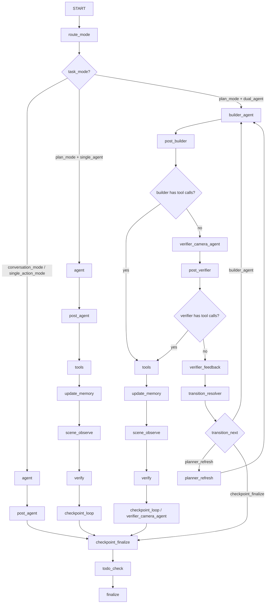
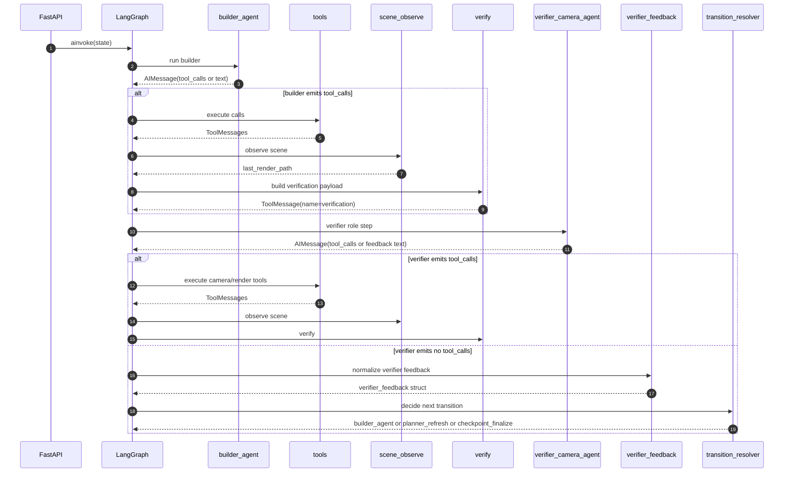
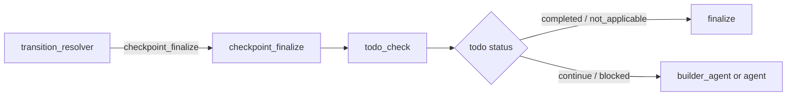

# 3DSceneAgent 工作流抽象与 Dual-Agent（简化版）实现文档

更新时间：2026-02-26  
作者：Codex

## 1. 目标与结论

本次实现聚焦三件事：

1. 在现有系统上补一层可配置抽象（workflow topology + tool policy + memory profile）。
2. 在 `plan_mode` 下实现“最小改动”的 dual-agent：`builder` 与“可操作相机/渲染工具”的 `verifier`。
3. 简化过重 recovery 路径，去掉主图中的强制灾难恢复分支，保持前端消息协议兼容。

关键结论：

1. 单 agent 与双 agent是“同一套系统支持两种拓扑”，每次请求只会选一种，不会同请求并行两套。
2. `verifier` 现在是可调用相机/渲染工具的 agent，而不是只读旁路。
3. recovery 已从“自动强制工具注入”降级为“产出 catastrophic 信号 + 由 verifier/builder 自主修复”。

## 2. 抽象层设计

新增抽象模块：

1. `scene_agent/agent/workflow_profiles.py`
2. `scene_agent/agent/tool_policy.py`
3. `scene_agent/agent/memory_scope.py`
4. `scene_agent/agent/graph_factory.py`

抽象能力：

1. `workflow_topology`: `single_agent | dual_agent`。
2. `workflow_topology_request`: `auto | single_agent | dual_agent`。
3. `memory_profile`: 当前默认 `thread_shared_only`，保留 `shared_plus_role_private` 扩展位。
4. 图装配集中在 `graph_factory.py`，`graph.py` 只负责运行时注入。

## 3. 双 Agent 最小改动节点设计

### 3.1 主节点

1. `builder_agent`：建模与场景修改主执行者。
2. `verifier_camera_agent`：可调用相机/渲染相关工具（包括相机位姿调整）的 verifier。
3. `verifier_feedback`：确定性反馈汇总节点（由 `verification` ToolMessage 归纳为结构化反馈）。
4. `transition_resolver`：规则路由，决定回 `builder`、`planner_refresh` 或 `checkpoint_finalize`。

### 3.2 路由骨架（dual + plan_mode）



## 4. 工具拆解（Builder vs Verifier）

工具策略位于 `scene_agent/agent/tool_policy.py`。

`verifier_camera_agent` 工具域（`VERIFIER_CAMERA_TOOLS`）：

1. `get_scene_info`
2. `get_object_info`
3. `observe_scene_global`
4. `camera_observe`
5. `render_from_camera`
6. `render_from_objects`
7. `camera_act`
8. `camera_set_pose`
9. `get_viewport_screenshot`

`builder_agent` 默认策略（`builder_default`）：

1. 排除上述相机/渲染工具域。
2. 保留建模、资产、材质、删除、代码执行等场景改造工具。

说明：

1. verifier 不再是只读解释器，可以主动调整相机与验证视角。
2. builder 与 verifier 工具域分离，降低单 agent 上下文过重问题。

## 5. Recovery 简化

### 5.1 做了什么

1. 主图不再接入 `blocked_recovery -> blocked_recovery_action` 节点链。
2. `todo_check` 在 `blocked` 时直接回到执行 agent（single 回 `agent`，dual 回 `builder_agent`）。
3. `verify_node` 的 catastrophic 分支不再自动注入强制恢复工具调用。

### 5.2 现在的行为

1. catastrophic 时仍输出 `ToolMessage(name="verification")`，状态为 `catastrophic`。
2. `hard_recovery` 字段保留但固定为禁用语义：`forced=false`, `action="disabled"`, `tool_calls=[]`。
3. 真正修复动作由 builder/verifier 后续决策执行，而不是隐式灾难注入节点执行。

## 6. Verify 在哪里进行

当前是“双层 verify”机制：

1. `verify_node`：固定序列节点（`scene_observe -> verify`）负责统一产出结构化 `verification` 信号。
2. `verifier_camera_agent`：可继续调用相机/渲染工具补充检查，并通过 `verifier_feedback` 输出可执行修复建议。

这保证：

1. 仍有统一的机器可解析验证基线。
2. verifier 又具备主动视角探索和反馈能力。

## 7. 前端兼容性

未改变消息基础协议：

1. 仍使用 `HumanMessage / AIMessage / ToolMessage`。
2. `verification` 仍通过 `ToolMessage` 下发。
3. `graph_node` 事件里 `node` 字段是字符串，新增节点名不会破坏解析。

校验：

1. `pytest -q tests/unit` 通过。
2. `cd web && npm run build` 通过（TypeScript + Vite）。

## 8. 配置方式：plan_mode 用单 agent 还是双 agent

### 8.1 请求级配置（推荐）

`ChatRequest` 增加：`workflow_topology`。

可选值：

1. `single_agent`
2. `dual_agent`
3. `auto`（默认）

示例：

```json
{
  "message": "请根据参考图重建完整场景",
  "thread_id": "t-001",
  "workflow_topology": "single_agent"
}
```

```json
{
  "message": "请根据参考图重建完整场景",
  "thread_id": "t-001",
  "workflow_topology": "dual_agent"
}
```

### 8.2 环境级配置（auto 模式生效）

环境变量：`ENABLE_PLANMODE_DUAL_AGENT`

1. `true`：`plan_mode + auto` 时默认 dual。
2. `false`：`plan_mode + auto` 时默认 single。

约束：

1. 只有 `plan_mode` 可进入 dual。
2. `conversation_mode / single_action_mode` 强制 single。

## 9. 时序图（可解析版本）

### 9.1 `plan_mode + dual_agent` 典型回路



### 9.2 结束路径



## 10. 涉及代码文件

1. `scene_agent/agent/graph.py`
2. `scene_agent/agent/graph_factory.py`
3. `scene_agent/agent/nodes.py`
4. `scene_agent/agent/tool_policy.py`
5. `tests/unit/test_agent_workflow_control.py`
6. `tests/unit/test_tool_policy.py`
7. `tests/unit/test_verify_node.py`

## 11. 本次回归结果

已执行：

1. `python -m py_compile scene_agent/agent/graph.py scene_agent/agent/graph_factory.py scene_agent/agent/nodes.py scene_agent/agent/tool_policy.py tests/unit/test_agent_workflow_control.py tests/unit/test_tool_policy.py tests/unit/test_verify_node.py`
2. `pytest -q tests/unit`
3. `cd web && npm run build`

结果：

1. `tests/unit`: `217 passed, 4 skipped`
2. `web build`: 通过
