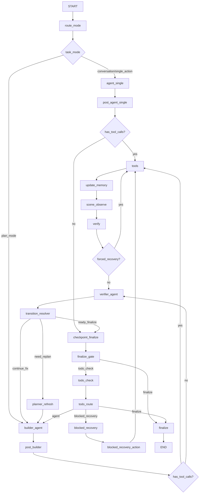

# 3DSceneAgent 工作流下一阶段优化计划（抽象层 + `plan_mode` 最小改动双 Agent）

更新时间：2026-02-26  
作者：Codex

---

## 0. 执行摘要

本计划给出两条并行推进、但分阶段落地的主线：

1. **先加一层抽象（推荐先做）**  
   抽象目标不是“为了抽象而抽象”，而是把当前已有的 `task_mode + budget + verify` 基础，升级为可配置的：
   - 工作流拓扑（single/dual）
   - 工具域（builder/verifier/read-only）
   - memory 作用域（shared/private/artifact）

2. **在 `plan_mode` 内引入最小改动双 Agent（推荐第二步）**  
   不替换 `conversation_mode` / `single_action_mode`。  
   仅对 `plan_mode` 采用 Builder-Agent + Verifier-Agent 协作，且保持你现有 `update_memory -> scene_observe -> verify -> todo_check` 主干节点可复用。

核心判断：
- 当前主要问题是“**单 Agent 面对过宽工具面**”，不是 state 字段数量本身失控。  
- 因此优先做“抽象层 + 工具域隔离”会比直接全局双 Agent 更稳。  
- 双 Agent 适合复杂场景复刻、长链路修复和高失败成本任务，不适合所有请求默认启用。

---

## 1. 背景与现状（与本计划强相关）

结合当前代码实现，已具备以下基础能力：

1. **请求级模式路由**  
   `conversation_mode / single_action_mode / plan_mode`  
   入口：`route_mode_node()`。

2. **请求级预算与客观路由**  
   已有 `request_agent_turns / request_tool_batches / max_*`。

3. **工具后固定验证流水线**  
   `tools -> update_memory -> scene_observe -> verify -> checkpoint/todo_check`。

4. **已初步抑制 state 膨胀**  
   `scene_objects`、`scene_camera_params` 使用替换 reducer；视觉消息使用固定 message id。

当前瓶颈：

1. `plan_mode` 下一个 Agent 同时承担“规划、建模、验证解读、恢复策略”，认知负担过高。
2. 运行时虽然支持 `enabled_mcp_tools`，但缺少“角色级默认工具域模板”。
3. verify 输出已经结构化，但还未形成“Verifier 反馈协议 -> Builder 可执行动作”的稳定契约。
4. memory 尚未显式分层，`shared` 与 `working scratch` 混在同一消息语义中。

---

## 2. 目标、非目标、约束

## 2.1 目标

1. 支持不同 workflow 拓扑（single / dual）可配置。
2. 支持不同 memory 策略（共享 + 角色私有 + 产物记忆）。
3. 在不破坏当前稳定性的前提下，让 `plan_mode` 支持双 Agent 协作。
4. 保持 API 兼容，用户无感切换或可灰度开启。

## 2.2 非目标

1. 不在本阶段引入多于 2 个 agent 的复杂编排。
2. 不在本阶段改造 MCP server 工具定义与注册机制。
3. 不在本阶段重写 verify 模型与全部 prompt。

## 2.3 工程约束

1. 兼容现有 `ChatRequest.enabled_mcp_tools`。
2. 默认行为可保持当前 single-agent。
3. 失败时可快速回退到旧图（feature flag）。

---

## 3. 总体方案：两阶段推进

## 3.1 阶段 A：抽象层先行（不改变核心行为）

先引入抽象对象和装配层，但先让默认实现仍走当前单 agent 图。

## 3.2 阶段 B：仅 `plan_mode` 启用双 Agent

在抽象层就位后，将 `plan_mode` 的 agent 节点替换为最小新增节点，复用既有工具、memory、verify、todo_check、recovery 节点。

---

## 4. 阶段 A 详细计划：再加一层抽象

## 4.1 新增抽象域模型（建议）

建议新增文件：`scene_agent/agent/workflow_profiles.py`

### 4.1.1 `WorkflowTopology`

```python
Literal["single_agent", "dual_agent"]
```

### 4.1.2 `AgentRole`

```python
Literal["general", "builder", "verifier"]
```

### 4.1.3 `ToolProfile`

```python
Literal[
  "all_tools",
  "read_only",
  "builder_default",
  "verifier_default",
]
```

### 4.1.4 `MemoryProfile`

```python
Literal[
  "thread_shared_only",
  "shared_plus_role_private",
]
```

### 4.1.5 `WorkflowProfile`（核心）

```python
class WorkflowProfile(TypedDict):
    name: str
    topology: WorkflowTopology
    default_tool_profile: dict[str, ToolProfile]  # role -> profile
    memory_profile: MemoryProfile
    budgets: dict[str, int]  # agent turns/tool batches/review loops
    verify_policy: dict[str, Any]
```

---

## 4.2 新增抽象：Tool Domain Resolver

建议新增文件：`scene_agent/agent/tool_policy.py`

职责：

1. 根据 `task_mode + topology + role + enabled_mcp_tools` 得到 `effective_tool_names`。
2. 集中定义工具域模板，避免分散在 prompt 和节点里。

建议模板：

1. `read_only`  
   `get_scene_info/get_object_info/observe_scene_global/camera_observe/render_from_*...`
2. `builder_default`  
   优先建模、导入、材质、必要相机观察；可包含少量渲染工具。
3. `verifier_default`  
   `render_from_* / camera_* / observe_scene_global / get_scene_info`，不允许 scene mutation。

---

## 4.3 新增抽象：Memory Scope Router

建议新增文件：`scene_agent/agent/memory_scope.py`

定义三类 memory：

1. `shared_memory`（线程共享，入 checkpoint）
   - scene_objects
   - todos
   - verify summary
   - workflow metadata

2. `role_private_memory`（角色私有，入 checkpoint）
   - `builder_private_notes`
   - `verifier_private_notes`
   - `builder_last_plan_step`

3. `artifact_memory`（可重构产物）
   - last_render_path / last_verified_path
   - reference image bindings
   - render evidence index

注意：
- role-private 只存结构化摘要，不复制整段消息，防止 state 继续膨胀。

---

## 4.4 API 扩展（向后兼容）

在 `ChatRequest` 增加可选字段（默认不传）：

1. `workflow_topology: "auto" | "single_agent" | "dual_agent"`  
2. `memory_profile: "auto" | "thread_shared_only" | "shared_plus_role_private"`  
3. `workflow_profile: str | None`（预留）

兼容策略：
- 若未传，保持当前行为。
- 若传 `dual_agent` 且 mode 不是 `plan_mode`，默认降级为 single 并记录诊断日志。

---

## 4.5 图构建抽象（Graph Assembler）

建议新增：`scene_agent/agent/graph_factory.py`

职责：

1. 根据 `task_mode + workflow_topology` 装配不同子图。
2. 复用公共节点：
   - tools/update_memory/scene_observe/verify/checkpoint/todo_check/finalize
3. 将“节点选择逻辑”从 `graph.py` 拆到装配层，降低 `graph.py` 复杂度。

---

## 4.6 阶段 A 实施步骤（建议 5 个 PR）

### PR-A1：域模型与配置层

1. 新增 `workflow_profiles.py`
2. 新增默认 profile 常量
3. 单测：profile 解析与默认值回退

### PR-A2：Tool Policy Resolver

1. 新增 `tool_policy.py`
2. 将 `nodes.py` 中工具域判断迁移到 resolver
3. 单测：不同 mode/role/tool_profile 的 allow-list 结果

### PR-A3：Memory Scope 字段最小接入

1. 在 `AgentState` 增加 role-private 结构化字段
2. 不改现有路由，只写入最小摘要
3. 单测：reducer 与 checkpoint 恢复

### PR-A4：Graph Factory（行为不变）

1. 提取装配逻辑到 `graph_factory.py`
2. `graph.py` 仅保留 provider/tools 初始化 + 调用 factory
3. 回归测试：旧请求输出一致

### PR-A5：API 可选参数与日志埋点

1. 扩展 `ChatRequest`
2. 透传到 graph invocation state
3. 增加 `workflow_topology_selected` 诊断事件

---

## 5. 阶段 B 详细计划：`plan_mode` 最小改动双 Agent 图设计

## 5.1 设计原则（最小改动）

1. 不改 `conversation_mode` 与 `single_action_mode` 主流程。
2. 双 Agent 仅替换 `plan_mode` 中“谁来产出下一轮 tool calls”。
3. 保留你现有的 `verify_node` 作为客观评估源。
4. Builder 不直接接管全部相机工具，通过工具域配置受控开放。

---

## 5.2 角色职责

### 5.2.1 Builder-Agent（建模执行）

输入：
- 用户请求
- 当前 todos
- 最新 verifier 反馈摘要
- scene memory 摘要

输出：
- 工具调用（建模/导入/材质/必要渲染）
- todo 更新建议（可选）

### 5.2.2 Verifier-Agent（审查反馈）

输入：
- `verify_node` 输出
- 当前 todos
- 失败历史、恢复状态

输出（结构化 `VerifierFeedback`）：
- `status: pass | needs_fix | catastrophic`
- `focus_objects`
- `fix_instructions`（可执行短句）
- `confidence`
- `should_replan`
- `suggested_budget_adjustment`（可选）

---

## 5.3 `plan_mode` 双 Agent 新图（最小改动版）



说明：
- `tools/update_memory/scene_observe/verify/todo_check/blocked_recovery/finalize` 均复用现有节点。
- `plan_mode` 下新增最少节点：`builder_agent/post_builder/verifier_agent/transition_resolver/planner_refresh`。

---

## 5.4 新增/改造节点清单

## 5.4.1 新增 `builder_agent_node`

基于现有 `agent_node` 复用逻辑，差异：

1. role 固定为 `builder`
2. 工具域默认 `builder_default`
3. 系统提示词聚焦“执行具体修复动作，不做长篇审查”

## 5.4.2 新增 `post_builder_node`

复用 `post_agent_node` 计数逻辑，附加：

1. 维护 `builder_turn_count`
2. 若连续 N 轮无工具调用，标记 `builder_stall`

## 5.4.3 新增 `verifier_agent_node`（LLM 评审层）

输入来源：

1. 最新 `ToolMessage(name="verification")`
2. `todo_check`
3. active todos

输出：

```json
{
  "status": "needs_fix",
  "focus_objects": ["chair_01", "table_top"],
  "fix_instructions": [
    "将椅子缩小到与桌高匹配",
    "桌面材质粗糙度降低并改为浅木纹"
  ],
  "should_replan": false,
  "ready_to_finalize": false
}
```

注意：
- 该节点不调用 MCP 工具，仅产出结构化反馈。
- 你已有 `verify_node` 的客观检测仍是第一信号，`verifier_agent_node` 负责“翻译为可执行反馈”。

## 5.4.4 新增 `transition_resolver_node`（确定性规则）

纯规则节点，不调用模型。  
输入：budget、verifier feedback、todo_check。  
输出路由：

1. `continue_fix` -> `builder_agent`
2. `need_replan` -> `planner_refresh`
3. `ready_finalize` -> `checkpoint_finalize`

建议优先级：

1. 若 budget 耗尽 -> `checkpoint_finalize`
2. 若 catastrophic 且自动恢复未完成 -> `builder_agent`
3. 若 `should_replan=True` -> `planner_refresh`
4. 若 todos 全部 terminal 且 verify=match -> `checkpoint_finalize`
5. 否则 `builder_agent`

## 5.4.5 新增 `planner_refresh_node`（轻量）

目的：
- 当 verifier 指出“目标定义不充分/任务偏移”时，重排 todos。

最小实现：
- 先只做“todo 状态重排 + 新增修复 todo”
- 不引入独立 Planner 大模型

---

## 5.5 state 变更设计（最小新增）

在 `AgentState` 增加（NotRequired）：

1. `workflow_topology: str`  
2. `active_role: str`  # builder/verifier
3. `builder_turn_count: int`
4. `verifier_turn_count: int`
5. `builder_stall_count: int`
6. `verifier_feedback: dict[str, Any]`
7. `role_private_memory: dict[str, dict[str, Any]]`
8. `plan_replan_count: int`
9. `max_plan_replans: int`

控制原则：
- 只存结构化摘要，不存冗长自然语言全文。

---

## 5.6 工具权限策略（关键）

## 5.6.1 Builder 工具域（默认）

允许：
- 场景编辑/导入/材质
- 必要对象级观察和渲染工具
- `get_scene_info`

限制：
- 不允许全局破坏型恢复工具频繁触发（由 verify/recovery gate 控）

## 5.6.2 Verifier 工具域（默认）

允许：
- `render_from_camera/render_from_objects/camera_observe/observe_scene_global/get_scene_info`

禁止：
- 所有 scene mutation 工具

## 5.6.3 与 `enabled_mcp_tools` 的关系

最终工具集合 = `请求传入 allow-list` ∩ `role 工具域`。  
这样保持 API 兼容，又能角色隔离。

---

## 5.7 “Builder 看不到渲染图”问题的处理

不建议让 Builder 完全看不到图。建议折中：

1. 默认通过 `verifier_feedback` 给 Builder 提供结构化视觉结论。
2. Builder 允许“按需只读视觉工具”做二次确认（如局部 `render_from_objects`）。
3. 若 Verifier 置信度低或反馈冲突，`transition_resolver` 可触发 Builder 自主复核回路。

这样可避免：
- 双 agent 信息断层
- Verifier 单点错误导致 Builder 盲修

---

## 5.8 代码改造计划（`plan_mode` 双 Agent，建议 6 个 PR）

### PR-B1：state 与 profile 接入

1. 新增 dual-agent 所需 state 字段
2. 默认 `workflow_topology=single_agent`
3. 增加序列化回归测试

### PR-B2：builder/verifier 节点骨架

1. 新增 `builder_agent_node/post_builder_node`
2. 新增 `verifier_agent_node`（先规则版，可后续升级 LLM 版）
3. 单测覆盖基础路由

### PR-B3：transition_resolver + planner_refresh

1. 新增确定性路由器
2. 新增轻量 replan 节点
3. 单测覆盖 10+ 路由分支

### PR-B4：graph 装配分支

1. 在 `graph_factory` 中加入 `plan_mode + dual_agent` 分支
2. 保持其他 mode 不变
3. 集成测试：single/dual 对照

### PR-B5：prompt 与反馈协议

1. 新增 builder/verifier role prompts
2. 定义 `VerifierFeedback` schema
3. 回归 verify 结果到 todo 更新链路

### PR-B6：灰度开关与观测

1. 增加 feature flag（例如 `ENABLE_PLANMODE_DUAL_AGENT`）
2. 指标埋点（成功率、工具调用数、平均回合、恢复率）
3. 可一键回退 single-agent

---

## 5.9 测试计划（详细）

## 5.9.1 Unit

1. `route_mode_node` + topology 选择
2. tool policy 组合测试（mode x role x allow-list）
3. `transition_resolver` 决策表测试
4. `planner_refresh` todo 重排测试
5. state reducer 与 checkpoint 恢复测试

## 5.9.2 Integration

1. `plan_mode single` vs `plan_mode dual` 行为一致性基线
2. 高失败任务（遮挡、尺度灾难）恢复对比
3. 长任务（>5 steps）token/turn/tool-batch 对比
4. `enabled_mcp_tools` 子集限制下双 agent 能力退化是否可控

## 5.9.3 Contract

1. API 请求参数向后兼容
2. 新字段不影响旧客户端
3. stream 输出事件结构保持兼容

## 5.9.4 Manual

建议固定 12 个场景任务集：

1. 单物体生成
2. 双物体关系布局
3. 室内半封闭空间
4. 室外场景复刻
5. 多材质对齐
6. 复杂遮挡修复
7. catastrophic recovery
8. replan 触发
9. 工具受限执行
10. 纯问答
11. 图像问答
12. 长线程续跑

---

## 5.10 观测指标与验收门槛

## 5.10.1 指标

1. 任务成功率（verify 最终 match + todo terminal）
2. 平均请求时延
3. 平均 agent turns
4. 平均 tool batches
5. catastrophic 恢复成功率
6. 人工复审通过率（主观质量）

## 5.10.2 验收门槛（建议）

1. `plan_mode` 复杂任务成功率较当前基线提升 >= 8%
2. 平均 tool batches 不上升超过 20%
3. catastrophic 失败率下降 >= 30%
4. 非 plan_mode 延迟回归恶化 <= 5%

---

## 5.11 灰度发布与回滚

## 5.11.1 灰度步骤

1. 内部线程白名单开启 dual-agent（10%）
2. 扩展到 30%
3. 扩展到 50%，观察一周
4. 最终默认开启（仅 plan_mode）

## 5.11.2 回滚策略

1. Feature flag 关闭 -> 立即回退 single-agent plan_mode
2. 保留 dual-agent state 字段但不参与路由
3. 不需要迁移/清理历史 checkpoint 即可回滚

---

## 6. 里程碑排期（建议 3 周）

## Week 1：抽象层基础

1. PR-A1/A2 完成
2. PR-A3 完成
3. 单元测试稳定

## Week 2：双 Agent 最小骨架

1. PR-B1/B2/B3 完成
2. 本地集成验证
3. 修正路由边界条件

## Week 3：装配、灰度、评估

1. PR-A4/A5 + PR-B4/B5/B6 完成
2. 灰度发布与指标观察
3. 输出实施总结文档

---

## 7. 风险清单与缓解

1. 风险：双 Agent 造成 token 成本明显上升  
   缓解：仅在 `plan_mode` 启用；Verifier 输出严格结构化、限制长度。

2. 风险：Builder 与 Verifier 反馈冲突导致回路震荡  
   缓解：`transition_resolver` 设置最大 review 循环与 replan 上限。

3. 风险：工具域分割过严，Builder 无法完成修复  
   缓解：允许按策略开放少量只读相机/渲染工具。

4. 风险：API 兼容性回归  
   缓解：新增字段全部可选，默认行为不变；合同测试覆盖。

---

## 8. 建议的立即执行顺序（可直接开工）

1. 先做 **PR-A1 + PR-A2**：把 `WorkflowProfile + ToolPolicyResolver` 落地。  
2. 再做 **PR-B2 + PR-B3**：先跑通 `builder/verifier/transition`，图先不切换默认。  
3. 然后做 **PR-B4**：只对 `plan_mode` 且 flag 开启时启用双 agent。  
4. 最后做 **PR-B6**：加灰度与指标，再逐步扩大流量。

---

## 9. 附录：最小可行 `VerifierFeedback` Schema（建议）

```json
{
  "type": "object",
  "required": ["status", "ready_to_finalize", "should_replan", "fix_instructions"],
  "properties": {
    "status": {
      "type": "string",
      "enum": ["pass", "needs_fix", "catastrophic"]
    },
    "ready_to_finalize": { "type": "boolean" },
    "should_replan": { "type": "boolean" },
    "focus_objects": {
      "type": "array",
      "items": { "type": "string" },
      "maxItems": 8
    },
    "fix_instructions": {
      "type": "array",
      "items": { "type": "string" },
      "maxItems": 8
    },
    "confidence": {
      "type": "number",
      "minimum": 0,
      "maximum": 1
    },
    "notes": {
      "type": "string",
      "maxLength": 1200
    }
  }
}
```

---

## 10. 结论

建议采用“**抽象层先行 + `plan_mode` 最小改动双 Agent**”路线。  
该路线能在保留当前稳定收益（模式路由、预算控制、verify 闭环）的同时，最大化降低一次性架构切换风险，并逐步验证双 Agent 在复杂 3D 任务上的真实收益。

