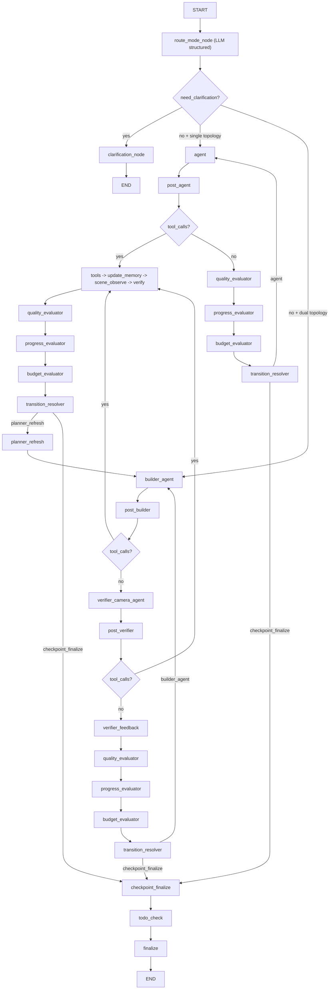

# 3DSceneAgent Agentic Workflow 重构建议（LLM Router + 通用 Agent + Evaluator）

更新时间：2026-02-26  
作者：Codex

---

## 0. 执行摘要

当前系统已完成 dual-agent 与工具域拆分的第一阶段，但仍存在两类核心缺口：

1. 路由仍偏规则化，缺乏基于上下文语义的 LLM 自动分流能力。
2. 评估逻辑分散，缺少统一 evaluator pipeline（quality/progress/budget/transition）。

本提案升级为当前实施基线：

1. `route_mode_node` 升级为 LLM 结构化路由（默认启用）。
2. 保持通用 `agent`（single 路径不再拆 conversation/single/executor 多节点）。
3. dual 路径保持 `builder + verifier_camera + verifier_feedback`。
4. single 与 dual 都接入统一 evaluator cluster。
5. catastrophic 继续非自动恢复：不做强制恢复工具注入。

---

## 1. 设计目标

1. 简单任务低成本：问答/轻任务尽快收敛。
2. 复杂任务稳定推进：多步任务可验证、可重规划、可终止。
3. 控制流确定性：agent 决定“做什么”，resolver 决定“去哪”。
4. 去除过时兼容叙述：文档与当前代码一致。

---

## 2. 现状对齐（以当前仓库为准）

### 2.1 图像接口现状

1. 对外图像接口为：
   - `POST /threads/{thread_id}/images`
   - `GET /threads/{thread_id}/images`
2. `reference-images` 已废弃，不再兼容。
3. `image-bindings` 保留为内部 memory 能力，不暴露公开 API。

### 2.2 工作流现状

1. single 路径与 dual 路径已共存。
2. dual 已有 `builder/verifier` 角色分离，但 evaluator 仍需统一化。

---

## 3. 目标架构（最终形态）

---

## 4. Router 设计（LLM 强约束）

### 4.1 结构化输出

`route_mode_node` 输出：

1. `intent`
2. `mode`（`conversation_mode | single_action_mode | plan_mode`）
3. `confidence`（0~1）
4. `need_clarification`
5. `clarification_question`
6. `requires_scene_mutation`

### 4.2 严格澄清策略

1. 当 `need_clarification=true` 或 `confidence` 低于阈值时，进入 `clarification_node`。
2. 本轮直接结束，不执行工具。
3. 用户补充后下一轮重新路由。

---

## 5. Agent 与 Evaluator 分工

### 5.1 Agent 侧

1. single 路径统一使用 `agent`。
2. dual 路径使用 `builder_agent` 与 `verifier_camera_agent`。
3. `verifier_camera_agent` 可以调用相机/渲染相关工具（含相机位姿更新）。

### 5.2 Evaluator 侧（single/dual 共用）

1. `quality_evaluator`：产出 `match/mismatch/catastrophic/skipped`。
2. `progress_evaluator`：产出 `continue/done/blocked` 与 `should_replan`。
3. `budget_evaluator`：统一预算检查并给出 `stop_reason`。
4. `transition_resolver`：确定性路由，不调用模型。

### 5.3 Transition 优先级

1. `budget_exhausted`
2. `done`
3. `catastrophic`
4. `replan`
5. `continue`

说明：catastrophic 仍不自动恢复，仅回执行 agent 并附带原因。

---

## 6. 图像资产与角色语义

### 6.1 语义角色（内部）

1. `question_image`
2. `object_reference`
3. `scene_reference`
4. `style_reference`
5. `verification_reference`

### 6.2 绑定策略

1. 对外只暴露 `/images` 上传/列举。
2. task-role 绑定由后端 memory 内部自动维护。
3. verify 按 mode 选择角色集合进行检索。

---

## 7. 与当前代码的实施映射

### 7.1 关键文件

1. `scene_agent/agent/nodes.py`
   - LLM router
   - clarification
   - quality/progress/budget evaluators
   - transition resolver 扩展
2. `scene_agent/agent/graph.py`
   - route_after_mode 增加 clarify 分支
   - single/dual 路由统一接 evaluator pipeline
3. `scene_agent/agent/graph_factory.py`
   - 注入 clarification + evaluator 节点
4. `scene_agent/agent/state.py`
   - 新增 `router_*`、`*_eval`、`transition_reason` 字段
5. `scene_agent/interfaces/api.py`
   - 请求字段保持最小变更，继续透传 `workflow_topology`

### 7.2 明确不做

1. 不拆分 conversation/single/executor 多个 single-agent 节点。
2. 不恢复 `reference-images` 兼容接口。
3. 不引入自动 catastrophic 恢复注入。

---

## 8. 测试与验收

### 8.1 单测

1. `router`：正常分流、低置信度澄清、结构化异常澄清。
2. `evaluator`：quality/progress/budget/transition 四类断言。
3. workflow control：single/dual 都经过 evaluator 主链。
4. verify：catastrophic 非自动恢复语义保持。

### 8.2 回归

1. `pytest -q tests/unit`
2. `pytest -q tests/contract/test_reference_images.py`
3. `cd web && npm run build`

### 8.3 验收标准

1. 模糊请求先澄清，不误执行工具。
2. single 与 dual 都统一进入 evaluator 决策。
3. 文档中不再出现 `reference-images` 兼容保留描述。

---

## 9. 分阶段执行（当前版本）

### Phase 1

1. 文档先对齐（移除过时兼容叙述）。

### Phase 2

1. LLM router + clarification 落地。

### Phase 3

1. evaluator cluster 落地并接入 single/dual 主链。

### Phase 4

1. 全量测试与文档/流程图同步更新。

---

## 10. 结论

该方案保留 proposal 的核心工程思想（router + evaluator + 规则化 transition），同时严格对齐你当前要求：

1. 通用 agent（single）+ builder/verifier（dual）
2. 无过时兼容分支
3. 无自动 catastrophic 恢复注入
4. 架构可直接实施并可测试
