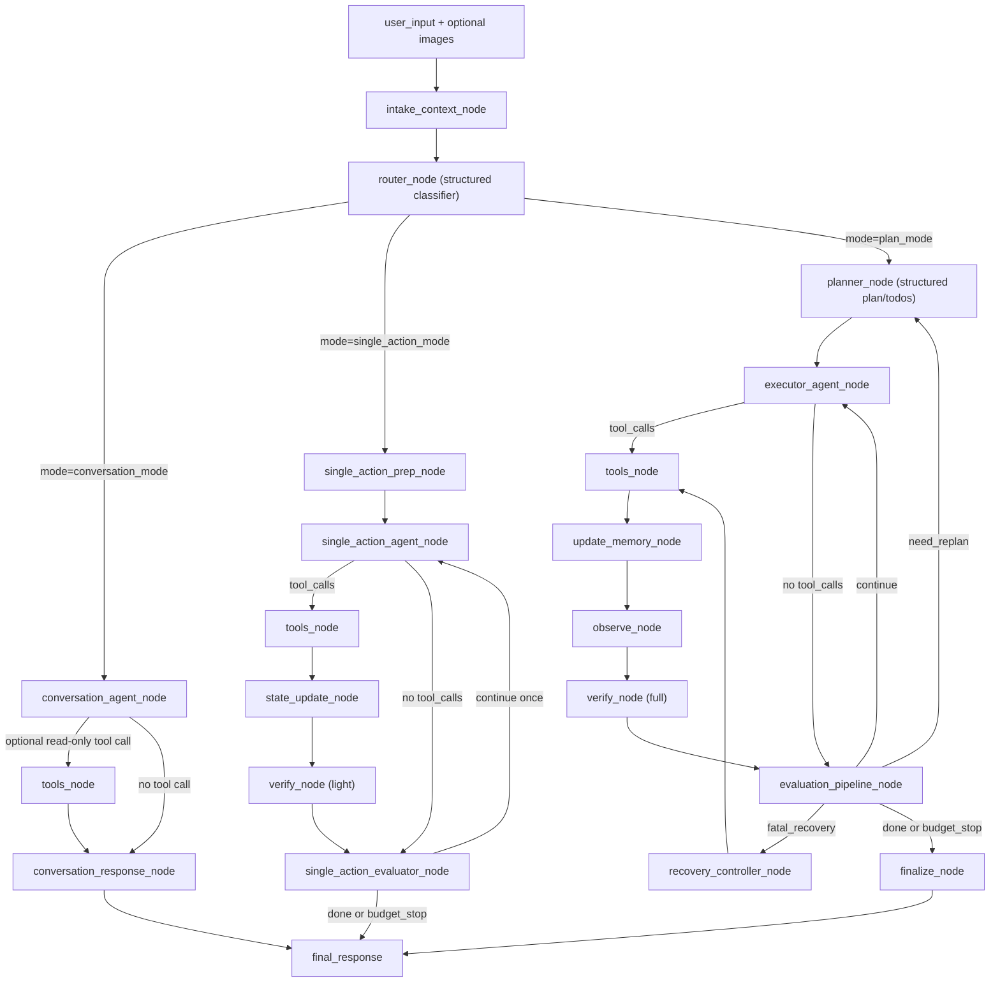

# 3DSceneAgent Agentic Workflow 重构建议（分层路由 + 可扩展 Todo/Plan）

更新时间：2026-02-25  
作者：Codex（基于仓库现状调研与业界实践）

---

## 0. 执行摘要

当前后端工作流以单一重型链路为主（`agent -> post_agent -> tools -> update_memory -> scene_observe -> verify -> checkpoint/todo_check`），在复杂 3D 任务上可用，但对简单问答/简单视觉问答存在过度编排；`reference_image` 语义过窄（偏验证用途）；`agent_decision` 在路由中承担了过多控制职责，导致稳定性、可测性和可演进性受限。

建议采用**分层分流 + 按需升级**架构：

1. 新增轻量 `router_node`，先判定 `intent/mode/side_effect/complexity`，将请求分到 `conversation_mode / single_action_mode / plan_mode`。
2. 将 `reference_image` 升级为通用 `image_assets` + `task_image_bindings(role)`，支持“看图问答 / 单物体生成 / 场景复刻 / 验证参考”等多场景复用。
3. 让 `agent` 直接输出工具调用；`post_agent` 降级为“结构化提取与记录”，**移除其路由权**。
4. 控制流改为规则机驱动（tool calls / tool result / verify result / budget），`agent_decision` 仅保留为可观测日志。
5. 对不同模式配置不同预算和护栏，保证简单任务低延迟，复杂任务可持续迭代。

---

## 1. 背景与目标

### 1.1 背景

你提出的核心问题是正确的：

1. 用户有大量“简单对话/简单问答”需求（如天气问答、概念问答），不应强行进入重工作流。
2. 用户上传图片的意图高度多样，不只是“验证参考图”：
   - “这张图是什么？”（视觉问答）
   - “按这张图生成一个单体物体放进场景”
   - “按图复刻整场景”
3. 这些需求复杂度差异巨大，若使用同一链路，成本与不确定性都会放大。

### 1.2 本次重构目标

1. 建立可扩展的多模式工作流，而不是“单路径加分支补丁”。
2. 让 todo/plan 在复杂任务中发挥作用，但不拖慢简单任务。
3. 将决策权从模型主观字段（`agent_decision`）迁移到客观状态与规则。
4. 提升系统的可测试性、可观测性、可恢复性与多轮稳定性。

---

## 2. 调研范围与参考依据

## 2.1 仓库内调研范围（按你的要求排除 `web/`）

### 核心设计与实现

- `README.md`
- `docs/architecture/agentic-workflow.md`
- `docs/codex_created/current-agent-workflow.md`
- `docs/codex_created/todo-check-and-verify-strategy.md`
- `scene_agent/agent/state.py`
- `scene_agent/agent/graph.py`
- `scene_agent/agent/nodes.py`
- `scene_agent/interfaces/api.py`
- `scene_agent/memory/reference_image_memory.py`
- `scene_agent/memory/reference_image_store.py`
- `scene_agent/agent/redis_checkpointer.py`

### 相关测试

- `tests/unit/test_agent_workflow_control.py`
- `tests/unit/test_verify_node.py`
- `tests/unit/test_reference_image_memory.py`
- `tests/unit/test_reference_image_store_fallback.py`
- （此前已验证）`tests/contract/test_reference_images.py`
- （此前已验证）`tests/integration/test_reference_images.py`

## 2.2 外部参考（方法论依据）

1. Anthropic Engineering: *Building effective agents*（2024-12-19）  
   https://www.anthropic.com/engineering/building-effective-agents  
   关键依据：先简单后复杂；workflow 与 agent 的边界；routing / evaluator-optimizer 等模式；可观测与工具接口设计。

2. LangGraph Docs: *Workflows and agents*  
   https://docs.langchain.com/oss/python/langgraph/workflows-agents  
   关键依据：路由、编排-执行分离、orchestrator-worker、structured planning。

3. LangChain Docs: *Structured output*  
   https://docs.langchain.com/oss/python/langchain/structured-output  
   关键依据：结构化输出用于 schema 提取/分类，不应替代真实执行反馈。

4. OpenAI Docs: *Function calling*  
   https://platform.openai.com/docs/guides/function-calling/how-do-i-ensure-the-model-calls-the-correct-function  
   关键依据：工具调用是多步回路；允许工具子集；严格 schema；服务端校验。

5. OpenAI Docs: *Structured outputs*  
   https://platform.openai.com/docs/guides/structured-outputs/function-calling-vs-response-format  
   关键依据：结构化输出用于稳定解析；控制流仍需业务规则与错误处理。

6. ReAct 论文（2022）  
   https://arxiv.org/abs/2210.03629  
   关键依据：reason + act 交替，但必须依赖环境反馈避免自洽幻觉。

---

## 3. 当前系统现状（与问题直接相关）

## 3.1 当前主链路（简化）

`agent -> post_agent -> (tools | checkpoint_finalize)`  
`tools -> update_memory -> scene_observe -> verify -> checkpoint_loop -> (todo_check | agent)`  

`post_agent` 当前会提取并写入：

1. `agent_decision`
2. `todos`
3. `iteration_count`

并且 `_route_after_post_agent` 中仍有 `agent_decision.should_call_tools` 的分支影响。

## 3.2 `reference_image` 当前语义

当前是线程级“参考图上传/列举”，在 `verify_node` 中统一作为 `reference_paths` 输入 `verify_render_with_references()`。  
这对“渲染对照验证”有效，但对“看图问答”“单图生成单物体”等场景语义不足。

## 3.3 现状优点

1. 已具备工具执行、视觉验证、checkpoint、todo_check 的闭环基础。
2. 已有一定恢复机制（blocked recovery / catastrophic recovery）。
3. 有基础测试覆盖路由、verify、reference image store。

## 3.4 现状痛点（本次重构焦点）

1. 简单任务路径过重，延迟与成本偏高。
2. `agent_decision` 同时承担“日志 + 路由”角色，导致控制不纯。
3. `reference_image` 强绑定“verify reference”，可扩展性不足。
4. todo/plan 与任务复杂度未分层，简单任务也会触发治理逻辑。

---

## 4. 设计原则（重构约束）

1. **复杂度按需增长**：默认走最简单可行路径，只有必要时升级到 plan 模式。
2. **控制流客观化**：路由依据执行证据（tool/verify/budget），不依赖模型主观声明。
3. **状态一等公民**：plan/todo/asset binding 进入可持久化状态，支持重入与审计。
4. **功能分层**：router（分类）/planner（结构化规划）/executor（工具执行）/evaluator（客观评估）解耦。
5. **向后兼容**：先兼容旧 `reference_images` 接口，再平滑迁移。

---

## 5. 目标架构草图（分层分流，细化版）

## 5.1 顶层路由与三模式主链路



## 5.2 `agent` 与 `evaluator` 节点细化（建议拆分）

### A. Agent 侧拆分

1. `router_node`（结构化输出）
   - 输入：用户请求、最近上下文、是否有图像资产。
   - 输出：`intent/mode/requires_scene_mutation/confidence/need_clarification`。

2. `conversation_agent_node`
   - 处理“纯问答 + 看图问答”统一路径。
   - 默认禁止 scene mutation 工具，仅允许 `read-only` 能力（可配置）。

3. `single_action_agent_node`
   - 仅允许小步动作，目标是 1~2 轮工具调用完成任务。
   - 输出必须带 `task_id/todo_id`（若有）。

4. `executor_agent_node`（plan 模式）
   - 基于当前 todo 执行工具调用。
   - 不负责决定路由，只负责“下一步动作”。

### B. Evaluator 侧拆分

1. `quality_evaluator`
   - 读取 verify 结果（`match/mismatch/catastrophic`）。
   - 不直接决定下游，只给出客观评价字段。

2. `progress_evaluator`
   - 推进 todo/plan 状态（`pending -> in_progress -> done/blocked`）。
   - 写入证据引用（`tool_call_id / verification_id`）。

3. `budget_evaluator`
   - 统一检查 `max_steps/max_tool_calls/max_replans/max_retries`。

4. `transition_resolver`（确定性规则）
   - 根据上述三个 evaluator 的结果做唯一跳转。
   - 该节点不调用模型，便于回归测试。

## 5.3 `transition_resolver` 路由优先级（建议）

1. `if catastrophic and recovery_available: recovery_controller_node`
2. `elif has_pending_tool_calls: tools_node`
3. `elif done: finalize_node`
4. `elif need_replan and replan_budget_ok: planner_node`
5. `elif can_continue: executor_agent_node`
6. `else: finalize_node(stop_reason=budget_or_no_progress)`

这样 `agent` 只负责“做什么”，`resolver` 负责“下一跳去哪”，避免控制流分散在多个节点里。

## 5.4 关键节点 I/O 契约（便于工程落地）

1. `router_node` 输出（结构化）
   - 必选字段：`intent`, `mode`, `confidence`, `requires_scene_mutation`, `need_clarification`
   - 可选字段：`tool_policy`, `image_roles`, `clarification_question`

2. `*_agent_node` 输出（统一约定）
   - `assistant_message`
   - `tool_calls`（可能为空）
   - `active_todo_id`（plan/single 模式推荐）
   - `reasoning_trace`（可选，仅日志）

3. `quality_evaluator` 输出
   - `verify_status`: `match|mismatch|catastrophic|skipped`
   - `verify_reason`
   - `verification_id`

4. `progress_evaluator` 输出
   - `todo_updates`
   - `plan_updates`
   - `progress_status`: `continue|done|blocked`

5. `budget_evaluator` 输出
   - `budget_ok`（布尔）
   - `stop_reason`（超预算时必填）

6. `transition_resolver` 输出
   - `next_node`
   - `transition_reason`（用于可观测与回放）
   - `route_snapshot`（可选，记录输入判定快照）

---

## 6. 任务模式设计（覆盖你提到的不同用户需求）

## 6.1 模式定义

1. `conversation_mode`：统一处理“纯对话/纯问答 + 看图问答/图像理解”，默认无场景变更。
2. `single_action_mode`：小步场景动作（如“生成一个物体放到场景”），通常 1~2 次工具调用。
3. `plan_mode`：多步复杂任务（如“参照图复刻场景”），进入 plan/todo/verify 循环。

## 6.2 路由输出 schema（建议）

```json
{
  "intent": "qa|image_qa|single_scene_action|scene_reconstruction",
  "mode": "conversation_mode|single_action_mode|plan_mode",
  "requires_scene_mutation": false,
  "tool_policy": "forbid_mutation|allow_read_only|allow_mutation",
  "image_roles": ["question_image", "object_reference", "scene_reference"],
  "confidence": 0.88,
  "need_clarification": false
}
```

## 6.3 预算策略（按模式）

1. `conversation_mode`: `max_steps=1~2`, `max_tool_calls=0~1`（只读工具）
2. `single_action_mode`: `max_steps<=3`, `max_tool_calls<=2`, `max_retries=1`
3. `plan_mode`: `max_steps<=8~12`, `max_tool_calls` 与 `max_replans<=2` 配置化

---

## 7. Todo/Plan 最佳实践落地（结合当前代码）

## 7.1 什么时候需要 plan/todo

1. 简单问答/简单视觉问答：不建 plan，直接回答。
2. 明确单动作：可不建全量 plan，仅建“执行子任务”。
3. 多目标、多依赖、多轮迭代：必须建 plan/todo，并做 checkpoint 驱动评估。

## 7.2 `agent_decision` 的定位调整

1. 保留：作为 `agent_reflection` 日志字段（便于调试）。
2. 移除：其对路由的控制权（如“是否调用工具”的主导地位）。
3. 路由改由客观规则机判断：
   - 是否有 `tool_calls`
   - 工具结果成功/失败
   - verify 状态（match/mismatch/catastrophic）
   - 预算是否耗尽
   - todo 是否终态

## 7.3 状态模型建议

```python
class PlanItem(TypedDict):
    id: str
    title: str
    success_criteria: str
    depends_on: list[str]
    status: Literal["pending", "in_progress", "done", "blocked", "skipped"]
    attempts: int
    evidence: list[str]

class TodoItem(TypedDict):
    id: str
    plan_id: str
    action: str
    tool_name: str | None
    tool_args: dict
    status: Literal["pending", "in_progress", "done", "failed", "cancelled"]
    attempts: int
    retryable: bool
    last_error: str | None
    correlation_id: str
```

---

## 8. `reference_image` 重构为通用图像资产层

## 8.1 现状问题

`reference_image` 目前核心语义接近“验证参考图”。  
这会导致：

1. 看图问答时语义不自然（明明是 question image）。
2. 单体生成时难表达“这是对象参考而不是全景参考”。
3. 一个线程内同图多用途难管理。

## 8.2 目标设计：`image_assets + task_bindings`

### 资产层（线程级）

`image_assets`

1. `image_id`
2. `thread_id`
3. `stored_path`
4. `filename/content_type/sha256/size`
5. `uploaded_at/source`

### 绑定层（任务级）

`task_image_bindings`

1. `task_id`
2. `image_id`
3. `role`（关键）：
   - `question_image`
   - `object_reference`
   - `scene_reference`
   - `style_reference`
   - `verification_reference`
4. `weight`（可选）

## 8.3 不同需求如何落地

1. “这张图是什么” -> `conversation_mode` + `question_image`
2. “按图生成单个3D物体” -> `single_action_mode` + `object_reference`
3. “参照图片复刻场景” -> `plan_mode` + `scene_reference`（verify 阶段可附加 `verification_reference`）

## 8.4 API 兼容策略

第一阶段保留现有：

1. `POST /threads/{thread_id}/reference-images`
2. `GET /threads/{thread_id}/reference-images`

新增建议：

1. `POST /threads/{thread_id}/images`（通用上传）
2. `POST /threads/{thread_id}/tasks/{task_id}/image-bindings`
3. `GET /threads/{thread_id}/tasks/{task_id}/image-bindings`

兼容映射：

- 旧 `reference-images` 上传默认映射到 `role=verification_reference`

---

## 9. 路由与节点职责重构建议（面向当前代码）

## 9.1 节点职责

1. `router_node`：结构化分类，不执行工具。
2. `planner_node`：仅在 `plan_mode` 生成结构化 `plan/todos`。
3. `agent_nodes`：按模式拆分为 `conversation_agent/single_action_agent/executor_agent`。
4. `tools_node`：执行工具并写入证据。
5. `evaluator_cluster`：拆分为 `quality/progress/budget/transition_resolver`，由确定性规则决定 continue/replan/finalize。
6. `recovery_node`：仅处理灾难恢复，保持 deterministic。
7. `finalize_node`：生成最终对用户回复，不再承接工作流控制逻辑。

## 9.2 关键路由规则（建议）

1. `if done: finalize`
2. `elif pending_tool_calls: tools`
3. `elif fatal_verify: recovery`
4. `elif need_replan and replan_budget_ok: planner`
5. `elif has_pending_todos and step_budget_ok: agent`
6. `else: finalize(stop_reason=budget_or_no_progress)`

---

## 10. 与现有代码的映射改造点

## 10.1 首批改造文件

1. `scene_agent/agent/state.py`  
   - 新增 `task_mode/task_profile/plan_items/task_image_bindings/execution_budget`。

2. `scene_agent/agent/graph.py`  
   - 新增 `router_node` 路由边。  
   - 移除 `_route_after_post_agent` 对 `agent_decision` 的依赖。  
   - 引入 `quality/progress/budget/transition_resolver` 的评估链路与路由。

3. `scene_agent/agent/nodes.py`  
   - `post_agent_node` 降级为提取记录节点。  
   - 新增 `router_node/planner_node/conversation_agent/single_action_agent/executor_agent/evaluator_cluster`。  
   - `verify_node` 支持按 `image role` 选择引用图片。

4. `scene_agent/memory/reference_image_memory.py`  
   - 升级为通用资产管理（可先加新类并兼容旧类）。

5. `scene_agent/interfaces/api.py`  
   - 新增图像资产与绑定 API。  
   - 删除线程时补齐资产文件 + 元数据 + checkpoint 清理。

## 10.2 `agent_decision` 处理策略

1. 重命名（可选）：`agent_reflection`
2. 保留字段用于日志、可视化、调试。
3. 不再参与 graph routing。

## 10.3 `state.py`（短期记忆）清理建议

本节聚焦 `scene_agent/agent/state.py` 的状态定义与 reducer 语义，目标是减少状态膨胀、避免语义漂移、提升可维护性。

### A. 高优先级问题（建议优先处理）

1. `scene_objects` reducer 使用 `merge_dicts`，与“全量快照写入”语义不一致。  
   - 现状：`scene_objects: Annotated[dict, merge_dicts]`。  
   - 风险：对象被删除后，旧键可能残留在 state，影响 verify / catastrophic 判定。  
   - 建议：将 `scene_objects` 改为“替换式更新”语义（全量覆盖），或引入显式 tombstone 删除机制。

2. `persistent_cameras` 使用 `add` reducer，存在重复累积与膨胀。  
   - 现状：`persistent_cameras: Annotated[list[str], add]`，scene_observe 每轮都可能回写。  
   - 风险：长会话后列表持续增长，重复值挤占上下文。  
   - 建议：改为“去重 + 保序” reducer（例如 merge_unique_cameras）。

### B. 中优先级问题（建议在 Phase 1/2 处理）

1. `iteration_count` 的语义混用（线程级累计 vs 请求级重试计数）。  
   - 风险：用于路由阈值时会随着线程历史增长而失真。  
   - 建议：拆分 `request_step_count` 与 `thread_total_steps`；或先移除其路由依赖。

2. 多个字段为“定义存在、使用稀薄或未使用”。  
   - 候选清理字段：`camera_renderings`、`reference_images`（state 内）、
     `diagnostics`（state 内）、`last_scene_observe_round`、`current_task`、`last_error`。  
   - 建议：先通过代码搜索确认读写路径，再删除字段与对应类型定义/注释。

3. `AgentState` 的必填字段与实际初始化模式不完全一致。  
   - 风险：类型提示严格但运行时依赖隐式缺省，增加理解与改造成本。  
   - 建议：除 `messages/thread_id` 外，优先改 `NotRequired`；或新增统一 `init_state_node` 显式补齐默认值。

### C. 低优先级问题（顺手修复）

1. `create_todo()` 目前使用 timestamp 生成 ID。  
   - 风险：高并发下存在碰撞可能。  
   - 建议：改为 `uuid4().hex` 或 `time_ns + random` 组合。

2. 状态结构体注释与真实使用存在漂移。  
   - 建议：每次字段增删同步更新 docstring 与测试断言，避免“注释即过期文档”。

### D. 建议落地顺序（最小风险）

1. 第一批：删除死字段（只删确认无读写路径者）。  
2. 第二批：修正 reducer 语义（`scene_objects` 替换式、`persistent_cameras` 去重式）。  
3. 第三批：计数器语义拆分（请求级与线程级分离）。  
4. 第四批：统一初始化策略（`NotRequired` 收敛或 `init_state_node`）。

### E. 验收点（针对 state 清理）

1. 删除对象后，`scene_objects` 不再残留幽灵对象。  
2. 长会话下 `persistent_cameras` 长度稳定且无重复。  
3. 路由行为不再依赖历史累计 `iteration_count` 偏差。  
4. `mypy/pyright`（若启用）对 `AgentState` 的报错显著减少。  

---

## 11. 分阶段实施计划（建议 4 阶段）

## Phase 1（1 周）：控制流去耦最小改造

目标：不大改功能，仅移除 `agent_decision` 路由权。

1. `graph.py` 路由只看 `tool_calls + gate + budget`。
2. `post_agent` 保留提取，不控制流。
3. 增加回归测试，确保行为不倒退。

验收：

1. 现有单测通过。
2. 复杂任务不早退。
3. 简单无工具请求可稳定 finalize。

## Phase 2（1~2 周）：分层路由上线（conversation/single/plan）

目标：简单请求快速通道，复杂请求走计划通道。

1. 新增 `router_node` 与 mode 配置。
2. 建立按 mode 的预算策略。
3. 加入低置信度澄清分支。

验收：

1. 简单问答平均步骤显著下降。
2. 对话问答（含图片问答）不触发 scene mutation 工具。
3. 单步场景动作不进入全量 todo_check 循环。

## Phase 3（1~2 周）：图像资产泛化

目标：`reference_image -> image_assets + bindings`。

1. 增加通用图片上传与绑定接口。
2. `verify_node` 按 role 消费图片。
3. 保持旧接口兼容。

验收：

1. 三类用户意图（图像问答/单体生成/场景复刻）都可正确路由并消费图片。
2. 旧前端接口继续可用。

## Phase 4（1 周）：可观测性与资源生命周期补齐

目标：把工程风险收口。

1. 删除线程时清理 checkpoint + image metadata + image files。
2. 统一 trace 字段（request_id/thread_id/task_id/todo_id/tool_call_id）。
3. 指标与告警接入（失败率/重规划率/预算耗尽率）。

验收：

1. 资源无泄漏。
2. 异常路径可追踪可复盘。
3. 多轮任务稳定性提升（可量化）。

---

## 12. 测试与验收方案

## 12.1 单测新增

1. `router_node` 分类正确性（含低置信度澄清）。
2. 各 mode 预算护栏与停止条件。
3. `agent_decision` 不影响路由。
4. `image role` 绑定解析与 verify 入参正确性。
5. delete_thread 资源清理完整性（checkpoint + metadata + files）。

## 12.2 集成/契约测试新增

1. 对话问答路径（文本与图片）无多余工具调用。
2. `conversation_mode` 路径不触发 scene mutate 工具。
3. 单体生成路径最多 N 步可收敛。
4. 复杂复刻路径可重规划，且 todo 状态单调推进（不回退/不振荡）。

## 12.3 指标（建议）

1. `mode_distribution`
2. `avg_steps_by_mode`
3. `tool_calls_by_mode`
4. `replan_rate`
5. `finalize_reason_distribution`
6. `verify_mismatch_recovery_success_rate`
7. `thread_cleanup_success_rate`

---

## 13. 风险与对策

1. **路由误分流**（复杂任务误判到简单模式）  
   对策：低置信度澄清 + 可升级触发（执行中发现多步依赖时升级到 `plan_mode`）。

2. **状态模型膨胀**  
   对策：先最小字段集；事件日志与业务状态分层存储。

3. **旧接口兼容成本**  
   对策：双写与映射期（`reference_images -> verification_reference`）。

4. **测试成本上升**  
   对策：按 mode 建测试模板；先覆盖高价值路径。

---

## 14. 结论与推荐落地顺序

推荐顺序：

1. 先做控制流去耦（Phase 1）  
2. 再做分层路由（Phase 2）  
3. 再做图像资产泛化（Phase 3）  
4. 最后收口工程治理（Phase 4）

这个顺序的好处是：先稳定控制面，再扩展能力面，最后做资源治理与可观测性闭环，能避免“大改动一次性上线”风险。

---

## 15. 附录 A：与本次讨论直接对应的决策

1. “是否去掉 `agent_decision`？”  
   - 结论：去掉其路由权，保留日志价值。

2. “agent 与 post_agent 是否冗余？”  
   - 结论：目前有部分冗余。应改为“agent 产工具调用，post_agent 仅做结构化提取/记录”。

3. “工具调用是不是 post_agent 输出的？”  
   - 结论：不是。常规工具调用来自 `agent` 输出；`post_agent` 只提取状态；恢复分支会注入强制工具调用。

4. “todo/plan 最佳实践？”  
   - 结论：只在复杂任务启用，且必须由客观执行证据推进状态，不依赖模型主观动作字段。

---

## 16. 附录 B：参考链接（外部）

1. Anthropic - Building effective agents  
   https://www.anthropic.com/engineering/building-effective-agents
2. LangGraph - Workflows and agents  
   https://docs.langchain.com/oss/python/langgraph/workflows-agents
3. LangChain - Structured output  
   https://docs.langchain.com/oss/python/langchain/structured-output
4. OpenAI - Function calling  
   https://platform.openai.com/docs/guides/function-calling/how-do-i-ensure-the-model-calls-the-correct-function
5. OpenAI - Structured outputs  
   https://platform.openai.com/docs/guides/structured-outputs/function-calling-vs-response-format
6. ReAct (arXiv)  
   https://arxiv.org/abs/2210.03629
