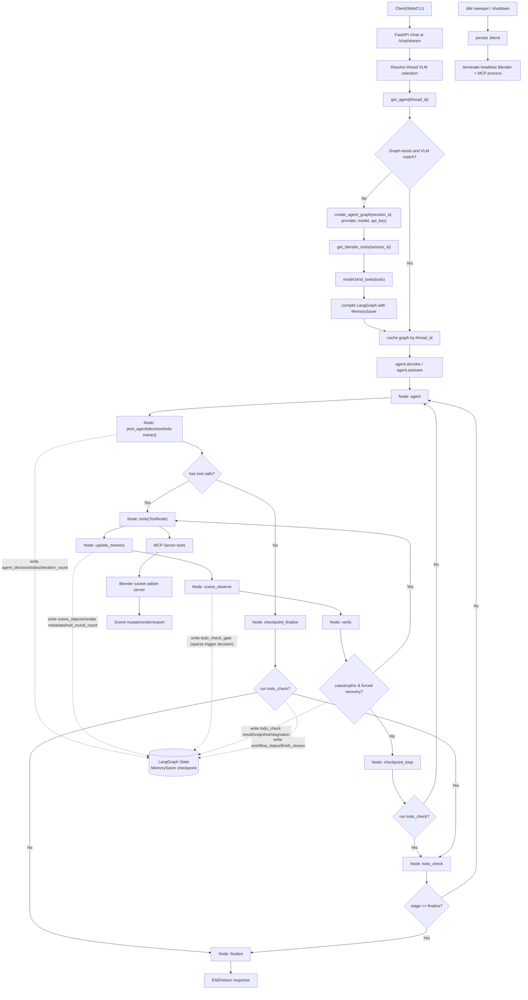
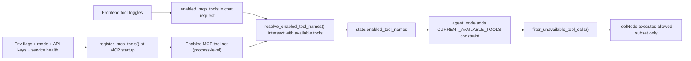
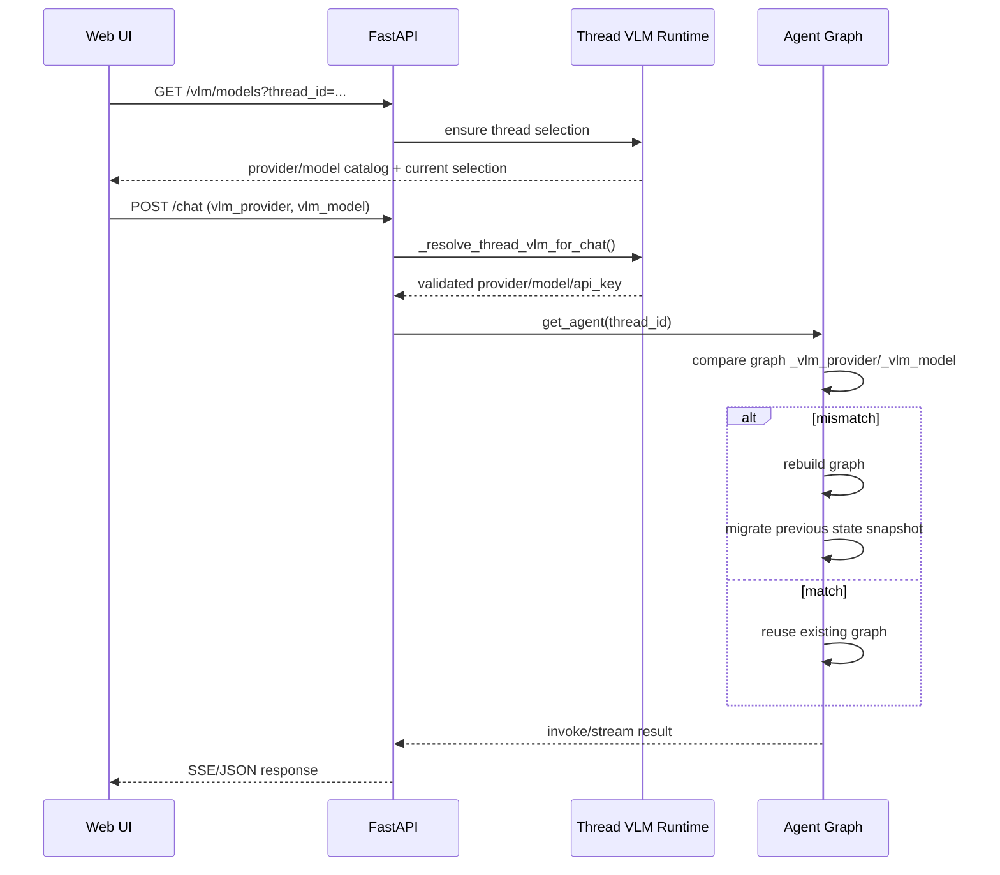

# 当前 Agent 工作流与配置机制分析（持久化版）

更新时间：2026-02-20

本文基于当前仓库实现，对以下内容做落地说明：
- Agent 生命周期：创建、调用、销毁
- MCP 配置机制：启用时配置（进程级）与运行时配置（请求级）
- 模型与 Provider 切换机制
- state 与 memory 的持久化边界
- 潜在风险与优先级评估

---

## 1. Agent 生命周期总览（创建 / 调用 / 销毁）

行为说明（当前实现）：
- `post_agent` 在每次 assistant 响应后执行，负责提取并落库 `agent_decision` / `todos`（不再依赖 tool path）。
- `todo_check` 采用 checkpoint 稀疏触发，不会在每次工具调用后都执行（支持 interval + milestone + pre-final guard）。
- 当 assistant 未产生 tool call 时：若 `agent_decision.should_call_tools=true` 且仍在重试预算内，会先回到 `agent` 重试一次；否则走 `checkpoint_finalize`，仅在存在 todo 时做一次 `todo_check` 兜底后再 `finalize`。
- `verify` 采用分层校验顺序：`catastrophic gate -> todo context progress -> request consistency`。
- 若 `verify` 检测到灾难性状态（例如场景尺度爆炸、位置异常、渲染异常平坦/灰图），会触发**硬自动恢复**而不是等待 agent 自行思考：
  - 第 1 次：`undo_last_snapshot -> get_scene_info -> observe_scene_global`
  - 第 2 次：`clear_scene -> get_scene_info -> observe_scene_global`
  - 恢复动作会以结构化 `verification` payload 记录，并自动回到 `tools` 路径执行。
  - 当最近一批工具包含新的常规 scene mutation（非 `undo_last_snapshot` / `clear_scene`）时，灾难恢复预算会重置为新事件，避免旧事件的 attempt 计数阻塞新一轮硬恢复。
- `todo_check` 聚焦计划进度/停滞检测，`verify` 聚焦视觉质量与灾难恢复，两者职责分离。
- `.blend` 自动持久化仅在显式 `scene-mutating` 命令执行后触发（已排除 `camera_act` / `camera_set_pose`）。

关键实现：
- Agent 获取与线程缓存：`scene_agent/interfaces/api.py`
- 图构建：`scene_agent/agent/graph.py`
- 节点逻辑：`scene_agent/agent/nodes.py`
- 会话回收：`scene_agent/interfaces/api.py` + `scene_agent/blender/session_manager.py`

---

## 2. MCP 配置机制（启用时 vs 运行时）

### 2.1 启用时配置（进程级）

MCP Server 启动时，通过 `register_mcp_tools()` 决定“哪些工具会被注册”。

输入条件：
- `BLENDER_MODE`
- `ENABLE_*` 系列开关（如 `ENABLE_TRELLIS2` / `ENABLE_RETRIEVAL` / `ENABLE_SKETCHFAB`）
- 必需 API Key（如 `RODIN_API_KEY` / `SKETCHFAB_API_KEY`）
- 条件服务健康探测（trellis2 / retrieval / pcg_integrator）
- 冲突组合校验（例如生成器开关互斥）

### 2.2 运行时配置（请求级）

前端每次请求可传 `enabled_mcp_tools`，后端与当前可用工具求交集后写入 state：
- API 侧：`enabled_tool_names`
- Agent 侧：系统提示注入 `CURRENT_AVAILABLE_TOOLS`
- Agent 输出侧：再次过滤掉不在 allow-list 的 tool call

即：**双层限制**（请求侧约束 + agent 输出过滤）。

---

## 3. Provider / Model 切换机制

线程级别维护 VLM 选择（provider + model）：
- 首次进入线程：按默认配置初始化
- 每次 `/chat` 可提交新 provider/model
- `get_agent(thread_id)` 会比较当前 graph 元数据 `_vlm_provider/_vlm_model`
  - 不匹配：重建 graph
  - 重建后尝试将旧 graph state 迁移到新 graph

---

## 4. State 与 Memory 持久化边界

| 类别 | 当前实现 | 是否跨进程/重启持久化 | 备注 |
|---|---|---|---|
| LangGraph 对话 state | `MemorySaver` | 否 | 仅当前 Python 进程内 |
| `_agent_graphs_by_thread` / `_thread_vlm_configs` | 进程内全局 dict | 否 | 多 worker 间不共享 |
| Headless 场景状态 | `.blend` + snapshots | 是（文件级） | 按 `thread_id` 存储在 `SESSION_BLEND_ROOT` |
| Blender 运行时进程 | SessionManager 管理 | 否（进程对象） | 空闲会回收，后续可重启恢复场景 |
| 参考图文件 | `REFERENCE_IMAGE_STORAGE_DIR` | 是（文件级） | 元数据索引不持久化 |
| 参考图元数据索引 | `ReferenceImageMemory._images` | 否 | 进程重启后丢失 |
| 渲染图缓存 | `/tmp/scene_agent_renders` | 有限 | 临时目录，策略依赖系统与清理行为 |
| 前端会话数据 | IndexedDB / localStorage | 是（浏览器本地） | 与后端状态解耦 |

补充（2026-02-20）：
- 增加 `verify_forced_recovery` 与 `catastrophic_recovery_attempts` 状态字段，用于硬恢复路由与预算控制。
- 新增 MCP 工具 `clear_scene`（addon 端命令），用于全场景重置。

---

## 5. 潜在风险分析（按优先级）

### P0 / 高风险
1. 远程代码执行面暴露风险  
   MCP 工具包含 `execute_blender_code`，若服务暴露在不可信网络且缺少鉴权，风险较高。

2. 多 worker 部署状态不一致  
   `api_workers > 1` 时，每个进程有独立内存态，线程图状态与 VLM 选择可能分裂。

### P1 / 中高风险
3. 对话 state 无重启恢复  
   `MemorySaver` 不落盘，服务重启后上下文丢失（即使 `.blend` 仍在）。

4. 线程删除缺后端清理接口  
   前端删线程仅本地生效，后端对应 session/graph/reference 文件可能残留。

5. 参考图“文件与索引”分离  
   文件落盘但元数据仅内存，重启后会出现“磁盘有文件但 API 列表为空”的不一致。

### P2 / 中风险
6. 并发窗口下 graph 重建竞态  
   同一 `thread_id` 并发请求可能触发重复建图/迁移窗口（无显式线程级单飞锁）。

7. MCP 启用与运行中健康状态漂移  
   工具启用由启动时探测决定，运行期间依赖服务若下线，仍可能显示可用但调用失败。

8. 灾难检测阈值依赖经验参数  
   当前 catastrophic gate 使用阈值（bbox/位置/尺寸/图像平坦度）做快速判定，极端但合法的艺术场景可能触发误报，需结合线上日志持续调参。

---

## 6. 关键代码定位（便于继续深挖）

- Agent 图构建：`scene_agent/agent/graph.py`
- Agent 节点与工具过滤：`scene_agent/agent/nodes.py`
- Verify 灾难检测与硬恢复：`scene_agent/agent/nodes.py`
- API 线程级 VLM 与 get_agent：`scene_agent/interfaces/api.py`
- MCP 工具注册与开关：`mcp_server/tool_registry.py`
- MCP 运行时连接与环境：`mcp_server/runtime.py`
- Headless 会话与进程管理：`scene_agent/blender/session_manager.py`
- Blender Socket 客户端：`scene_agent/blender/connection.py`
- Addon 持久化与 snapshot：`addon/blender_mcpv_addon/server.py`
- Addon 场景重置命令：`addon/blender_mcpv_addon/server_scene_tools_mixin.py`
- 前端模型与 MCP 工具选择：`web/src/components/ChatComposer.tsx`
- 前端本地持久化：`web/src/state/storage.ts`、`web/src/state/indexeddb.ts`

---

## 7. 结论（当前状态）

- 当前系统已经具备：线程级图实例、线程级 VLM 切换、双层 MCP 工具限制、headless 场景文件持久化。  
- 当前系统尚未具备：跨进程统一状态、重启可恢复对话 state、完整线程资源生命周期清理。  
- 若进入生产多实例/多 worker 场景，建议优先推进统一状态后端（如 Redis checkpointer + session coordinator）。
