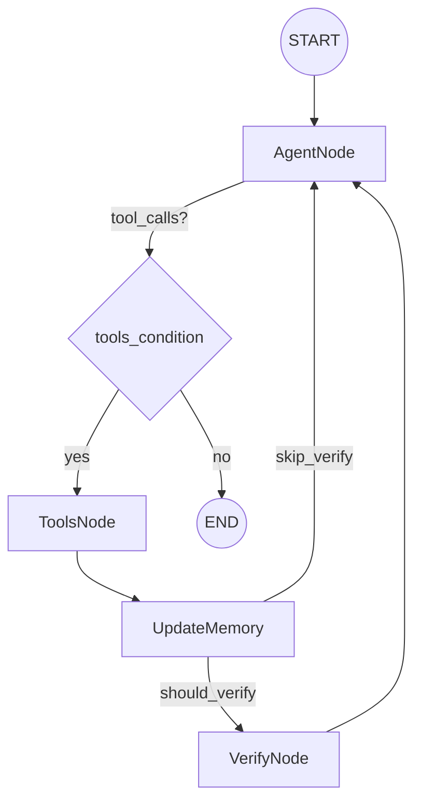

# Agent Graph Workflow

This document describes the LangGraph workflow used by the 3D scene agent, including
the verify routing logic and how render images are passed to the VLM.

## Graph Flow



## Verify Routing (Structured Decision)

The agent emits a structured decision block at the end of every response. The graph
routes to `VerifyNode` only when:

- A new render exists (`last_render_path` set and not already verified), and
- The agent decision includes `"should_verify": true`.

The decision block format is:

```
<agent_decision>{"should_verify": true|false, "reason": "...", "should_call_tools": true|false, "tool_plan": ["tool_name"], "scene_plan": "..."}</agent_decision>
```

This keeps verify logic under agent control instead of pre-set heuristics.

## Render Images to VLM

After tool execution, `UpdateMemory` extracts the latest render image and:

- Ensures a local render file path is recorded for verification.
- Injects a VLM-compatible image message so the next `AgentNode` invocation
  receives the render image even if `VerifyNode` is skipped.
- Tracks a `last_render_signature` to avoid sending duplicates.

This guarantees tool-rendered images are available to the VLM on the agent side.
